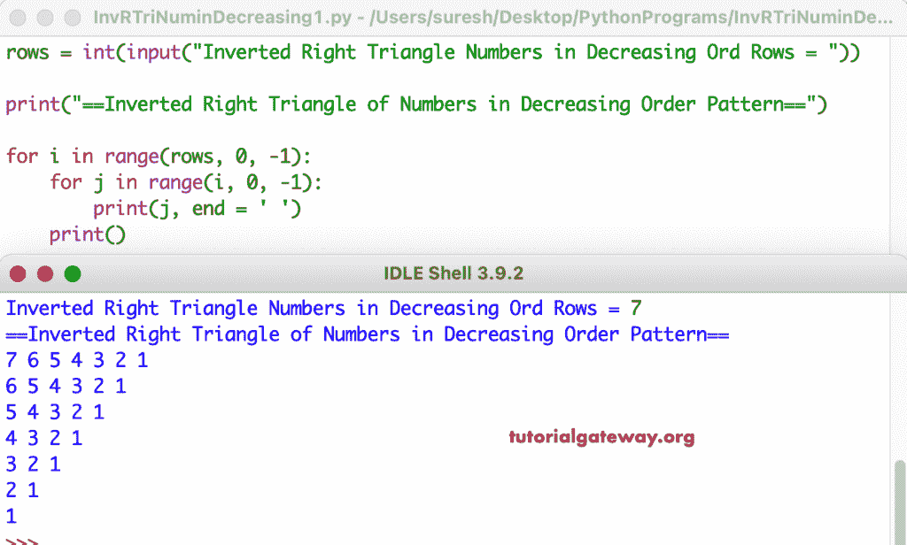

# Python 程序：打印递减顺序号倒直角三角形

> 原文：<https://www.tutorialgateway.org/python-program-to-print-inverted-right-triangle-of-decreasing-order-numbers/>

写一个 Python 程序打印倒直角三角形的递减顺序数字模式用于循环。

```py
rows = int(input("Inverted Right Triangle Numbers in Decreasing Ord Rows = "))

print("==Inverted Right Triangle of Numbers in Decreasing Order Pattern==")

for i in range(rows, 0, -1):
    for j in range(i, 0, -1):
        print(j, end = ' ')
    print()
```



这个 [Python 示例](https://www.tutorialgateway.org/python-programming-examples/)使用 while 循环以递减顺序打印数字的倒直角三角形。

```py
rows = int(input("Inverted Right Triangle Numbers in Decreasing Ord Rows = "))

print("==Inverted Right Triangle of Numbers in Decreasing Order Pattern==")

i = rows

while(i >= 1):
    j = i
    while(j >= 1):
        print(j, end = ' ')
        j = j - 1
    print()
    i = i - 1
```

```py
Inverted Right Triangle Numbers in Decreasing Ord Rows = 12
==Inverted Right Triangle of Numbers in Decreasing Order Pattern==
12 11 10 9 8 7 6 5 4 3 2 1 
11 10 9 8 7 6 5 4 3 2 1 
10 9 8 7 6 5 4 3 2 1 
9 8 7 6 5 4 3 2 1 
8 7 6 5 4 3 2 1 
7 6 5 4 3 2 1 
6 5 4 3 2 1 
5 4 3 2 1 
4 3 2 1 
3 2 1 
2 1 
1 
```