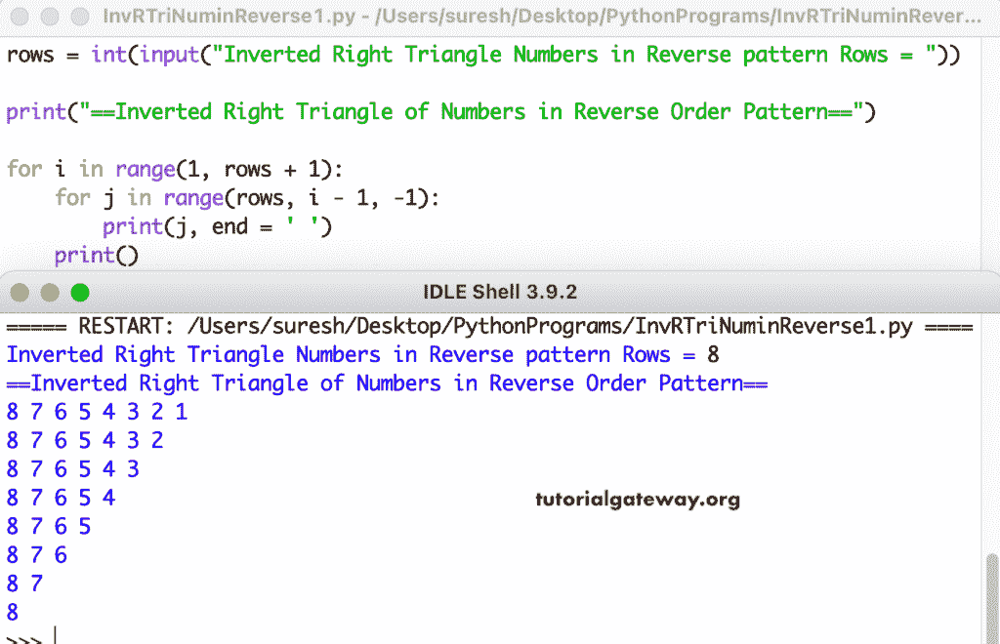

# Python 程序：反向打印倒直角三角形

> 原文：<https://www.tutorialgateway.org/python-program-to-print-inverted-right-triangle-numbers-in-reverse/>

编写一个 Python 程序，使用 for 循环以相反的顺序打印倒直角三角形的数字。

```py
rows = int(input("Inverted Right Triangle Numbers in Reverse pattern Rows = "))

print("==Inverted Right Triangle of Numbers in Reverse Order Pattern==")

for i in range(1, rows + 1):
    for j in range(rows, i - 1, -1):
        print(j, end = ' ')
    print()
```



这个 [Python 示例](https://www.tutorialgateway.org/python-programming-examples/)显示了一个倒直角三角形，其中它的数字使用 while 循环以相反的顺序打印。

```py
rows = int(input("Inverted Right Triangle Numbers in Reverse pattern Rows = "))

print("==Inverted Right Triangle of Numbers in Reverse Order Pattern==")
i = 1

while(i <= rows):
    j = rows
    while(j >= i):
        print(j, end = ' ')
        j = j - 1
    print()
    i = i + 1
```

```py
Inverted Right Triangle Numbers in Reverse pattern Rows = 13
==Inverted Right Triangle of Numbers in Reverse Order Pattern==
13 12 11 10 9 8 7 6 5 4 3 2 1 
13 12 11 10 9 8 7 6 5 4 3 2 
13 12 11 10 9 8 7 6 5 4 3 
13 12 11 10 9 8 7 6 5 4 
13 12 11 10 9 8 7 6 5 
13 12 11 10 9 8 7 6 
13 12 11 10 9 8 7 
13 12 11 10 9 8 
13 12 11 10 9 
13 12 11 10 
13 12 11 
13 12 
13
```