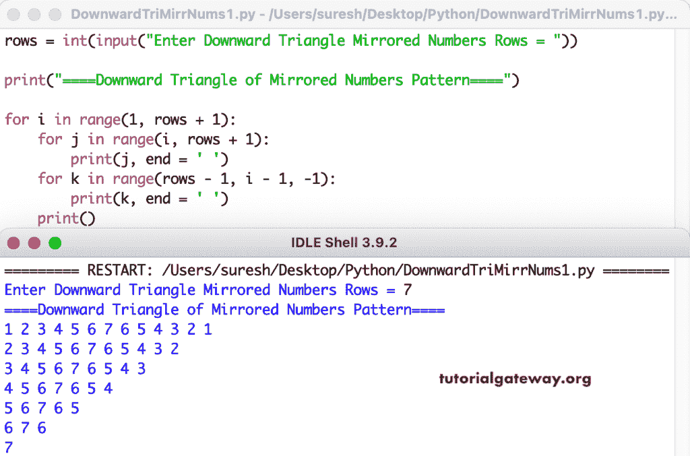

# Python 程序：打印镜像数字的向下三角形图案

> 原文：<https://www.tutorialgateway.org/python-program-to-print-downward-triangle-mirrored-numbers-pattern/>

编写一个 Python 程序，使用 for 循环打印向下的三角形镜像数字图案。

```py
rows = int(input("Enter Downward Triangle Mirrored Numbers Rows = "))

print("====Downward Triangle of Mirrored Numbers Pattern====")

for i in range(1, rows + 1):
    for j in range(i, rows + 1):
        print(j, end = ' ')
    for k in range(rows - 1, i - 1, -1):
        print(k, end = ' ')       
    print()
```



这个 Python 模式[示例](https://www.tutorialgateway.org/python-programming-examples/)使用 while 循环打印镜像数字的向下三角形。

```py
rows = int(input("Enter Downward Triangle Mirrored Numbers Rows = "))

print("====Downward Triangle of Mirrored Numbers Pattern====")
i = 1

while(i <= rows):
    j = i
    while(j <= rows):
        print(j, end = ' ')
        j = j + 1
    k = rows - 1
    while(k >= i):
        print(k, end = ' ')
        k = k - 1
    print()
    i = i + 1
```

```py
Enter Downward Triangle Mirrored Numbers Rows = 9
====Downward Triangle of Mirrored Numbers Pattern====
1 2 3 4 5 6 7 8 9 8 7 6 5 4 3 2 1 
2 3 4 5 6 7 8 9 8 7 6 5 4 3 2 
3 4 5 6 7 8 9 8 7 6 5 4 3 
4 5 6 7 8 9 8 7 6 5 4 
5 6 7 8 9 8 7 6 5 
6 7 8 9 8 7 6 
7 8 9 8 7 
8 9 8 
9 
```