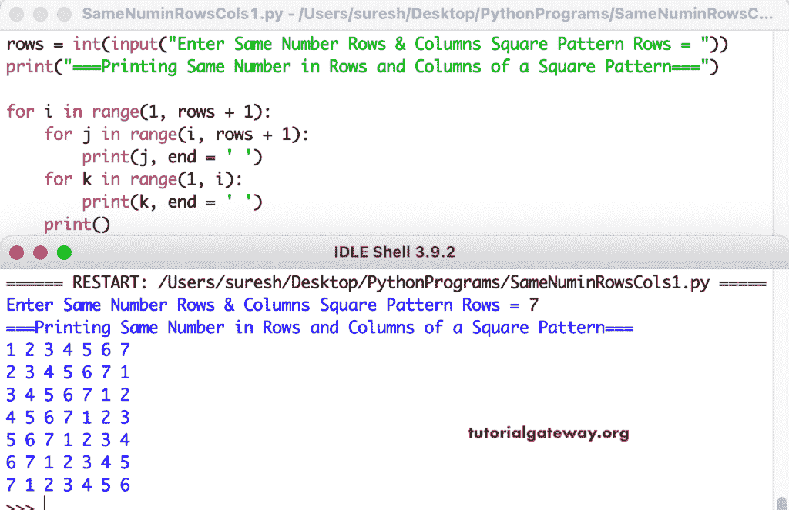

# Python 程序：打印方形行和列中相同数字

> 原文：<https://www.tutorialgateway.org/python-program-to-print-same-numbers-in-square-rows-and-columns/>

编写一个 Python 程序，使用 for 循环以方形行和列的数字模式打印相同的数字。

```py
rows = int(input("Enter Same Number Rows & Columns Square Pattern Rows = "))

print("===Printing Same Number in Rows and Columns of a Square Pattern===")

for i in range(1, rows + 1):
    for j in range(i, rows + 1):
        print(j, end = ' ')
    for k in range(1, i):
        print(k, end = ' ')
    print()
```



这个 [Python 示例](https://www.tutorialgateway.org/python-programming-examples/)使用 while 循环打印正方形数字模式，其中行和列具有相同的数字。

```py
rows = int(input("Enter Same Number Rows & Columns Square Pattern Rows = "))

print("===Printing Same Number in Rows and Columns of a Square Pattern===")
i = 1
while(i <= rows):

    j = i
    while(j < rows + 1):
        print(j, end = ' ')
        j = j + 1

    k = 1
    while(k < i):
        print(k, end = ' ')
        k = k + 1
    print()
    i = i + 1
```

```py
Enter Same Number Rows & Columns Square Pattern Rows = 9
===Printing Same Number in Rows and Columns of a Square Pattern===
1 2 3 4 5 6 7 8 9 
2 3 4 5 6 7 8 9 1 
3 4 5 6 7 8 9 1 2 
4 5 6 7 8 9 1 2 3 
5 6 7 8 9 1 2 3 4 
6 7 8 9 1 2 3 4 5 
7 8 9 1 2 3 4 5 6 
8 9 1 2 3 4 5 6 7 
9 1 2 3 4 5 6 7 8 
```