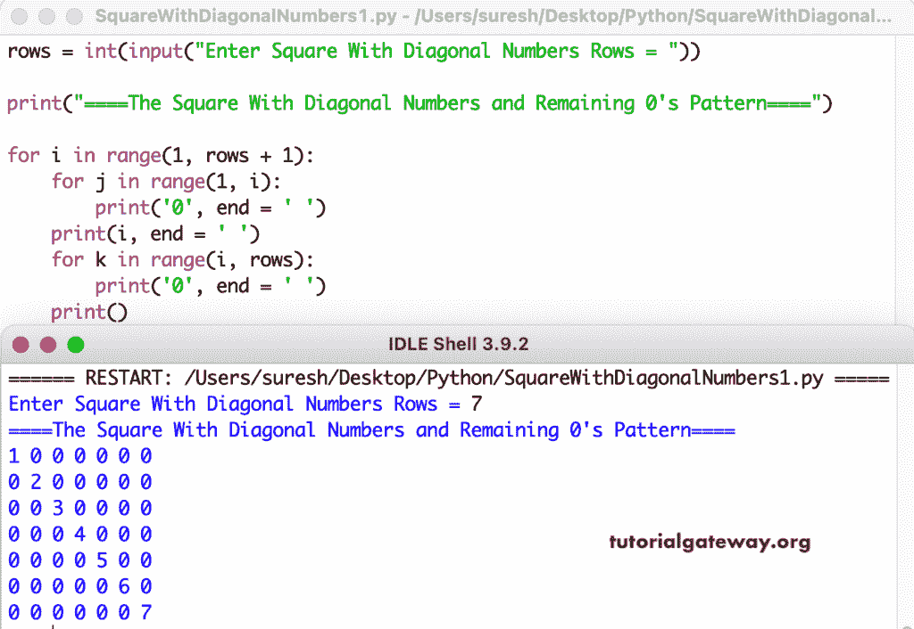

# Python 程序：用对角线数字图案打印正方形

> 原文：<https://www.tutorialgateway.org/python-program-to-print-square-with-diagonal-numbers-pattern/>

编写一个 Python 程序，打印除用于循环的对角线数字图案之外的全零正方形。

```py
rows = int(input("Enter Square With Diagonal Numbers Rows = "))

print("====The Square With Diagonal Numbers and Remaining 0's Pattern====")

for i in range(1, rows + 1):
    for j in range(1, i):
        print('0', end = ' ')
    print(i, end = ' ')
    for k in range(i, rows):
        print('0', end = ' ')
    print()
```



这是在 Python 中打印带有对角线数字和所有剩余零的正方形图案的另一种方式。

```py
rows = int(input("Enter Square With Diagonal Numbers Rows = "))

print("====The Square With Diagonal Numbers and Remaining 0's Pattern====")

for i in range(1, rows + 1):
    for j in range(1, rows + 1):
        if i == j:
            print(i, end = ' ')
        else:
            print('0', end = ' ')
    print()
```

```py
Enter Square With Diagonal Numbers Rows = 8
====The Square With Diagonal Numbers and Remaining 0's Pattern====
1 0 0 0 0 0 0 0 
0 2 0 0 0 0 0 0 
0 0 3 0 0 0 0 0 
0 0 0 4 0 0 0 0 
0 0 0 0 5 0 0 0 
0 0 0 0 0 6 0 0 
0 0 0 0 0 0 7 0 
0 0 0 0 0 0 0 8 
```

这个 [Python 程序](https://www.tutorialgateway.org/python-programming-examples/)显示增量对角线数的正方形模式。使用 while 循环，所有剩余的 1 都是 0。

```py
rows = int(input("Enter Square With Diagonal Numbers Rows = "))

print("====The Square With Diagonal Numbers and Remaining 0's Pattern====")
i = 1

while(i <= rows):
    j = 1
    while(j <= rows):
        if i == j:
            print(i, end = ' ')
        else:
            print('0', end = ' ')
        j = j + 1
    print()
    i = i + 1
```

```py
Enter Square With Diagonal Numbers Rows = 9
====The Square With Diagonal Numbers and Remaining 0's Pattern====
1 0 0 0 0 0 0 0 0 
0 2 0 0 0 0 0 0 0 
0 0 3 0 0 0 0 0 0 
0 0 0 4 0 0 0 0 0 
0 0 0 0 5 0 0 0 0 
0 0 0 0 0 6 0 0 0 
0 0 0 0 0 0 7 0 0 
0 0 0 0 0 0 0 8 0 
0 0 0 0 0 0 0 0 9 
```