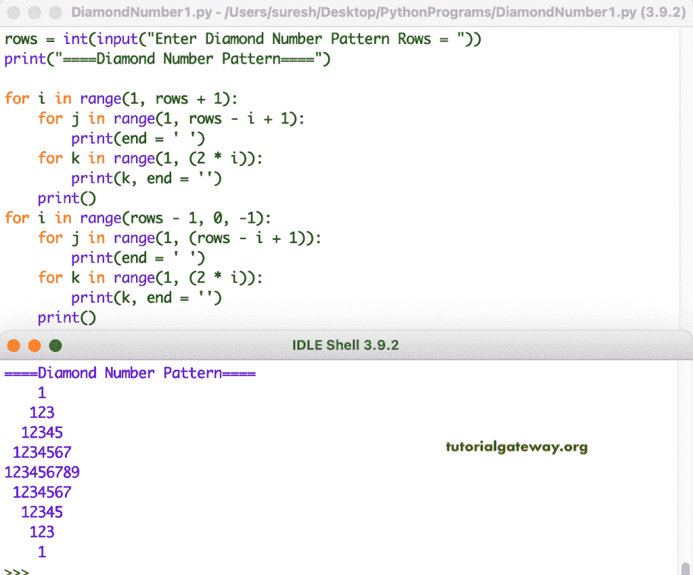

# Python 程序：打印数字的菱形图案

> 原文：<https://www.tutorialgateway.org/python-program-to-print-diamond-number-pattern/>

编写一个 Python 程序，使用 for 循环打印数字的菱形图案。

```py
rows = int(input("Enter Diamond Number Pattern Rows = "))

print("====Diamond Number Pattern====")

for i in range(1, rows + 1):
    for j in range(1, rows - i + 1):
        print(end = ' ')
    for k in range(1, (2 * i)):
        print(k, end = '')
    print()

for i in range(rows - 1, 0, -1):
    for j in range(1, (rows - i + 1)):
        print(end = ' ')
    for k in range(1, (2 * i)):
        print(k, end = '')
    print()
```



这是编写 Python 程序来显示数字菱形模式的另一种方式。

```py
rows = int(input("Enter Diamond Number Pattern Rows = "))

print("====Diamond Number Pattern====") 
for i in range(1, rows + 1):
    for j in range(1, rows - i + 1):
        print(end = ' ')
    for k in range(i, 0, -1):
        print(k, end = '')
    for l in range(2, i + 1):
        print(l, end = '')
    print()

for i in range(rows - 1, 0, -1):
    for j in range(1, (rows - i + 1)):
        print(end = ' ')
    for k in range(i, 0, -1):
        print(k, end = '')
    for l in range(2, i + 1):
        print(l, end = '')
    print()
```

```py
Enter Diamond Number Pattern Rows = 6
====Diamond Number Pattern====
     1
    212
   32123
  4321234
 543212345
65432123456
 543212345
  4321234
   32123
    212
     1
```

这个 [Python 示例](https://www.tutorialgateway.org/python-programming-examples/)使用 while 循环打印数字的菱形模式。

```py
rows = int(input("Enter Diamond Number Pattern Rows = "))

print("====Diamond Number Pattern====")
i = 1
while(i <= rows):
    j = 1
    while(j <=  rows - i):
        print(end = ' ')
        j = j + 1
    k = i
    while(k >= 1):
        print(k, end = '')
        k = k - 1
    l = 2
    while(l <= i):
        print(l, end = '')
        l = l + 1
    print()
    i = i + 1

i = rows - 1
while(i > 0):
    j = 1
    while(j <=  rows - i):
        print(end = ' ')
        j = j + 1
    k = i
    while(k >= 1):
        print(k, end = '')
        k = k - 1
    l = 2
    while(l <= i):
        print(l, end = '')
        l = l + 1
    print()
    i = i - 1
```

```py
Enter Diamond Number Pattern Rows = 9
====Diamond Number Pattern====
        1
       212
      32123
     4321234
    543212345
   65432123456
  7654321234567
 876543212345678
98765432123456789
 876543212345678
  7654321234567
   65432123456
    543212345
     4321234
      32123
       212
        1
```