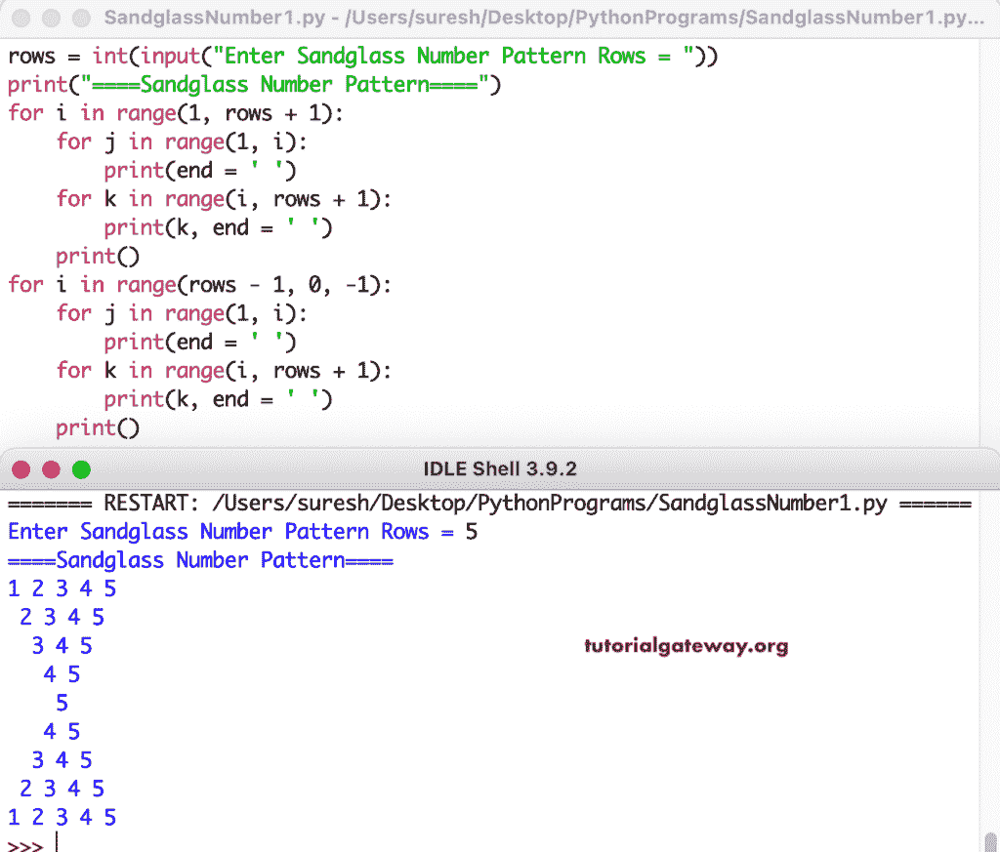

# Python 程序：打印数字的沙漏图案

> 原文：<https://www.tutorialgateway.org/python-program-to-print-sandglass-number-pattern/>

写一个 Python 程序打印数字的沙漏图案用于循环。

```py
rows = int(input("Enter Sandglass Number Pattern Rows = "))

print("====Sandglass Number Pattern====")

for i in range(1, rows + 1):
    for j in range(1, i):
        print(end = ' ')
    for k in range(i, rows + 1):
        print(k, end = ' ')                
    print()

for i in range(rows - 1, 0, -1):
    for j in range(1, i):
        print(end = ' ')
    for k in range(i, rows + 1):
        print(k, end = ' ')      
    print()
```



这个 [Python 示例](https://www.tutorialgateway.org/python-programming-examples/)使用 while 循环以沙漏模式打印数字。

```py
rows = int(input("Enter Sandglass Number Pattern Rows = "))

print("====Sandglass Number Pattern====")
i = 1
while(i <= rows):
    j = 1
    while(j < i):
        print(end = ' ')
        j = j + 1
    k = i
    while(k <= rows):
        print(k, end = ' ')
        k = k + 1
    print()
    i = i + 1

i = rows - 1
while(i >= 1):
    j = 1
    while(j < i):
        print(end = ' ')
        j = j + 1
    k = i
    while(k <= rows):
        print(k, end = ' ')
        k = k + 1   
    print()
    i = i - 1
```

```py
Enter Sandglass Number Pattern Rows = 10
====Sandglass Number Pattern====
1 2 3 4 5 6 7 8 9 10 
 2 3 4 5 6 7 8 9 10 
  3 4 5 6 7 8 9 10 
   4 5 6 7 8 9 10 
    5 6 7 8 9 10 
     6 7 8 9 10 
      7 8 9 10 
       8 9 10 
        9 10 
         10 
        9 10 
       8 9 10 
      7 8 9 10 
     6 7 8 9 10 
    5 6 7 8 9 10 
   4 5 6 7 8 9 10 
  3 4 5 6 7 8 9 10 
 2 3 4 5 6 7 8 9 10 
1 2 3 4 5 6 7 8 9 10 
```