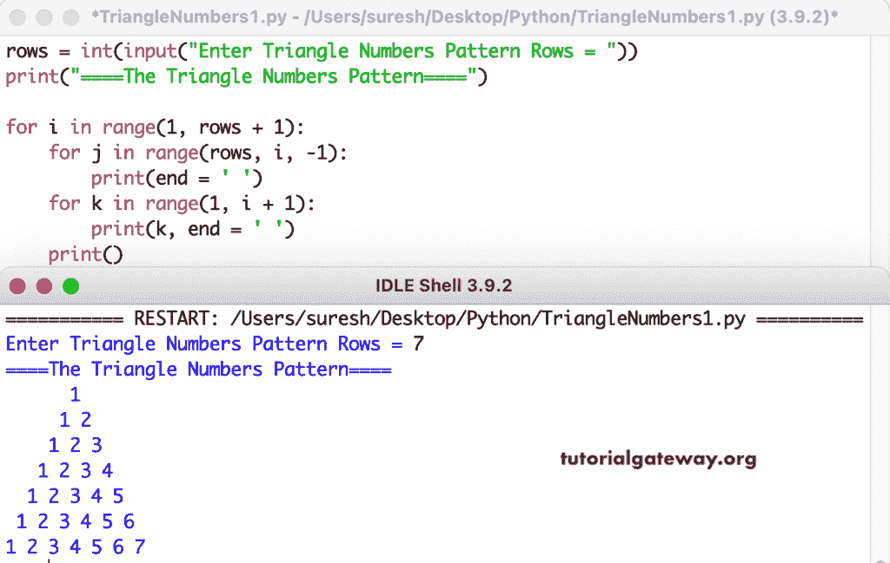

# Python 程序：打印数字的三角形图案

> 原文：<https://www.tutorialgateway.org/python-program-to-print-triangle-numbers-pattern/>

编写一个 Python 程序，使用 for 循环打印三角形数字图案。

```py
rows = int(input("Enter Triangle Numbers Pattern Rows = "))

print("====The Triangle Numbers Pattern====")

for i in range(1, rows + 1):
    for j in range(rows, i, -1):
        print(end = ' ')
    for k in range(1, i + 1):
        print(k, end = ' ')
    print()

```



这个 [Python 示例](https://www.tutorialgateway.org/python-programming-examples/)使用 while 循环打印数字的三角形模式。

```py
rows = int(input("Enter Triangle Numbers Pattern Rows = "))

print("====The Triangle Numbers Pattern====")
i = 1

while(i <= rows):
    j = rows
    while(j > i):
        print(end = ' ')
        j = j - 1
    k = 1
    while(k <= i):
        print(k, end = ' ')
        k = k + 1
    print()
    i = i + 1

```

```py
Enter Triangle Numbers Pattern Rows = 9
====The Triangle Numbers Pattern====
        1 
       1 2 
      1 2 3 
     1 2 3 4 
    1 2 3 4 5 
   1 2 3 4 5 6 
  1 2 3 4 5 6 7 
 1 2 3 4 5 6 7 8 
1 2 3 4 5 6 7 8 9 
```