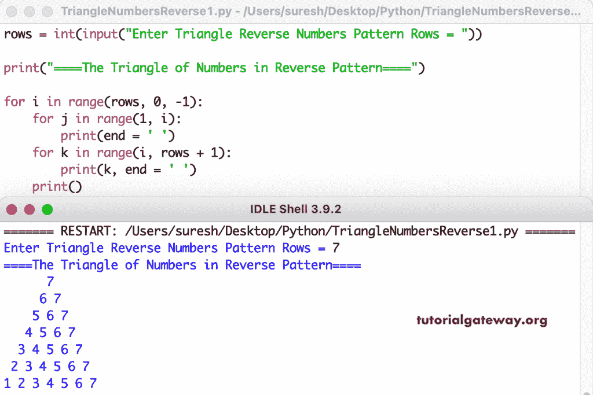

# Python 程序：打印倒三角数字

> 原文：<https://www.tutorialgateway.org/python-program-to-print-triangle-of-numbers-in-reverse-pattern/>

编写一个 Python 程序，使用 for 循环以反向模式打印数字三角形。

```py
rows = int(input("Enter Triangle Reverse Numbers Pattern Rows = "))

print("====The Triangle of Numbers in Reverse Pattern====")

for i in range(rows, 0, -1):
    for j in range(1, i):
        print(end = ' ')
    for k in range(i, rows + 1):
        print(k, end = ' ')
    print()
```



这个 [Python 示例](https://www.tutorialgateway.org/python-programming-examples/)使用 while 循环以降序或逆序打印数字的三角形模式。

```py
rows = int(input("Enter Triangle Reverse Numbers Pattern Rows = "))

print("====The Triangle of Numbers in Reverse Pattern====")
i = rows

while(i >= 1):
    j = 1
    while(j < i):
        print(end = ' ')
        j = j + 1
    k = i
    while(k <= rows):
        print(k, end = ' ')
        k = k + 1
    print()
    i = i - 1
```

```py
Enter Triangle Reverse Numbers Pattern Rows = 9
====The Triangle of Numbers in Reverse Pattern====
        9 
       8 9 
      7 8 9 
     6 7 8 9 
    5 6 7 8 9 
   4 5 6 7 8 9 
  3 4 5 6 7 8 9 
 2 3 4 5 6 7 8 9 
1 2 3 4 5 6 7 8 9 
```