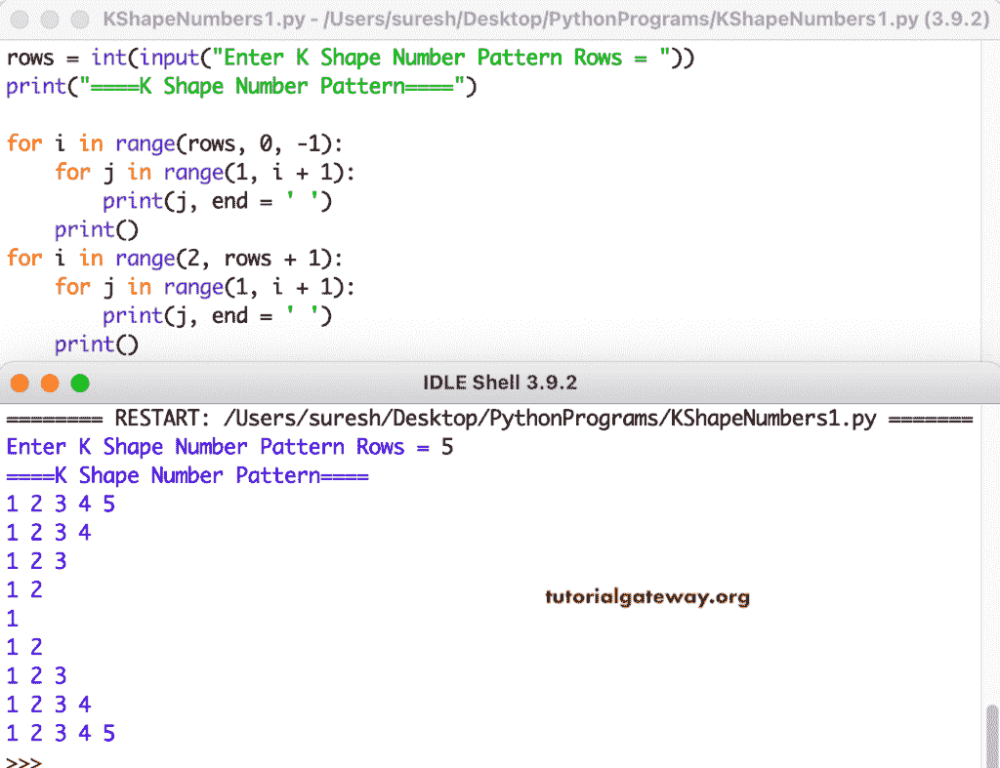

# Python 程序：打印数字的`K`形图案

> 原文：<https://www.tutorialgateway.org/python-program-to-print-k-shape-number-pattern/>

编写一个 Python 程序，使用 for 循环打印数字的 K 形图案。

```py
rows = int(input("Enter K Shape Number Pattern Rows = "))

print("====K Shape Number Pattern====")

for i in range(rows, 0, -1):
    for j in range(1, i + 1):
        print(j, end = ' ')
    print()

for i in range(2, rows + 1):
    for j in range(1, i + 1):
        print(j, end = ' ')
    print()
```



这个 [Python 示例](https://www.tutorialgateway.org/python-programming-examples/)使用 while 循环打印数字的一个 K 形图案。

```py
rows = int(input("Enter K Shape Number Pattern Rows = "))

print("====K Shape Number Pattern====")
i = rows

while(i >= 1):
    j = 1
    while(j <= i):
        print(j, end = ' ')
        j = j + 1
    print()
    i = i - 1

i = 2
while(i <= rows ):
    j = 1
    while(j <= i):
        print(j, end = ' ')
        j = j + 1
    print()
    i = i + 1
```

```py
Enter K Shape Number Pattern Rows = 9
====K Shape Number Pattern====
1 2 3 4 5 6 7 8 9 
1 2 3 4 5 6 7 8 
1 2 3 4 5 6 7 
1 2 3 4 5 6 
1 2 3 4 5 
1 2 3 4 
1 2 3 
1 2 
1 
1 2 
1 2 3 
1 2 3 4 
1 2 3 4 5 
1 2 3 4 5 6 
1 2 3 4 5 6 7 
1 2 3 4 5 6 7 8 
1 2 3 4 5 6 7 8 9 
```