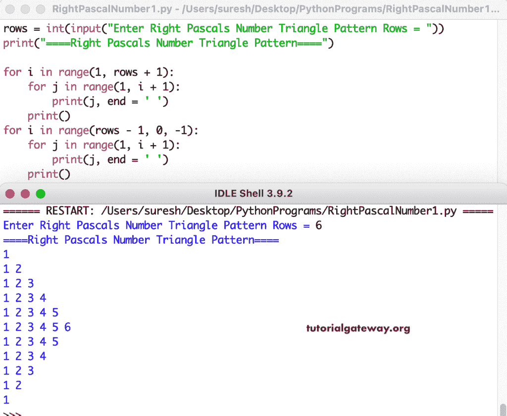

# Python 程序：打印数字的右帕斯卡三角形

> 原文：<https://www.tutorialgateway.org/python-program-to-print-right-pascals-number-triangle/>

编写一个 Python 程序，使用 for 循环打印右帕斯卡数字三角形。

```py
rows = int(input("Enter Right Pascals Number Triangle Pattern Rows = "))

print("====Right Pascals Number Triangle Pattern====")

for i in range(1, rows + 1):
    for j in range(1, i + 1):
        print(j, end = ' ')
    print()

for i in range(rows - 1, 0, -1):
    for j in range(1, i + 1):
        print(j, end = ' ')
    print()
```



这个 Python 例子使用 while 循环打印数字的右帕斯卡三角形。

```py
rows = int(input("Enter Right Pascals Number Triangle Pattern Rows = "))

print("====Right Pascals Number Triangle Pattern====")
i = 1

while(i <= rows):
    j = 1
    while(j <= i):
        print(j, end = ' ')
        j = j + 1
    print()
    i = i + 1

i = rows - 1
while(i >= 1):
    j = 1
    while(j <= i):
        print(j, end = ' ')
        j = j + 1
    print()
    i = i - 1
```

```py
Enter Right Pascals Number Triangle Pattern Rows = 10
====Right Pascals Number Triangle Pattern====
1 
1 2 
1 2 3 
1 2 3 4 
1 2 3 4 5 
1 2 3 4 5 6 
1 2 3 4 5 6 7 
1 2 3 4 5 6 7 8 
1 2 3 4 5 6 7 8 9 
1 2 3 4 5 6 7 8 9 10 
1 2 3 4 5 6 7 8 9 
1 2 3 4 5 6 7 8 
1 2 3 4 5 6 7 
1 2 3 4 5 6 
1 2 3 4 5 
1 2 3 4 
1 2 3 
1 2 
1
```