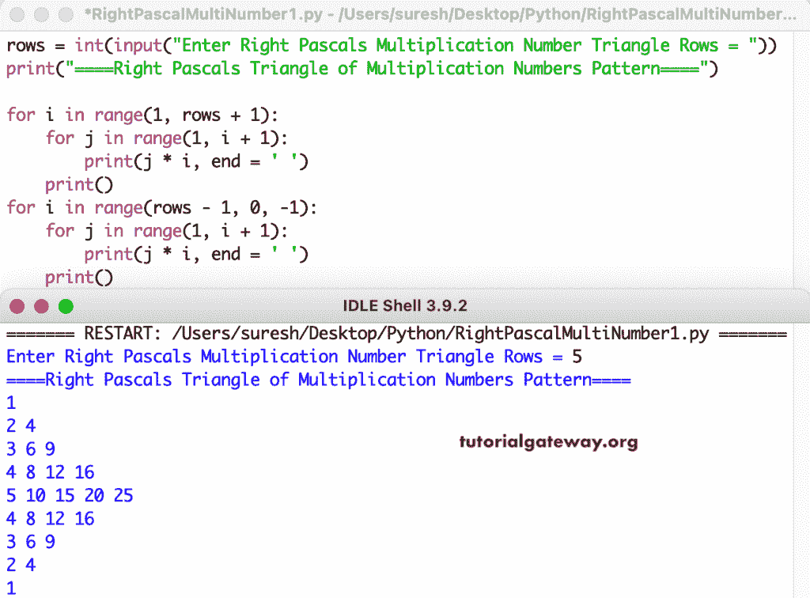

# Python 程序：打印乘法数字图案的直角三角形

> 原文：<https://www.tutorialgateway.org/python-program-to-print-right-pascals-triangle-of-multiplication-numbers-pattern/>

编写一个 Python 程序，使用 for 循环打印乘法数字的右帕斯卡三角形模式。

```py
rows = int(input("Enter Right Pascals Multiplication Number Triangle Rows = "))

print("====Right Pascals Triangle of Multiplication Numbers Pattern====")

for i in range(1, rows + 1):
    for j in range(1, i + 1):
        print(j * i, end = ' ')
    print()

for i in range(rows - 1, 0, -1):
    for j in range(1, i + 1):
        print(j * i, end = ' ')
    print()
```



这个 [Python 示例](https://www.tutorialgateway.org/python-programming-examples/)使用 while 循环打印乘法数字的右帕斯卡三角形模式。

```py
rows = int(input("Enter Right Pascals Multiplication Number Triangle Rows = "))

print("====Right Pascals Triangle of Multiplication Numbers Pattern====")
i = 1

while(i <= rows):
    j = 1
    while(j <= i):
        print(i * j, end = ' ')
        j = j + 1
    print()
    i = i + 1

i = rows - 1
while(i >= 1):
    j = 1
    while(j <= i):
        print(i * j, end = ' ')
        j = j + 1
    print()
    i = i - 1
```

```py
Enter Right Pascals Multiplication Number Triangle Rows = 12
====Right Pascals Triangle of Multiplication Numbers Pattern====
1 
2 4 
3 6 9 
4 8 12 16 
5 10 15 20 25 
6 12 18 24 30 36 
7 14 21 28 35 42 49 
8 16 24 32 40 48 56 64 
9 18 27 36 45 54 63 72 81 
10 20 30 40 50 60 70 80 90 100 
11 22 33 44 55 66 77 88 99 110 121 
12 24 36 48 60 72 84 96 108 120 132 144 
11 22 33 44 55 66 77 88 99 110 121 
10 20 30 40 50 60 70 80 90 100 
9 18 27 36 45 54 63 72 81 
8 16 24 32 40 48 56 64 
7 14 21 28 35 42 49 
6 12 18 24 30 36 
5 10 15 20 25 
4 8 12 16 
3 6 9 
2 4 
1 
```