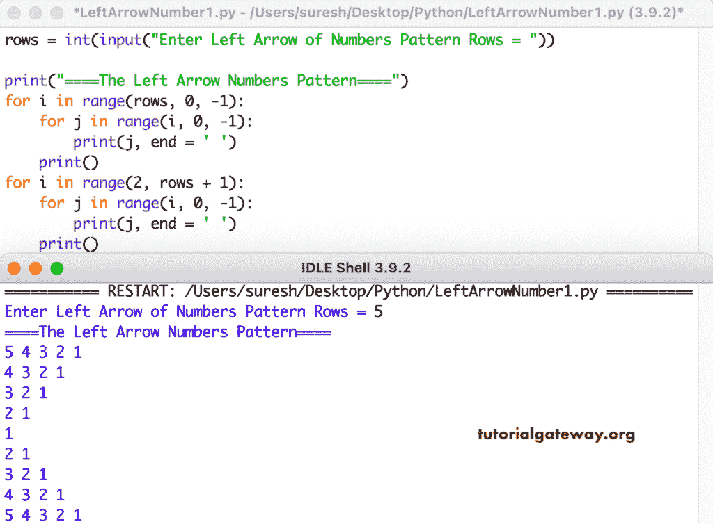

# Python 程序：打印数字的左箭头图案

> 原文：<https://www.tutorialgateway.org/python-program-to-print-left-arrow-numbers-pattern/>

编写一个 Python 程序，使用 for 循环打印左箭头数字图案。

```py
rows = int(input("Enter Left Arrow of Numbers Pattern Rows = "))

print("====The Left Arrow Numbers Pattern====")

for i in range(rows, 0, -1):
    for j in range(i, 0, -1):
        print(j, end = ' ')
    print()

for i in range(2, rows + 1):
    for j in range(i, 0, -1):
        print(j, end = ' ')
    print()
```



这个 [Python 示例](https://www.tutorialgateway.org/python-programming-examples/)使用 while 循环打印数字图案的左箭头。

```py
rows = int(input("Enter Left Arrow of Numbers Pattern Rows = "))

print("====The Left Arrow Numbers Pattern====")
i = rows

while(i >= 1):
    j = i
    while(j >= 1):
        print(j, end = ' ')
        j = j - 1
    print()
    i = i - 1

i = 2   
while(i <= rows):
    j = i
    while(j >= 1):
        print(j, end = ' ')
        j = j - 1
    print()
    i = i + 1
```

```py
Enter Left Arrow of Numbers Pattern Rows = 12
====The Left Arrow Numbers Pattern====
12 11 10 9 8 7 6 5 4 3 2 1 
11 10 9 8 7 6 5 4 3 2 1 
10 9 8 7 6 5 4 3 2 1 
9 8 7 6 5 4 3 2 1 
8 7 6 5 4 3 2 1 
7 6 5 4 3 2 1 
6 5 4 3 2 1 
5 4 3 2 1 
4 3 2 1 
3 2 1 
2 1 
1 
2 1 
3 2 1 
4 3 2 1 
5 4 3 2 1 
6 5 4 3 2 1 
7 6 5 4 3 2 1 
8 7 6 5 4 3 2 1 
9 8 7 6 5 4 3 2 1 
10 9 8 7 6 5 4 3 2 1 
11 10 9 8 7 6 5 4 3 2 1 
12 11 10 9 8 7 6 5 4 3 2 1 
```