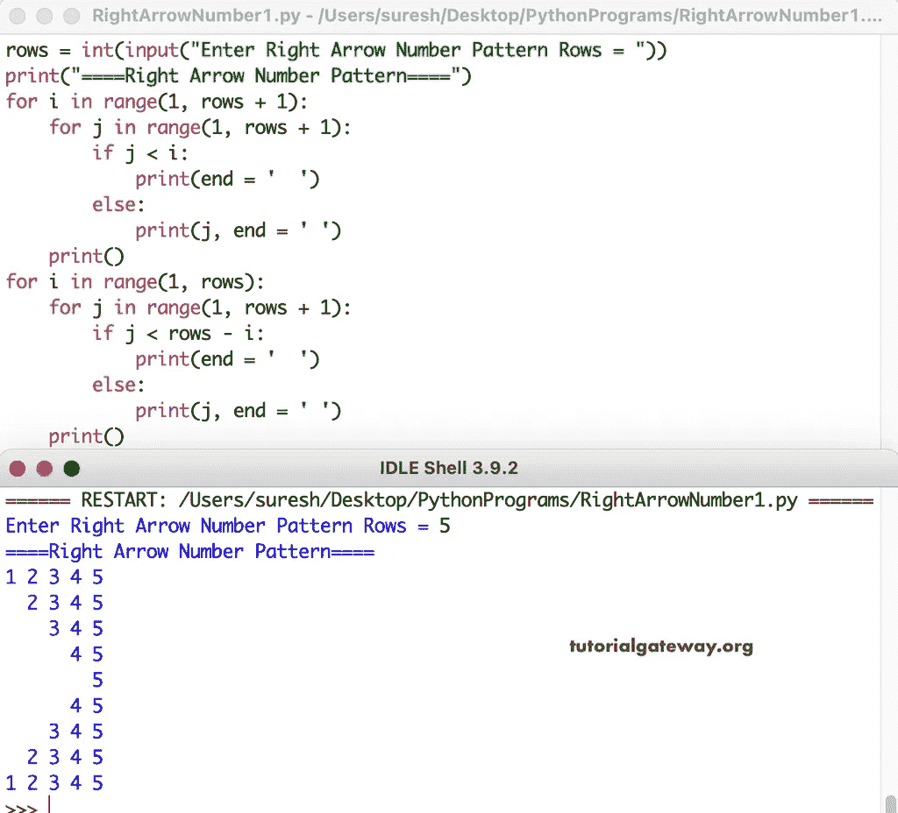

# Python 程序：打印右箭头数字图案

> 原文：<https://www.tutorialgateway.org/python-program-to-print-right-arrow-number-pattern/>

编写一个 Python 程序，使用 for 循环打印右箭头数字模式。

```py
rows = int(input("Enter Right Arrow Number Pattern Rows = "))

print("====Right Arrow Number Pattern====")

for i in range(1, rows + 1):
    for j in range(1, rows + 1):
        if j < i:
            print(end = '  ')
        else:
            print(j, end = ' ')      
    print()

for i in range(1, rows):
    for j in range(1, rows + 1):
        if j < rows - i:
            print(end = '  ')
        else:
            print(j, end = ' ')      
    print()
```



这个 [Python 示例](https://www.tutorialgateway.org/python-programming-examples/)使用 while 循环以右箭头模式打印数字。

```py
rows = int(input("Enter Right Arrow Number Pattern Rows = "))

print("====Right Arrow Number Pattern====")
i = 1

while(i <= rows):
    j = 1
    while(j <= rows):
        if j < i:
            print(end = '  ')
        else:
            print(j, end = ' ') 
        j = j + 1
    print()
    i = i + 1

i = 2
while(i < rows ):
    j = 1
    while(j <= rows):
        if j < rows - i:
            print(end = '  ')
        else:
            print(j, end = ' ') 
        j = j + 1
    print()
    i = i + 1
```

```py
Enter Right Arrow Number Pattern Rows = 8
====Right Arrow Number Pattern====
1 2 3 4 5 6 7 8 
  2 3 4 5 6 7 8 
    3 4 5 6 7 8 
      4 5 6 7 8 
        5 6 7 8 
          6 7 8 
            7 8 
              8 
          6 7 8 
        5 6 7 8 
      4 5 6 7 8 
    3 4 5 6 7 8 
  2 3 4 5 6 7 8 
1 2 3 4 5 6 7 8 
```