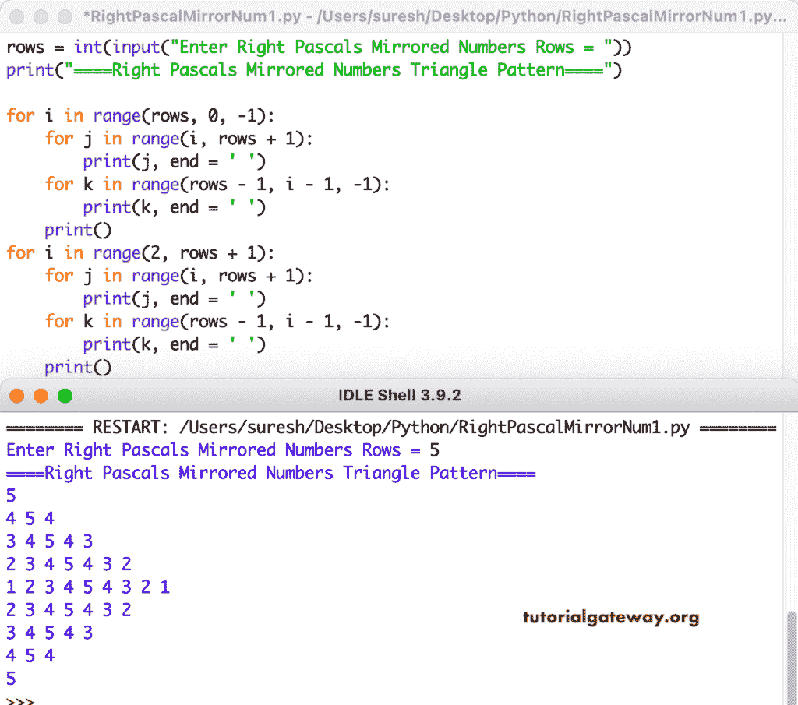

# Python 程序：打印镜像数字的直角三角形图案

> 原文：<https://www.tutorialgateway.org/python-program-to-print-right-pascals-triangle-of-mirrored-numbers-pattern/>

编写一个 Python 程序，使用 for 循环打印镜像数字图案的右帕斯卡三角形。

```py
rows = int(input("Enter Right Pascals Mirrored Numbers Rows = "))

print("====Right Pascals Mirrored Numbers Triangle Pattern====")

for i in range(rows, 0, -1):
    for j in range(i, rows + 1):
        print(j, end = ' ')
    for k in range(rows - 1, i - 1, -1):
        print(k, end = ' ')
    print()

for i in range(2, rows + 1):
    for j in range(i, rows + 1):
        print(j, end = ' ')
    for k in range(rows - 1, i - 1, -1):
        print(k, end = ' ')
    print()
```



这个 Python 程序使用 while 循环打印镜像数字的右帕斯卡三角形图案。

```py
rows = int(input("Enter Right Pascals Mirrored Numbers Rows = "))

print("====Right Pascals Mirrored Numbers Triangle Pattern====")
i = rows

while(i >= 1):
    j = i
    while(j <= rows):
        print(j, end = ' ')
        j = j + 1
    k = rows - 1
    while(k >= i):
        print(k, end = ' ')
        k = k - 1
    print()
    i = i - 1

i = 2    
while(i <= rows):
    j = i
    while(j <= rows):
        print(j, end = ' ')
        j = j + 1
    k = rows - 1
    while(k >= i):
        print(k, end = ' ')
        k = k - 1
    print()
    i = i + 1
```

```py
Enter Right Pascals Mirrored Numbers Rows = 12
====Right Pascals Mirrored Numbers Triangle Pattern====
12 
11 12 11 
10 11 12 11 10 
9 10 11 12 11 10 9 
8 9 10 11 12 11 10 9 8 
7 8 9 10 11 12 11 10 9 8 7 
6 7 8 9 10 11 12 11 10 9 8 7 6 
5 6 7 8 9 10 11 12 11 10 9 8 7 6 5 
4 5 6 7 8 9 10 11 12 11 10 9 8 7 6 5 4 
3 4 5 6 7 8 9 10 11 12 11 10 9 8 7 6 5 4 3 
2 3 4 5 6 7 8 9 10 11 12 11 10 9 8 7 6 5 4 3 2 
1 2 3 4 5 6 7 8 9 10 11 12 11 10 9 8 7 6 5 4 3 2 1 
2 3 4 5 6 7 8 9 10 11 12 11 10 9 8 7 6 5 4 3 2 
3 4 5 6 7 8 9 10 11 12 11 10 9 8 7 6 5 4 3 
4 5 6 7 8 9 10 11 12 11 10 9 8 7 6 5 4 
5 6 7 8 9 10 11 12 11 10 9 8 7 6 5 
6 7 8 9 10 11 12 11 10 9 8 7 6 
7 8 9 10 11 12 11 10 9 8 7 
8 9 10 11 12 11 10 9 8 
9 10 11 12 11 10 9 
10 11 12 11 10 
11 12 11 
12 
```

在这个 Python 模式[示例](https://www.tutorialgateway.org/python-programming-examples/)中，我们使用了 forloopIter 函数来显示右帕斯卡镜像数字三角形。

```py
def forloopIter(rows):
    for j in range(i, rows + 1):
        print(j, end = ' ')
    for k in range(rows - 1, i - 1, -1):
        print(k, end = ' ')

rows = int(input("Enter Right Pascals Mirrored Numbers Rows = "))

print("====Right Pascals Mirrored Numbers Triangle Pattern====")

for i in range(rows, 0, -1):
    forloopIter(rows)
    print()

for i in range(2, rows + 1):
    forloopIter(rows)
    print()
```

```py
Enter Right Pascals Mirrored Numbers Rows = 15
====Right Pascals Mirrored Numbers Triangle Pattern====
15 
14 15 14 
13 14 15 14 13 
12 13 14 15 14 13 12 
11 12 13 14 15 14 13 12 11 
10 11 12 13 14 15 14 13 12 11 10 
9 10 11 12 13 14 15 14 13 12 11 10 9 
8 9 10 11 12 13 14 15 14 13 12 11 10 9 8 
7 8 9 10 11 12 13 14 15 14 13 12 11 10 9 8 7 
6 7 8 9 10 11 12 13 14 15 14 13 12 11 10 9 8 7 6 
5 6 7 8 9 10 11 12 13 14 15 14 13 12 11 10 9 8 7 6 5 
4 5 6 7 8 9 10 11 12 13 14 15 14 13 12 11 10 9 8 7 6 5 4 
3 4 5 6 7 8 9 10 11 12 13 14 15 14 13 12 11 10 9 8 7 6 5 4 3 
2 3 4 5 6 7 8 9 10 11 12 13 14 15 14 13 12 11 10 9 8 7 6 5 4 3 2 
1 2 3 4 5 6 7 8 9 10 11 12 13 14 15 14 13 12 11 10 9 8 7 6 5 4 3 2 1 
2 3 4 5 6 7 8 9 10 11 12 13 14 15 14 13 12 11 10 9 8 7 6 5 4 3 2 
3 4 5 6 7 8 9 10 11 12 13 14 15 14 13 12 11 10 9 8 7 6 5 4 3 
4 5 6 7 8 9 10 11 12 13 14 15 14 13 12 11 10 9 8 7 6 5 4 
5 6 7 8 9 10 11 12 13 14 15 14 13 12 11 10 9 8 7 6 5 
6 7 8 9 10 11 12 13 14 15 14 13 12 11 10 9 8 7 6 
7 8 9 10 11 12 13 14 15 14 13 12 11 10 9 8 7 
8 9 10 11 12 13 14 15 14 13 12 11 10 9 8 
9 10 11 12 13 14 15 14 13 12 11 10 9 
10 11 12 13 14 15 14 13 12 11 10 
11 12 13 14 15 14 13 12 11 
12 13 14 15 14 13 12 
13 14 15 14 13 
14 15 14 
15 
```