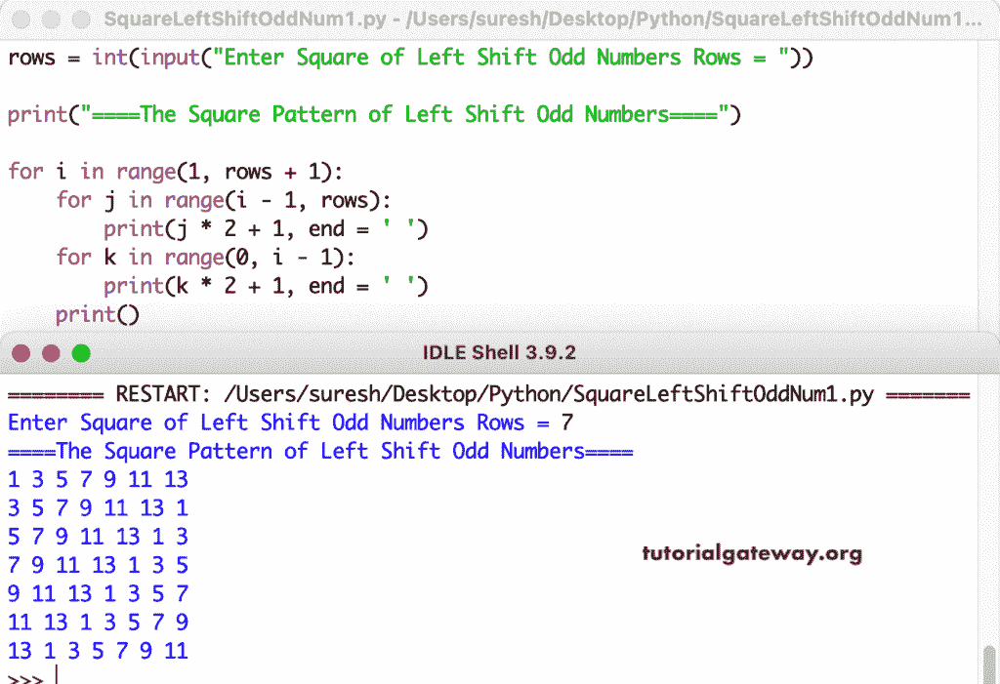

# Python 程序：打印左旋转奇数方形图案

> 原文：<https://www.tutorialgateway.org/python-program-to-print-square-pattern-of-left-rotating-odd-numbers/>

编写一个 Python 程序，使用 for 循环打印左旋转奇数的正方形图案。

```py
rows = int(input("Enter Square of Left Shift Odd Numbers Rows = "))

print("====The Square Pattern of Left Shift Odd Numbers====")

for i in range(1, rows + 1):
    for j in range(i - 1, rows):
        print(j * 2 + 1, end = ' ')
    for k in range(0, i - 1):
        print(k * 2 + 1, end = ' ')
    print()
```



这是编写 Python 程序的另一种方式，打印从上到下左移的奇数的正方形图案。

```py
rows = int(input("Enter Square of Left Shift Odd Numbers Rows = "))

print("====The Square Pattern of Left Shift Odd Numbers====")

for i in range(1, rows + 1):
    j = i * 2 - 1
    for k in range(1, rows + 1):
        print(j, end = ' ')
        j = j + 2
        if j > rows * 2 - 1:
            j = 1
    print()
```

```py
Enter Square of Left Shift Odd Numbers Rows = 9
====The Square Pattern of Left Shift Odd Numbers====
1 3 5 7 9 11 13 15 17 
3 5 7 9 11 13 15 17 1 
5 7 9 11 13 15 17 1 3 
7 9 11 13 15 17 1 3 5 
9 11 13 15 17 1 3 5 7 
11 13 15 17 1 3 5 7 9 
13 15 17 1 3 5 7 9 11 
15 17 1 3 5 7 9 11 13 
17 1 3 5 7 9 11 13 15 
```

本 Python [示例](https://www.tutorialgateway.org/python-programming-examples/)使用 while 循环显示向左旋转或移动的奇数的方形图案。

```py
rows = int(input("Enter Square of Left Shift Odd Numbers Rows = "))

print("====The Square Pattern of Left Shift Odd Numbers====")

i = 1

while(i <= rows):
    j = i - 1
    while(j < rows):
        print(j * 2 + 1, end = ' ')
        j = j + 1
    k = 0
    while(k < i - 1):
        print(k * 2 + 1, end = ' ')
        k = k + 1
    print()
    i = i + 1
```

```py
Enter Square of Left Shift Odd Numbers Rows = 13
====The Square Pattern of Left Shift Odd Numbers====
1 3 5 7 9 11 13 15 17 19 21 23 25 
3 5 7 9 11 13 15 17 19 21 23 25 1 
5 7 9 11 13 15 17 19 21 23 25 1 3 
7 9 11 13 15 17 19 21 23 25 1 3 5 
9 11 13 15 17 19 21 23 25 1 3 5 7 
11 13 15 17 19 21 23 25 1 3 5 7 9 
13 15 17 19 21 23 25 1 3 5 7 9 11 
15 17 19 21 23 25 1 3 5 7 9 11 13 
17 19 21 23 25 1 3 5 7 9 11 13 15 
19 21 23 25 1 3 5 7 9 11 13 15 17 
21 23 25 1 3 5 7 9 11 13 15 17 19 
23 25 1 3 5 7 9 11 13 15 17 19 21 
25 1 3 5 7 9 11 13 15 17 19 21 23 
```