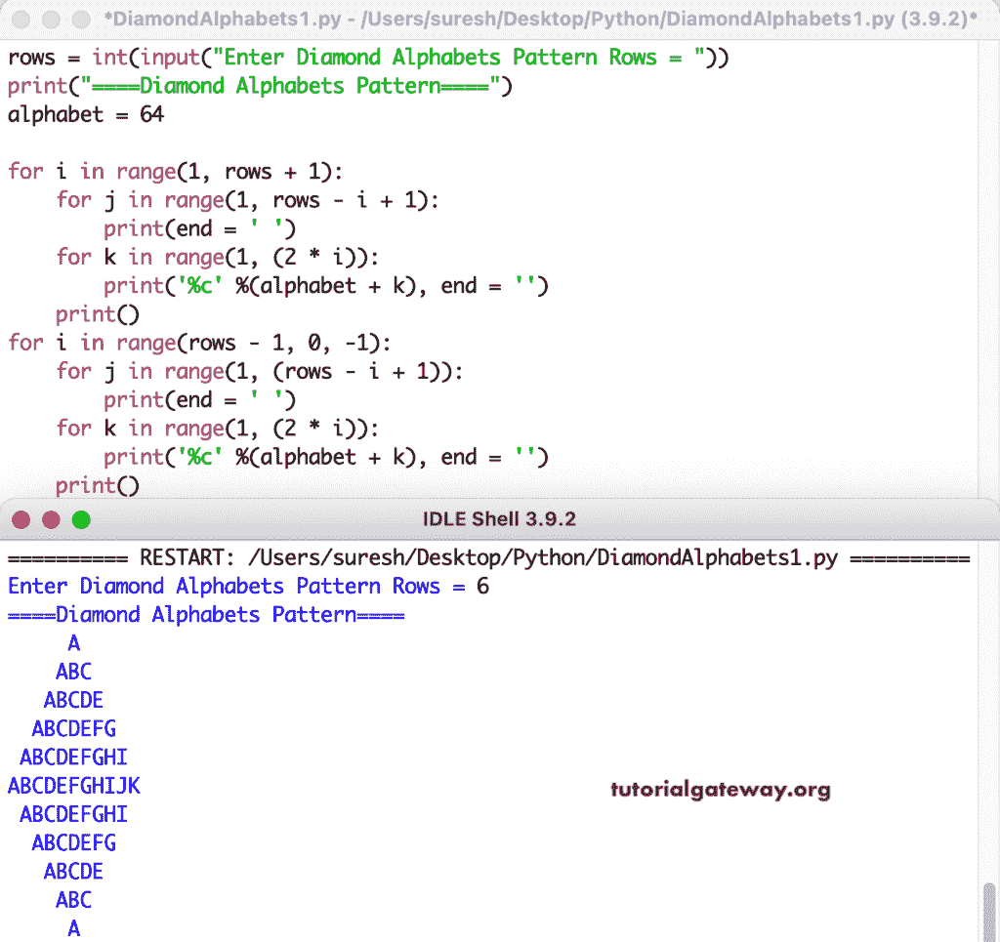

# Python 程序：打印菱形字母图案

> 原文：<https://www.tutorialgateway.org/python-program-to-print-diamond-alphabets-pattern/>

编写一个 Python 程序，使用 for 循环打印菱形字母图案。

```py
rows = int(input("Enter Diamond Alphabets Pattern Rows = "))

print("====Diamond Alphabets Pattern====")
alphabet = 64

for i in range(1, rows + 1):
    for j in range(1, rows - i + 1):
        print(end = ' ')
    for k in range(1, (2 * i)):
        print('%c' %(alphabet + k), end = '')
    print()

for i in range(rows - 1, 0, -1):
    for j in range(1, (rows - i + 1)):
        print(end = ' ')
    for k in range(1, (2 * i)):
        print('%c' %(alphabet + k), end = '')
    print()
```



这是用 Python 编写字母代码菱形模式的另一种方式。

```py
rows = int(input("Enter Diamond Alphabets Pattern Rows = "))

print("====Diamond Alphabets Pattern====")
alphabet = 64

for i in range(1, rows + 1):
    for j in range(1, rows - i + 1):
        print(end = ' ')
    for k in range(i, 0, -1):
        print('%c' %(alphabet + k), end = '')
    for l in range(2, i + 1):
        print('%c' %(alphabet + l), end = '')
    print()

for i in range(rows - 1, 0, -1):
    for j in range(1, (rows - i + 1)):
        print(end = ' ')
    for k in range(i, 0, -1):
        print('%c' %(alphabet + k), end = '')
    for l in range(2, i + 1):
        print('%c' %(alphabet + l), end = '')
    print()
```

```py
Enter Diamond Alphabets Pattern Rows = 8
====Diamond Alphabets Pattern====
       A
      BAB
     CBABC
    DCBABCD
   EDCBABCDE
  FEDCBABCDEF
 GFEDCBABCDEFG
HGFEDCBABCDEFGH
 GFEDCBABCDEFG
  FEDCBABCDEF
   EDCBABCDE
    DCBABCD
     CBABC
      BAB
       A
```

这个 [Python 例子](https://www.tutorialgateway.org/python-programming-examples/)使用 while 循环打印字母的菱形模式。

```py
rows = int(input("Enter Diamond Alphabets Pattern Rows = "))

print("====Diamond Alphabets Pattern====")
alphabet = 64
i = 1

while(i <= rows):
    j = 1
    while(j <=  rows - i):
        print(end = ' ')
        j = j + 1
    k = i
    while(k >= 1):
        print('%c' %(alphabet + k), end = '')
        k = k - 1
    l = 2
    while(l <= i):
        print('%c' %(alphabet + l), end = '')
        l = l + 1
    print()
    i = i + 1

i = rows - 1
while(i > 0):
    j = 1
    while(j <=  rows - i):
        print(end = ' ')
        j = j + 1
    k = i
    while(k >= 1):
        print('%c' %(alphabet + k), end = '')
        k = k - 1
    l = 2
    while(l <= i):
        print('%c' %(alphabet + l), end = '')
        l = l + 1
    print()
    i = i - 1
```

```py
Enter Diamond Alphabets Pattern Rows = 14
====Diamond Alphabets Pattern====
             A
            BAB
           CBABC
          DCBABCD
         EDCBABCDE
        FEDCBABCDEF
       GFEDCBABCDEFG
      HGFEDCBABCDEFGH
     IHGFEDCBABCDEFGHI
    JIHGFEDCBABCDEFGHIJ
   KJIHGFEDCBABCDEFGHIJK
  LKJIHGFEDCBABCDEFGHIJKL
 MLKJIHGFEDCBABCDEFGHIJKLM
NMLKJIHGFEDCBABCDEFGHIJKLMN
 MLKJIHGFEDCBABCDEFGHIJKLM
  LKJIHGFEDCBABCDEFGHIJKL
   KJIHGFEDCBABCDEFGHIJK
    JIHGFEDCBABCDEFGHIJ
     IHGFEDCBABCDEFGHI
      HGFEDCBABCDEFGH
       GFEDCBABCDEFG
        FEDCBABCDEF
         EDCBABCDE
          DCBABCD
           CBABC
            BAB
             A
```