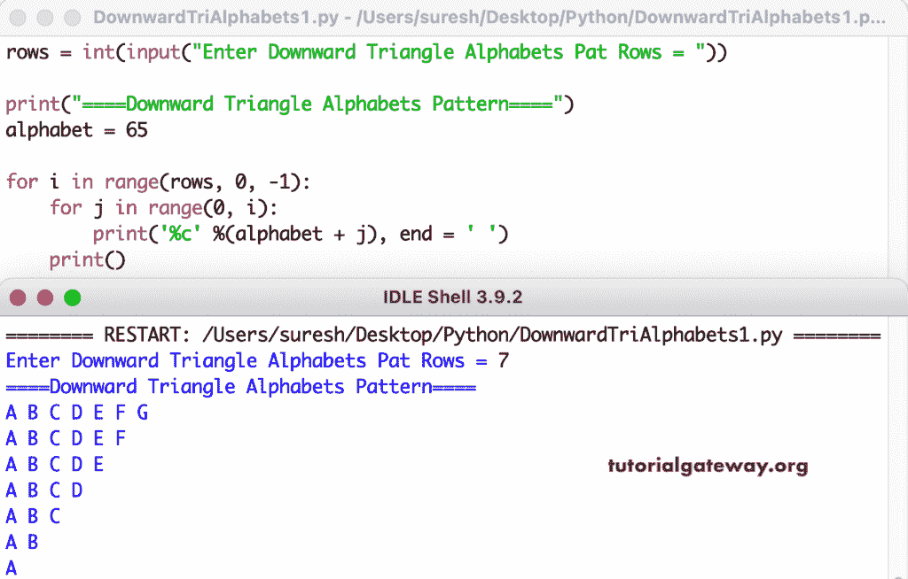

# Python 程序：打印向下三角形字母图案

> 原文：<https://www.tutorialgateway.org/python-program-to-print-downward-triangle-alphabets-pattern/>

编写一个 Python 程序来打印向下的三角形字母图案，用于循环。

```py
rows = int(input("Enter Downward Triangle Alphabets Pat Rows = "))

print("====Downward Triangle Alphabets Pattern====")
alphabet = 65

for i in range(rows, 0, -1):
    for j in range(0, i):
        print('%c' %(alphabet + j), end = ' ')
    print()
```



这个 [Python 示例](https://www.tutorialgateway.org/python-programming-examples/)使用 while 循环打印字母的向下三角形模式。

```py
rows = int(input("Enter Downward Triangle Alphabets Pat Rows = "))

print("====Downward Triangle Alphabets Pattern====")
alphabet = 65
i = rows - 1

while(i >= 0):
    j = 0
    while(j <= i):
        print('%c' %(alphabet + j), end = ' ')
        j = j + 1
    print()
    i = i - 1
```

```py
Enter Downward Triangle Alphabets Pat Rows = 12
====Downward Triangle Alphabets Pattern====
A B C D E F G H I J K L 
A B C D E F G H I J K 
A B C D E F G H I J 
A B C D E F G H I 
A B C D E F G H 
A B C D E F G 
A B C D E F 
A B C D E 
A B C D 
A B C 
A B 
A
```