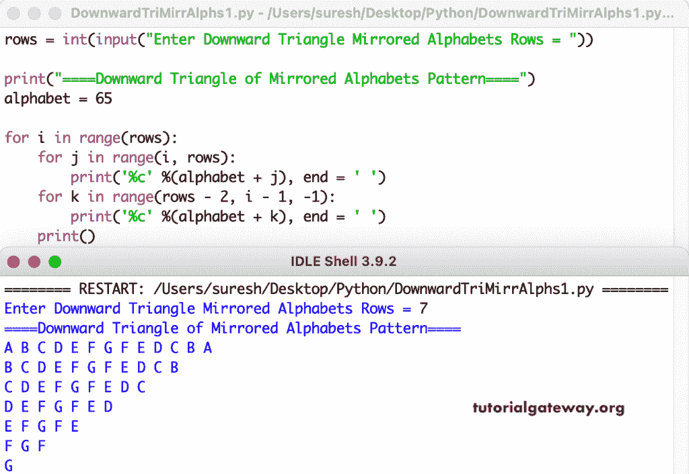

# Python 程序：打印字母的镜像向下三角形图案

> 原文：<https://www.tutorialgateway.org/python-program-to-print-downward-triangle-mirrored-alphabets-pattern/>

编写一个 Python 程序，使用 for 循环打印字母的向下的三角形镜像图案。

```py
rows = int(input("Enter Downward Triangle Mirrored Alphabets Rows = "))

print("====Downward Triangle of Mirrored Alphabets Pattern====")
alphabet = 65

for i in range(rows):
    for j in range(i, rows):
        print('%c' %(alphabet + j), end = ' ')
    for k in range(rows - 2, i - 1, -1):
        print('%c' %(alphabet + k), end = ' ')       
    print()
```



这个 [Python 示例](https://www.tutorialgateway.org/python-programming-examples/)使用 while 循环打印镜像字母的向下三角形模式。

```py
rows = int(input("Enter Downward Triangle Mirrored Alphabets Rows = "))

print("====Downward Triangle of Mirrored Alphabets Pattern====")
alphabet = 65
i = 0

while(i < rows):
    j = i
    while(j < rows):
        print('%c' %(alphabet + j), end = ' ')
        j = j + 1
    k = rows - 2
    while(k >= i):
        print('%c' %(alphabet + k), end = ' ')
        k = k - 1
    print()
    i = i + 1
```

```py
Enter Downward Triangle Mirrored Alphabets Rows = 14
====Downward Triangle of Mirrored Alphabets Pattern====
A B C D E F G H I J K L M N M L K J I H G F E D C B A 
B C D E F G H I J K L M N M L K J I H G F E D C B 
C D E F G H I J K L M N M L K J I H G F E D C 
D E F G H I J K L M N M L K J I H G F E D 
E F G H I J K L M N M L K J I H G F E 
F G H I J K L M N M L K J I H G F 
G H I J K L M N M L K J I H G 
H I J K L M N M L K J I H 
I J K L M N M L K J I 
J K L M N M L K J 
K L M N M L K 
L M N M L 
M N M 
N 
```