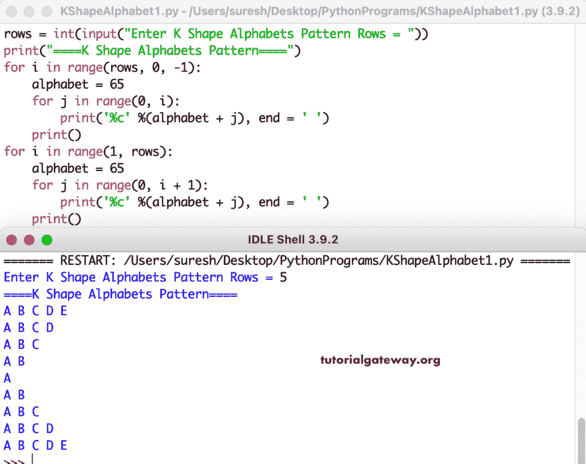

# Python 程序：打印字母的`K`形图案

> 原文：<https://www.tutorialgateway.org/python-program-to-print-k-shape-alphabets-pattern/>

编写一个 Python 程序来打印字母的用于循环的`K`形图案。

```py
rows = int(input("Enter K Shape Alphabets Pattern Rows = "))

print("====K Shape Alphabets Pattern====")

for i in range(rows, 0, -1):
    alphabet = 65
    for j in range(0, i):
        print('%c' %(alphabet + j), end = ' ')
    print()

for i in range(1, rows):
    alphabet = 65
    for j in range(0, i + 1):
        print('%c' %(alphabet + j), end = ' ')
    print()
```



这个 [Python 示例](https://www.tutorialgateway.org/python-programming-examples/)使用 while 循环打印以`K`形模式排列的字母。

```py
rows = int(input("Enter K Shape Alphabets Pattern Rows = "))

print("====K Shape Alphabets Pattern====")

i = rows - 1
while(i >= 0):
    alphabet = 65
    j = 0
    while(j <= i):
        print('%c' %(alphabet + j), end = ' ')
        j = j + 1
    print()
    i = i - 1

i = 1
while(i < rows):
    alphabet = 65
    j = 0
    while(j <= i):
        print('%c' %(alphabet + j), end = ' ')
        j = j + 1
    print()
    i = i + 1
```

```py
Enter K Shape Alphabets Pattern Rows = 8
====K Shape Alphabets Pattern====
A B C D E F G H 
A B C D E F G 
A B C D E F 
A B C D E 
A B C D 
A B C 
A B 
A 
A B 
A B C 
A B C D 
A B C D E 
A B C D E F 
A B C D E F G 
A B C D E F G H 
```