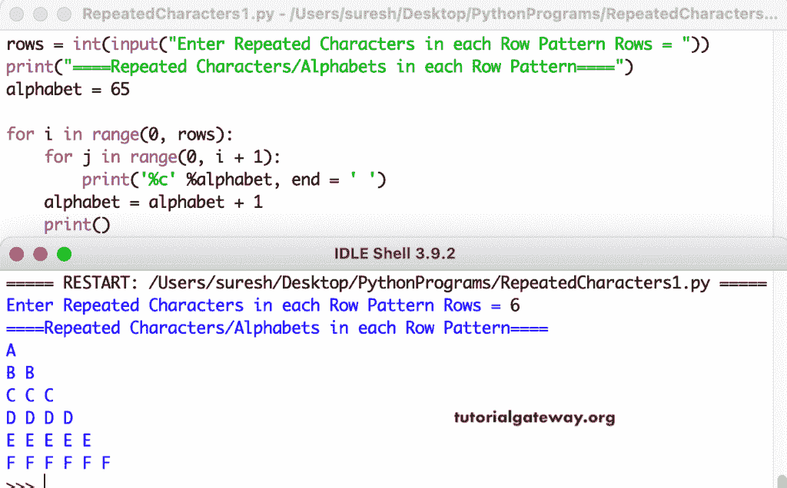

# Python 程序：打印重复字符模式

> 原文：<https://www.tutorialgateway.org/python-program-to-print-repeated-character-pattern/>

编写一个 Python 程序，使用 for 循环在每行中打印字母的重复的字符模式或图案。

```py
rows = int(input("Enter Repeated Characters in each Row Pattern Rows = "))

print("====Repeated Characters/Alphabets in each Row Pattern====")

alphabet = 65

for i in range(0, rows):   
    for j in range(0, i + 1):
        print('%c' %alphabet, end = ' ')
    alphabet = alphabet + 1
    print()
```



这个 [Python 示例](https://www.tutorialgateway.org/python-programming-examples/)使用 while 循环显示每行模式中重复字符的直角三角形模式。

```py
rows = int(input("Enter Repeated Characters in each Row Pattern Rows = "))

print("====Repeated Characters/Alphabets in each Row Pattern====")

alphabet = 65
i = 0

while(i < rows):
    j = 0
    while(j <=  i):
        print('%c' %alphabet, end = ' ')
        j = j + 1
    alphabet = alphabet + 1
    print()
    i = i + 1
```

```py
Enter Repeated Characters in each Row Pattern Rows = 12
====Repeated Characters/Alphabets in each Row Pattern====
A 
B B 
C C C 
D D D D 
E E E E E 
F F F F F F 
G G G G G G G 
H H H H H H H H 
I I I I I I I I I 
J J J J J J J J J J 
K K K K K K K K K K K 
L L L L L L L L L L L L 
```