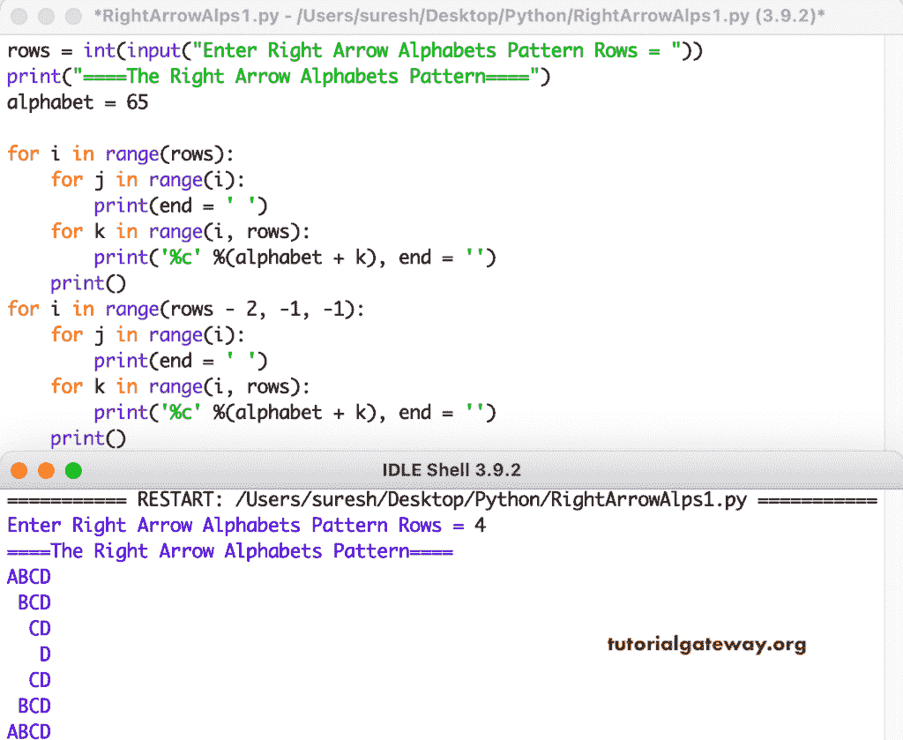

# Python 程序：打印右箭头字母图案

> 原文：<https://www.tutorialgateway.org/python-program-to-print-right-arrow-alphabets-pattern/>

编写一个 Python 程序来打印用于循环的右箭头字母模式。

```py
rows = int(input("Enter Right Arrow Alphabets Pattern Rows = "))

print("====The Right Arrow Alphabets Pattern====")
alphabet = 65

for i in range(rows):
    for j in range(i):
        print(end = ' ')
    for k in range(i, rows):
        print('%c' %(alphabet + k), end = '')
    print()

for i in range(rows - 2, -1, -1):
    for j in range(i):
        print(end = ' ')
    for k in range(i, rows):
        print('%c' %(alphabet + k), end = '')
    print()
```



这个 [Python 示例](https://www.tutorialgateway.org/python-programming-examples/)使用 while 循环打印字母的右箭头模式。

```py
rows = int(input("Enter Right Arrow Alphabets Pattern Rows = "))

print("====The Right Arrow Alphabets Pattern====")
alphabet = 65
i = 0

while(i < rows):
    j = 0
    while(j < i):
        print(end = ' ')
        j = j + 1
    k = i
    while(k < rows):
        print('%c' %(alphabet + k), end = '')
        k = k + 1
    print()
    i = i + 1

i = rows - 2
while(i >= 0):
    j = 0
    while(j < i):
        print(end = ' ')
        j = j + 1
    k = i
    while(k < rows):
        print('%c' %(alphabet + k), end = '')
        k = k + 1
    print()
    i = i - 1
```

```py
Enter Right Arrow Alphabets Pattern Rows = 12
====The Right Arrow Alphabets Pattern====
ABCDEFGHIJKL
 BCDEFGHIJKL
  CDEFGHIJKL
   DEFGHIJKL
    EFGHIJKL
     FGHIJKL
      GHIJKL
       HIJKL
        IJKL
         JKL
          KL
           L
          KL
         JKL
        IJKL
       HIJKL
      GHIJKL
     FGHIJKL
    EFGHIJKL
   DEFGHIJKL
  CDEFGHIJKL
 BCDEFGHIJKL
ABCDEFGHIJKL
```