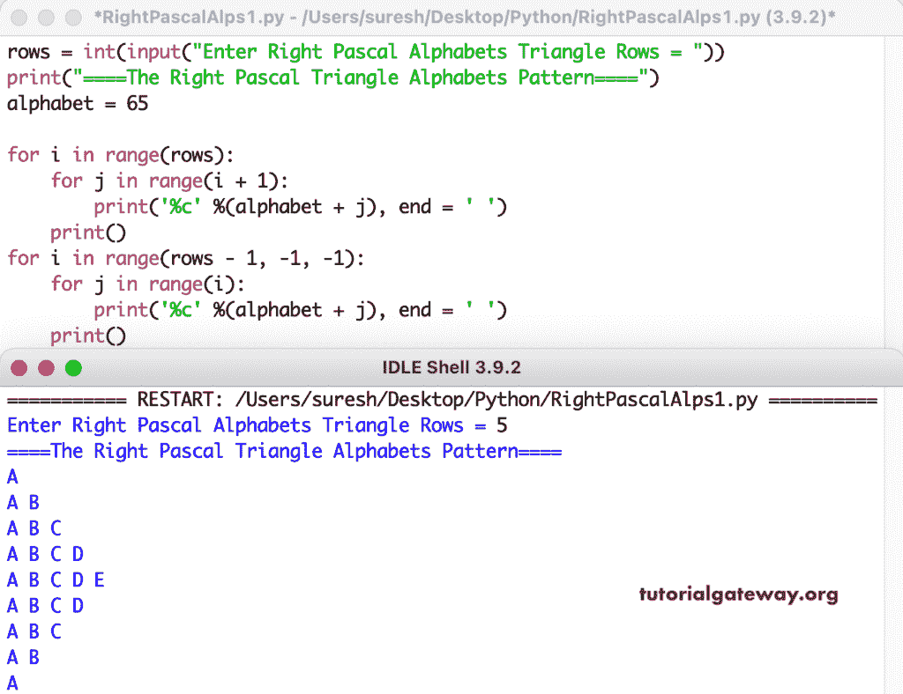

# Python 程序：打印直角三角形字母图案

> 原文：<https://www.tutorialgateway.org/python-program-to-print-right-pascals-triangle-alphabets-pattern/>

编写一个 Python 程序来打印用于循环的直角三角形字母图案。

```py
rows = int(input("Enter Right Pascal Alphabets Triangle Rows = "))

print("====The Right Pascal Triangle Alphabets Pattern====")
alphabet = 65

for i in range(rows):
    for j in range(i + 1):
        print('%c' %(alphabet + j), end = ' ')
    print()

for i in range(rows - 1, -1, -1):
    for j in range(i):
        print('%c' %(alphabet + j), end = ' ')
    print()
```



这个 [Python 示例](https://www.tutorialgateway.org/python-programming-examples/)使用 while 循环打印字母表的右帕斯卡三角形模式。

```py
rows = int(input("Enter Right Pascal Alphabets Triangle Rows = "))

print("====The Right Pascal Triangle Alphabets Pattern====")
alphabet = 65
i = 0

while(i < rows):
    j = 0
    while(j <= i):
        print('%c' %(alphabet + j), end = ' ')
        j = j + 1
    print()
    i = i + 1

i = rows - 1
while(i >= 0):
    j = 0
    while(j < i):
        print('%c' %(alphabet + j), end = ' ')
        j = j + 1
    print()
    i = i - 1
```

```py
Enter Right Pascal Alphabets Triangle Rows = 12
====The Right Pascal Triangle Alphabets Pattern====
A 
A B 
A B C 
A B C D 
A B C D E 
A B C D E F 
A B C D E F G 
A B C D E F G H 
A B C D E F G H I 
A B C D E F G H I J 
A B C D E F G H I J K 
A B C D E F G H I J K L 
A B C D E F G H I J K 
A B C D E F G H I J 
A B C D E F G H I 
A B C D E F G H 
A B C D E F G 
A B C D E F 
A B C D E 
A B C D 
A B C 
A B 
A 
```