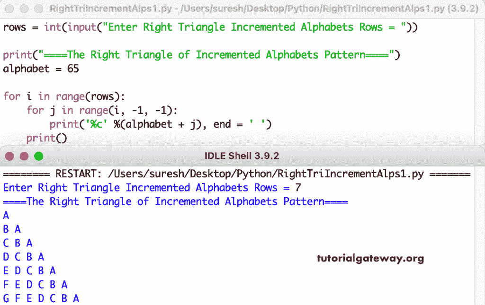

# Python 程序：打印递增字母的直角三角形图案

> 原文：<https://www.tutorialgateway.org/python-program-to-print-right-triangle-of-incremental-alphabets-pattern/>

编写一个 Python 程序来打印字母的用于循环的增量图案的直角三角形。

```py
rows = int(input("Enter Right Triangle Incremented Alphabets Rows = "))

print("====The Right Triangle of Incremented Alphabets Pattern====")
alphabet = 65

for i in range(rows):
    for j in range(i, -1, -1):
        print('%c' %(alphabet + j), end = ' ')
    print()
```



这个 [Python 示例](https://www.tutorialgateway.org/python-programming-examples/)使用 while 循环打印递增字母或升序的直角三角形图案。

```py
rows = int(input("Enter Right Triangle Incremented Alphabets Rows = "))

print("====The Right Triangle of Incremented Alphabets Pattern====")
alphabet = 65
i = 0

while(i < rows):
    j = i
    while(j >= 0):
        print('%c' %(alphabet + j), end = ' ')
        j = j - 1
    print()
    i = i + 1
```

```py
Enter Right Triangle Incremented Alphabets Rows = 12
====The Right Triangle of Incremented Alphabets Pattern====
A 
B A 
C B A 
D C B A 
E D C B A 
F E D C B A 
G F E D C B A 
H G F E D C B A 
I H G F E D C B A 
J I H G F E D C B A 
K J I H G F E D C B A 
L K J I H G F E D C B A 
```