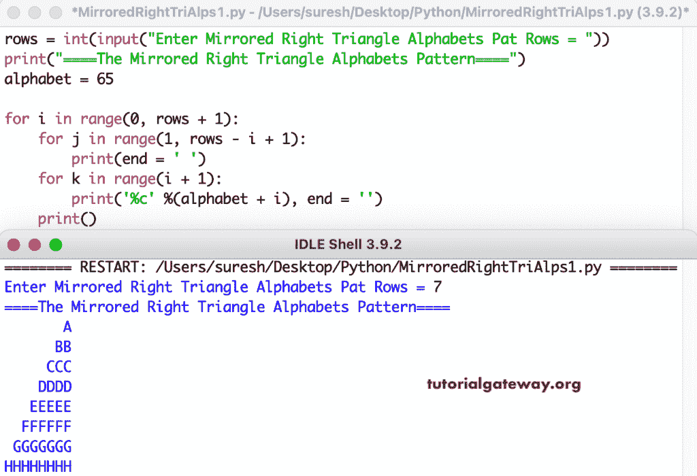

# Python 程序：打印字母的镜像直角三角形图案

> 原文：<https://www.tutorialgateway.org/python-program-to-print-mirrored-right-triangle-alphabets-pattern/>

编写一个 Python 程序来打印字母的用于循环的镜像直角三角形图案。

```py
rows = int(input("Enter Mirrored Right Triangle Alphabets Pat Rows = "))

print("====The Mirrored Right Triangle Alphabets Pattern====")
alphabet = 65

for i in range(0, rows + 1):
    for j in range(1, rows - i + 1):
        print(end = ' ')
    for k in range(i + 1):
        print('%c' %(alphabet + i), end = '')
    print()
```



这个 [Python 示例](https://www.tutorialgateway.org/python-programming-examples/)使用 while 循环打印字母图案的镜像直角三角形。

```py
rows = int(input("Enter Mirrored Right Triangle Alphabets Pat Rows = "))

print("====The Mirrored Right Triangle Alphabets Pattern====")
alphabet = 65
i = 0

while(i <= rows):
    j = 1
    while(j <= rows - i):
        print(end = ' ')
        j = j + 1
    k = 0
    while(k <= i):
        print('%c' %(alphabet + i), end = '')
        k = k + 1
    print()
    i = i + 1
```

```py
Enter Mirrored Right Triangle Alphabets Pat Rows = 13
====The Mirrored Right Triangle Alphabets Pattern====
             A
            BB
           CCC
          DDDD
         EEEEE
        FFFFFF
       GGGGGGG
      HHHHHHHH
     IIIIIIIII
    JJJJJJJJJJ
   KKKKKKKKKKK
  LLLLLLLLLLLL
 MMMMMMMMMMMMM
NNNNNNNNNNNNNN
```