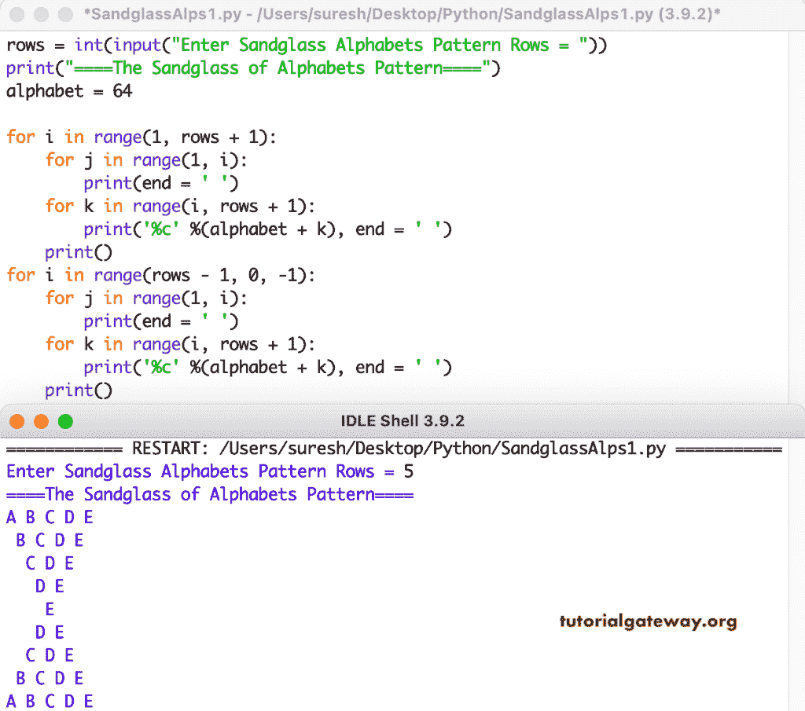

# Python 程序：打印字母的沙漏图案

> 原文：<https://www.tutorialgateway.org/python-program-to-print-sandglass-alphabets-pattern/>

编写一个 Python 程序来打印字母的沙漏图案，用于循环。

```py
rows = int(input("Enter Sandglass Alphabets Pattern Rows = "))

print("====The Sandglass of Alphabets Pattern====")
alphabet = 64

for i in range(1, rows + 1):
    for j in range(1, i):
        print(end = ' ')
    for k in range(i, rows + 1):
        print('%c' %(alphabet + k), end = ' ')
    print()

for i in range(rows - 1, 0, -1):
    for j in range(1, i):
        print(end = ' ')
    for k in range(i, rows + 1):
        print('%c' %(alphabet + k), end = ' ')
    print()
```



这个 [Python 程序](https://www.tutorialgateway.org/python-programming-examples/)使用 while 循环显示字母的沙漏模式。

```py
rows = int(input("Enter Sandglass Alphabets Pattern Rows = "))

print("====The Sandglass of Alphabets Pattern====")
alphabet = 64
i = 1

while(i <= rows):
    j = 1
    while(j < i):
        print(end = ' ')
        j = j + 1
    k = i
    while(k <= rows):
        print('%c' %(alphabet + k), end = ' ')
        k = k + 1
    print()
    i = i + 1

i = rows - 1
while(i >= 1):
    j = 1
    while(j < i):
        print(end = ' ')
        j = j + 1
    k = i
    while(k <= rows):
        print('%c' %(alphabet + k), end = ' ')
        k = k + 1
    print()
    i = i - 1
```

```py
Enter Sandglass Alphabets Pattern Rows = 11
====The Sandglass of Alphabets Pattern====
A B C D E F G H I J K 
 B C D E F G H I J K 
  C D E F G H I J K 
   D E F G H I J K 
    E F G H I J K 
     F G H I J K 
      G H I J K 
       H I J K 
        I J K 
         J K 
          K 
         J K 
        I J K 
       H I J K 
      G H I J K 
     F G H I J K 
    E F G H I J K 
   D E F G H I J K 
  C D E F G H I J K 
 B C D E F G H I J K 
A B C D E F G H I J K 
```