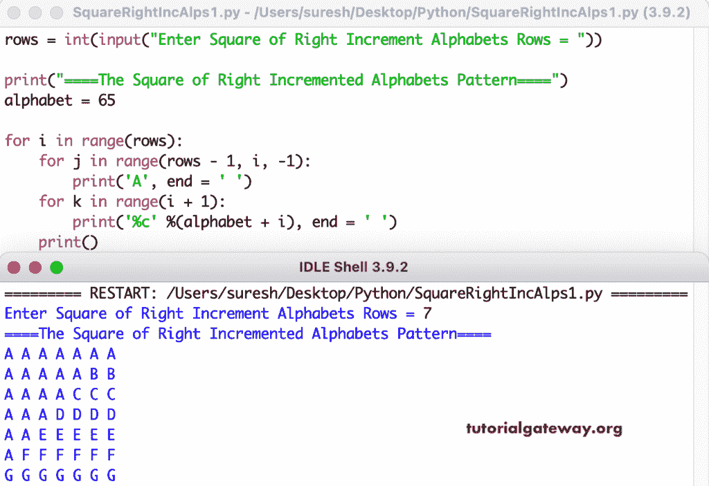

# Python 程序：打印右递增字母的方形图案

> 原文：<https://www.tutorialgateway.org/python-program-to-print-square-of-right-increment-alphabets-pattern/>

编写一个 Python 程序来打印字母的用于循环的直角增量图案。

```py
rows = int(input("Enter Square of Right Increment Alphabets Rows = "))

print("====The Square of Right Incremented Alphabets Pattern====")
alphabet = 65

for i in range(rows):
    for j in range(rows - 1, i, -1):
        print('A', end = ' ')
    for k in range(i + 1):
        print('%c' %(alphabet + i), end = ' ')
    print()
```



这个 [Python 程序](https://www.tutorialgateway.org/python-programming-examples/)使用 while 循环从右侧打印增量字母的正方形模式。

```py
rows = int(input("Enter Square of Right Increment Alphabets Rows = "))

print("====The Square of Right Incremented Alphabets Pattern====")
alphabet = 65
i = 0

while(i < rows):
    j = rows - 1
    while(j > i):
        print('A', end = ' ')
        j = j - 1
    k = 0
    while(k <= i):
        print('%c' %(alphabet + i), end = ' ')
        k = k + 1
    print()
    i = i + 1
```

```py
Enter Square of Right Increment Alphabets Rows = 12
====The Square of Right Incremented Alphabets Pattern====
A A A A A A A A A A A A 
A A A A A A A A A A B B 
A A A A A A A A A C C C 
A A A A A A A A D D D D 
A A A A A A A E E E E E 
A A A A A A F F F F F F 
A A A A A G G G G G G G 
A A A A H H H H H H H H 
A A A I I I I I I I I I 
A A J J J J J J J J J J 
A K K K K K K K K K K K 
L L L L L L L L L L L L 
```