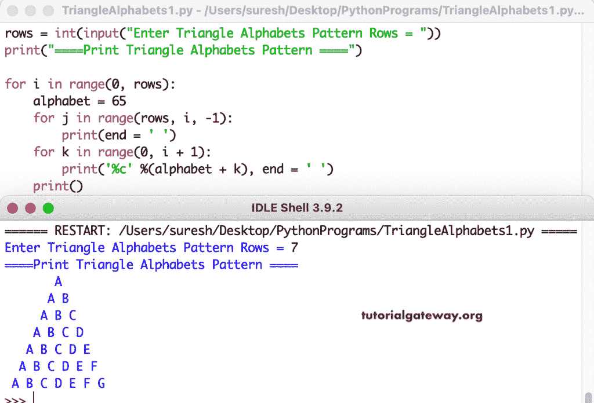

# Python 程序：打印字母的三角形图案

> 原文：<https://www.tutorialgateway.org/python-program-to-print-triangle-alphabets-pattern/>

编写一个 Python 程序来打印字母的用于循环的三角形图案。

```py
rows = int(input("Enter Triangle Alphabets Pattern Rows = "))

print("====Print Triangle Alphabets Pattern ====")

for i in range(0, rows):
    alphabet = 65
    for j in range(rows, i, -1):
        print(end = ' ')
    for k in range(0, i + 1):
        print('%c' %(alphabet + k), end = ' ')
    print()
```



这个 [Python 示例](https://www.tutorialgateway.org/python-programming-examples/)使用 while 循环以三角形图案显示字母。

```py
rows = int(input("Enter Triangle Alphabets Pattern Rows = "))

print("====Print Triangle Alphabets Pattern ====")

i = 0

while(i < rows):
    alphabet = 65
    j = rows
    while(j > i):
        print(end = ' ')
        j = j - 1
    k = 0
    while(k <= i):
        print('%c' %(alphabet + k), end = ' ')
        k = k + 1
    print()
    i = i + 1
```

```py
Enter Triangle Alphabets Pattern Rows = 10
====Print Triangle Alphabets Pattern ====
          A 
         A B 
        A B C 
       A B C D 
      A B C D E 
     A B C D E F 
    A B C D E F G 
   A B C D E F G H 
  A B C D E F G H I 
 A B C D E F G H I J 
```