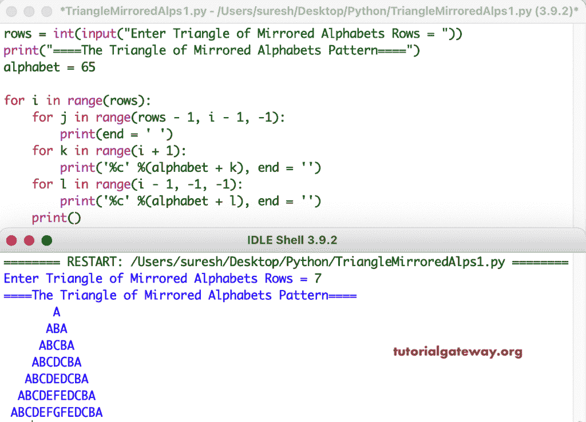

# Python 程序：打印字母的镜像三角形图案

> 原文：<https://www.tutorialgateway.org/python-program-to-print-triangle-of-mirrored-alphabets-pattern/>

写一个 Python 程序来打印字母的三角形的镜像图案，用于循环。

```py
rows = int(input("Enter Triangle of Mirrored Alphabets Rows = "))

print("====The Triangle of Mirrored Alphabets Pattern====")
alphabet = 65

for i in range(rows):
    for j in range(rows - 1, i - 1, -1):
        print(end = ' ')
    for k in range(i + 1):
        print('%c' %(alphabet + k), end = '')
    for l in range(i - 1, -1, -1):
        print('%c' %(alphabet + l), end = '')
    print()
```



这个 Python 模式[示例](https://www.tutorialgateway.org/python-programming-examples/)使用 while 循环打印镜像字母的三角形。

```py
rows = int(input("Enter Triangle of Mirrroed Alphabets Rows = "))

print("====The Triangle of Mirrored Alphabets Pattern====")
alphabet = 65
i = 0

while(i < rows):
    j = rows - 1
    while(j >= i):
        print(end = ' ')
        j = j - 1
    k = 0
    while(k <= i):
        print('%c' %(alphabet + k), end = '')
        k = k + 1
    l = i - 1
    while(l >= 0):
        print('%c' %(alphabet + l), end = '')
        l = l - 1
    print()
    i = i + 1
```

```py
Enter Triangle of Mirrroed Alphabets Rows = 11
====The Triangle of Mirrored Alphabets Pattern====
           A
          ABA
         ABCBA
        ABCDCBA
       ABCDEDCBA
      ABCDEFEDCBA
     ABCDEFGFEDCBA
    ABCDEFGHGFEDCBA
   ABCDEFGHIHGFEDCBA
  ABCDEFGHIJIHGFEDCBA
 ABCDEFGHIJKJIHGFEDCBA
```