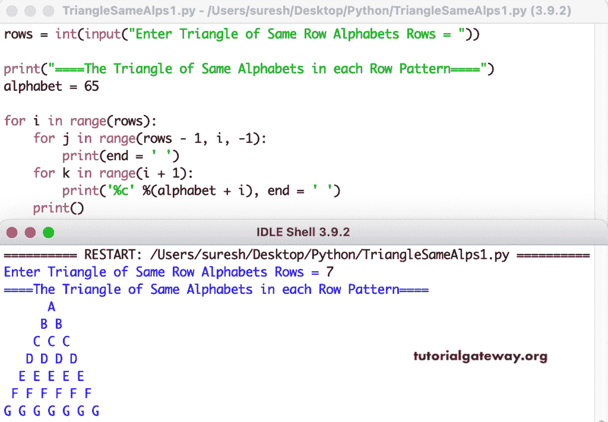

# Python 程序：打印字母的相同图案三角形

> 原文：<https://www.tutorialgateway.org/python-program-to-print-triangle-of-same-alphabets-pattern/>

编写一个 Python 程序，使用 for 循环打印字母的每行中相同图案的三角形。

```py
rows = int(input("Enter Triangle of Same Row Alphabets Rows = "))

print("====The Triangle of Same Alphabets in each Row Pattern====")
alphabet = 65

for i in range(rows):
    for j in range(rows - 1, i, -1):
        print(end = ' ')
    for k in range(i + 1):
        print('%c' %(alphabet + i), end = ' ')
    print()
```



这个 Python 模式[示例](https://www.tutorialgateway.org/python-programming-examples/)使用 while 循环在每一行打印相同字母表的三角形。

```py
rows = int(input("Enter Triangle of Same Row Alphabets Rows = "))

print("====The Triangle of Same Alphabets in each Row Pattern====")
alphabet = 65
i = 0

while(i < rows):
    j = rows - 1
    while(j > i):
        print(end = ' ')
        j = j - 1
    k = 0
    while(k <= i):
        print('%c' %(alphabet + i), end = ' ')
        k = k + 1
    print()
    i = i + 1
```

```py
Enter Triangle of Same Row Alphabets Rows = 12
====The Triangle of Same Alphabets in each Row Pattern====
           A 
          B B 
         C C C 
        D D D D 
       E E E E E 
      F F F F F F 
     G G G G G G G 
    H H H H H H H H 
   I I I I I I I I I 
  J J J J J J J J J J 
 K K K K K K K K K K K 
L L L L L L L L L L L L 
```