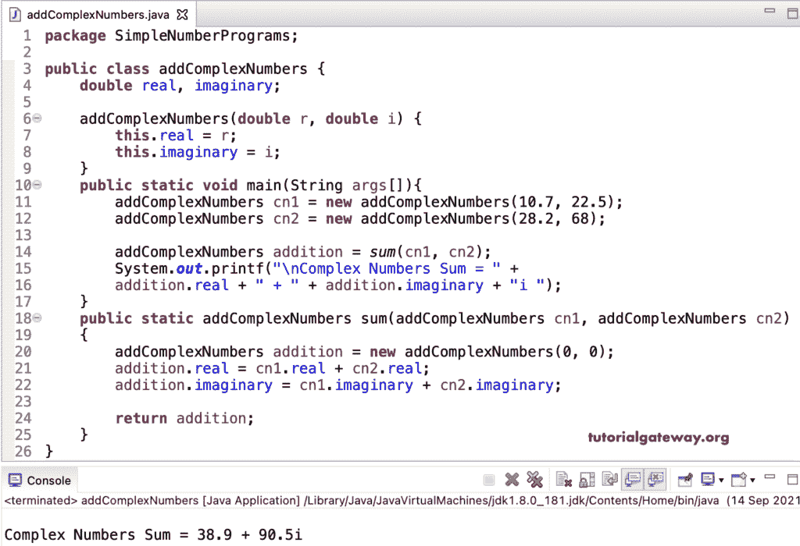

# Java 程序：两个复数相加

> 原文：<https://www.tutorialgateway.org/java-program-to-add-two-complex-numbers/>

写一个 Java 程序，用一个例子把两个复数相加。不幸的是，复数有实部和虚部，对两个复数进行加法是很棘手的。

例如，5 + 10i 表示 5 是实部，10 是虚部。加上另一个复数 11 + 9i 就等于 16 + 19i。

在这个 Java 添加复数的例子中，我们创建了一个构造函数来初始化复数。接下来，用默认值创建该类的实例。

```java
package SimpleNumberPrograms;

public class addComplexNumbers {

	double real, imaginary;

	addComplexNumbers(double r, double i) {
		this.real = r;
		this.imaginary = i;
	}

	public static void main(String args[]){
		addComplexNumbers cn1 = new addComplexNumbers(10.7, 22.5);
		addComplexNumbers cn2 = new addComplexNumbers(28.2, 68);

		addComplexNumbers addition = sum(cn1, cn2);
		System.out.printf("\nComplex Numbers Sum = " + 
		addition.real + " + " + addition.imaginary + "i ");
	}

	public static addComplexNumbers sum(addComplexNumbers cn1, addComplexNumbers cn2) {
		addComplexNumbers addition = new addComplexNumbers(0, 0);
		addition.real = cn1.real + cn2.real;
		addition.imaginary = cn1.imaginary + cn2.imaginary;

		return addition;
	}
}
```

