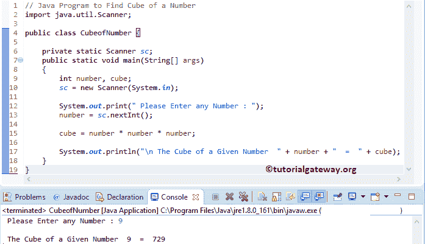

# Java 程序：寻找数字立方体

> 原文：<https://www.tutorialgateway.org/java-program-to-find-cube-of-a-number/>

用例子编写一个寻找数字立方体的 Java 程序。

## 寻找数字立方体的 Java 程序示例 1

这个 Java 程序允许用户输入一个整数值。然后这个 Java 程序使用[算术运算符](https://www.tutorialgateway.org/java-arithmetic-operators/)计算这个数的立方。

```java
// Java Program to Find Cube of a Number
import java.util.Scanner;

public class CubeofNumber {

	private static Scanner sc;
	public static void main(String[] args) 
	{
		int number, cube;
		sc = new Scanner(System.in);

		System.out.print(" Please Enter any Number : ");
		number = sc.nextInt();		

		cube = number * number * number;

		System.out.println("\n The Cube of a Given Number  " + number + "  =  " + cube);
	}
}
```



## 寻找数字立方体的 Java 程序示例 2

这个 [Java 程序](https://www.tutorialgateway.org/learn-java-programs/)同上。但是这次，我们创建了一个单独的 Java 方法来计算这个数字的立方。

```java
// Java Program to Find Cube of a Number
import java.util.Scanner;

public class CubeofNumber1 {

	private static Scanner sc;
	public static void main(String[] args) 
	{
		int number, cube;
		sc = new Scanner(System.in);

		System.out.print(" Please Enter any Number : ");
		number = sc.nextInt();		

		cube = calCube(number);

		System.out.println("\n The Cube of a Given Number  " + number + "  =  " + cube);
	}

	public static int calCube(int num)
	{
		return num * num * num;
	}
}
```

一个数字输出的 Java 立方体

```java
 Please Enter any Number : 5

 The Cube of a Given Number  5  =  125
```