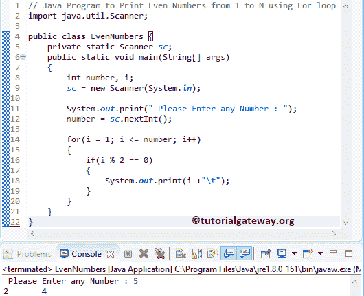

# Java 程序：打印从 1 到 N 的偶数

> 原文：<https://www.tutorialgateway.org/java-program-to-print-even-numbers-from-1-to-n/>

编写一个 Java 程序，使用 If 语句和条件运算符打印从 1 到 N 的偶数。如果给定的数能被 2 整除，那么它就是偶数。

## 打印从 1 到 N 的偶数的 Java 程序示例 1

这个 Java 程序允许用户输入最大限制值。接下来，这个 Java 程序使用 For 循环和 If 语句打印从 1 到最大极限值的偶数。

在 Java 编程中，我们有一个% Module)[算术运算符](https://www.tutorialgateway.org/java-arithmetic-operators/)来检查余数。如果余数是 0，那么这个数就是偶数。

```java
// Java Program to Print Even Numbers from 1 to N using For loop
import java.util.Scanner;

public class EvenNumbers {
	private static Scanner sc;
	public static void main(String[] args) 
	{
		int number, i;
		sc = new Scanner(System.in);

		System.out.print(" Please Enter any Number : ");
		number = sc.nextInt();	

		for(i = 1; i <= number; i++)
		{
			if(i % 2 == 0)
			{
				System.out.print(i +"\t"); 
			}
		}	
	}
}
```



首先，我们使用 For 循环从 1 迭代到最大值(这里，number = 5)。正如我们所知，如果这个数可以被 2 整除，它就是一个偶数。所以，我们用 [If 条件](https://www.tutorialgateway.org/java-if-statement/)来检查这个数除以 2 的余数是否正好等于 0。

用户输入值:数字= 5

对于循环第一次迭代:对于(I = 1；I<= 5; i++)
if(I % 2 = = 0)=>if(1% 2 = = 0)–For 循环条件为假

第二次迭代:对于(I = 2；2 <= 5; 2++)
如果(2% 2 = = 0)–条件为真。所以，我重视打印

第三次迭代:for(I = 3；3 <= 5; 3++)
如果(3% 2 = = 0)–条件为假

第四次迭代:for(I = 4；4 <= 5; 4++)
如果(4% 2 = = 0)–条件为真。所以，我看重打印

第五次迭代:for(I = 5；5 <= 5; 5++)
如果(5% 2 = = 0)–条件为假

第六次迭代:for(I = 6；6 <= 5; 6++)
条件(6 < = 5)为假。因此，Java 编译器退出 For 循环

## 打印从 1 到 N 的偶数的 Java 程序示例 2

这个 Java 程序和上面的一样，但是我们修改了循环来消除 [If 语句](https://www.tutorialgateway.org/if-statement-in-c/)。如果您观察下面的代码片段，我们从 2 开始 I，并将其增加 2(而不是 1)。这意味着，对于第一次迭代，我变成了 2，对于第二次迭代，我变成了 4(不是 3)，依此类推。

```java
// Java Program to Print Even Numbers from 1 to N
import java.util.Scanner;

public class EvenNumbers1 {

	private static Scanner sc;
	public static void main(String[] args) 
	{
		int number, i;
		sc = new Scanner(System.in);

		System.out.print(" Please Enter any Number : ");
		number = sc.nextInt();	

		for(i = 2; i <= number; i = i + 2)
		{
			System.out.print(i +"\t"); 
		}	
	}
}
```

用于循环输出的 Java 偶数

```java
Please Enter any Number : 40
2	4	6	8	10	12	14	16	18	20	22	24	26	28	30	32	34	36	38	40 
```

## 打印从 1 到 N 的偶数的 Java 程序示例 3

这个从 1 到 100 返回偶数的 Java 程序与第二个例子相同，但是我们使用的是 While 循环。

```java
// Java Program to Print Even Numbers from 1 to N using while loop
import java.util.Scanner;

public class EvenNumbers2 {

	private static Scanner sc;
	public static void main(String[] args) 
	{
		int number, i;
		sc = new Scanner(System.in);

		System.out.print(" Please Enter any Number : ");
		number = sc.nextInt();	
		i = 2; 

		while(i <= number)
		{
			System.out.print(i +"\t"); 
			i = i + 2;
		}	
	}
}
```

Java 偶数使用一个 [While Loop](https://www.tutorialgateway.org/java-while-loop/) 输出

```java
Please Enter any Number : 25
2	4	6	8	10	12	14	16	18	20	22	24 
```

## 用方法打印 1 到 N 的偶数的 Java 程序

这个 Java 程序与第一个示例相同。但是我们将 Java 偶数从 1 到 N 的逻辑分开，放在一个单独的方法中。

```java
// Java Program to Print Even Numbers from 1 to N using Methods
import java.util.Scanner;

public class EvenNumbers3 {
	private static Scanner sc;
	public static void main(String[] args) 
	{
		int number;
		sc = new Scanner(System.in);

		System.out.print(" Please Enter any Number : ");
		number = sc.nextInt();	

		findEven(number);	
	}

	public static void findEven(int num)
	{
		int i;
		for(i = 1; i <= num; i++)
		{
			if(i % 2 == 0)
			{
				System.out.print(i +"\t"); 
			}
		}	
	}
}
```

```java
Please Enter any Number : 70
2	4	6	8	10	12	14	16	18	20	22	24	26	28	30	32	34	36	38	40	42	44	46	48	50	52	54	56	58	60	62	64	66	68	70 
```

## 打印给定范围内偶数的 Java 程序

这个 [Java 程序](https://www.tutorialgateway.org/learn-java-programs/)允许用户输入最小值和最大值。接下来，这个 Java 程序显示一个介于最小值和最大值之间的偶数列表。

```java
// Java Program to Print Even Numbers between Maximum and Minimum
import java.util.Scanner;

public class EvenNumbers4 {
	private static Scanner sc;
	public static void main(String[] args) 
	{
		int minimum, maximum;
		sc = new Scanner(System.in);

		System.out.print(" Please Enter the Minimum value : ");
		minimum = sc.nextInt();	

		System.out.print(" Please Enter the Maximum value : ");
		maximum = sc.nextInt();	

		findEven(minimum, maximum);	
	}

	public static void findEven(int minimum, int maximum)
	{
		int i;
		if(minimum % 2 != 0)
		{
			minimum++;
		}
		for(i = minimum; i <= maximum; i++)
		{
			if(i % 2 == 0)
			{
				System.out.print(i +"\t"); 
			}
		}	
	}
}
```

Java 偶数从 5 到 150 输出

```java
 Please Enter the Minimum value : 5
 Please Enter the Maximum value : 150
6	8	10	12	14	16	18	20	22	24	26	28	30	32	34	36	38	40	42	44	46	48	50	52	54	56	58	60	62	64	66	68	70	72	74	76	78	80	82	84	86	88	90	92	94	96	98	100	102	104	106	108	110	112	114	116	118	120	122	124	126	128	130	132	134	136	138	140	142	144	146	148	150 
```