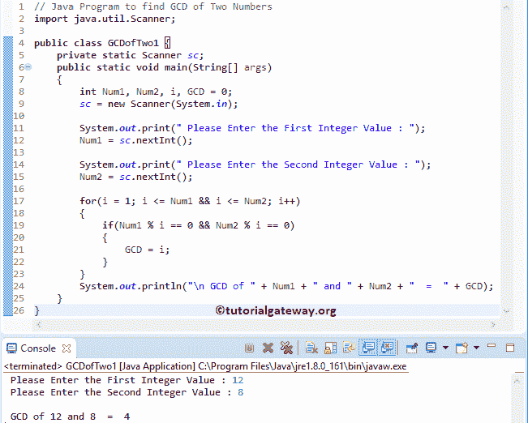

# Java 程序：寻找两个数的 GCD

> 原文：<https://www.tutorialgateway.org/java-program-to-find-gcd-of-two-numbers/>

编写一个 Java 程序，使用 For 循环、While 循环和递归方法找到两个数的 GCD。最大公约数也被称为最高公约数，或最高公约数(HCD)，或最大公约数，或最大公约数。

根据数学，两个或两个以上整数的 GCD 是给定整数除以没有任何余数的最大正整数。例如，8 和 12 的 Java GCD 是 4，因为 8 和 12 都可以被 1、2 和 4 整除。因数 1、2 和 4 中最大的正整数是 4。

注意:要在 Java 中找到最大公约数或 GCD，我们必须至少传递一个非零值。

## 用 For 循环求两个数的 GCD 的 Java 程序

这个 java 中的两个数 gcd 程序允许用户输入两个正整数值。接下来，它使用 [For Loop](https://www.tutorialgateway.org/java-for-loop/) 计算这两个值的最高公共因数(HCF)或 GCD。

```java
import java.util.Scanner;

public class GCDofTwo1 {
	private static Scanner sc;
	public static void main(String[] args) 
	{
		int Num1, Num2, i, GCD = 0;
		sc = new Scanner(System.in);

		System.out.print(" Please Enter the First Integer Value : ");
		Num1 = sc.nextInt();	

		System.out.print(" Please Enter the Second Integer Value : ");
		Num2 = sc.nextInt();

		for(i = 1; i <= Num1 && i <= Num2; i++)
	    {
	        if(Num1 % i == 0 && Num2 % i == 0)
	        {
	            GCD = i;
	        }
	    }	
		System.out.println("\n GCD of " + Num1 + " and " + Num2 + "  =  " + GCD);
	}
}
```



## 使用 While 循环查找两个数的 GCD 的 Java 程序

在这个两个数的 gcd 程序中，我们使用 While 循环和一个临时变量来计算 GCD。

```java
import java.util.Scanner;

public class GCDofTwo2 {
	private static Scanner sc;
	public static void main(String[] args) 
	{
		int Num1, Num2, Temp, GCD = 0;
		sc = new Scanner(System.in);

		System.out.print(" Please Enter the First Integer Value : ");
		Num1 = sc.nextInt();	

		System.out.print(" Please Enter the Second Integer Value : ");
		Num2 = sc.nextInt();

		while(Num2 != 0)
	    {
			Temp = Num2;
			Num2 = Num1 % Num2;
			Num1 = Temp;
	    }
		GCD = Num1;
		System.out.println("\n GCD  =  " + GCD);
	}
}
```

使用[同时循环](https://www.tutorialgateway.org/java-while-loop/)输出的两个数的 Java GCD

```java
 Please Enter the First Integer Value : 80
 Please Enter the Second Integer Value : 120

 GCD  =  40
```

## Java 程序不用 Temp 就能找到两个数的 GCD

这个计算两个数的 gcd 的 Java 程序不使用任何临时变量计算最大公测。

```java
import java.util.Scanner;

public class GCDofTwo3 {
	private static Scanner sc;
	public static void main(String[] args) 
	{
		int Num1, Num2, GCD = 0;
		sc = new Scanner(System.in);

		System.out.print(" Please Enter the First Integer Value : ");
		Num1 = sc.nextInt();	

		System.out.print(" Please Enter the Second Integer Value : ");
		Num2 = sc.nextInt();

		while(Num2 != 0)
	    {
			if(Num1 > Num2)
			{
				Num1 = Num1 - Num2;
			}
			else
			{
				Num2 = Num2 - Num1;
			}
	    }
		GCD = Num1;
		System.out.println("\n GCD  =  " + GCD);
	}
}
```

Java GCD 使用 temp 值输出

```java
 Please Enter the First Integer Value : 27
 Please Enter the Second Integer Value : 360

 GCD  =  9
```

## 用方法求两个数的 GCD 的程序

这个[程序](https://www.tutorialgateway.org/learn-java-programs/)求两个数的 gcd 和上面的例子一样。但是，这次我们分离了 [Java](https://www.tutorialgateway.org/java-tutorial/) 逻辑，并将其放在一个单独的方法中。它可以帮助您非常有效地调试代码。

```java
// Java Program to find HCF of Two Numbers
import java.util.Scanner;

public class GCDofTwo4 {
	private static Scanner sc;
	public static void main(String[] args) 
	{
		int Num1, Num2, GCD = 0;
		sc = new Scanner(System.in);

		System.out.print(" Please Enter the First Integer Value : ");
		Num1 = sc.nextInt();	

		System.out.print(" Please Enter the Second Integer Value : ");
		Num2 = sc.nextInt();

		GCD = HCFofTwo(Num1, Num2);

		System.out.println("\n GCD of " + Num1 + " and " + Num2 + "  =  " + GCD);
	}
	public static int HCFofTwo(int Num1, int Num2)
	{
		while(Num2 != 0)
	    {
			if(Num1 > Num2)
			{
				Num1 = Num1 - Num2;
			}
			else
			{
				Num2 = Num2 - Num1;
			}
	    }
		return Num1;
	}
}
```

```java
 Please Enter the First Integer Value : 75
 Please Enter the Second Integer Value : 1575

 GCD of 75 and 1575  =  75
```

## 用递归方法计算两个数的 GCD 的 Java 程序

这个计算两个数 gcd 的 Java 程序通过递归调用 HCFofTwo 函数计算最大公约数。我是说，递归函数调用。

```java
import java.util.Scanner;

public class GCDofTwo5 {
	private static Scanner sc;
	public static void main(String[] args) 
	{
		int Num1, Num2, GCD = 0;
		sc = new Scanner(System.in);

		System.out.print(" Please Enter the First Integer Value : ");
		Num1 = sc.nextInt();	

		System.out.print(" Please Enter the Second Integer Value : ");
		Num2 = sc.nextInt();

		GCD = HCFofTwo(Num1, Num2);

		System.out.println("\n GCD of " + Num1 + " and " + Num2 + "  =  " + GCD);
	}
	public static int HCFofTwo(int Num1, int Num2)
	{
		if(Num2 == 0)
		{
			return Num1;
		}
		else
		{
			return HCFofTwo(Num2, Num1 % Num2);
		}
	}
}
```

Java 递归函数查找 GCD

```java
 Please Enter the First Integer Value : 75
 Please Enter the Second Integer Value : 255

 GCD of 75 and 255  =  15
```