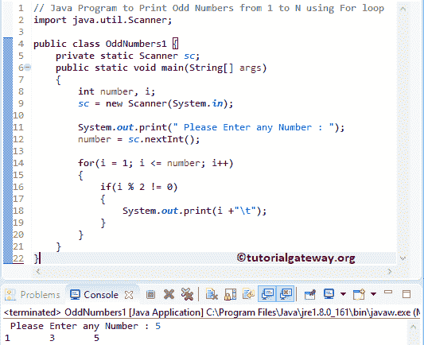

# Java 程序：打印从 1 到`N`的奇数

> 原文：<https://www.tutorialgateway.org/java-program-to-print-odd-numbers-from-1-to-n/>

如何用 For 循环写一个 Java 程序打印从 1 到 N 的奇数，While 循环举例。如果给定的数不能被 2 整除，它就是奇数。

## 打印从 1 到 N 的奇数的 Java 程序示例 1

这个 Java 程序允许输入最大限制值。接下来，这个 Java 程序使用 For 循环和 If 语句打印从 1 到最大极限值的奇数。

在 Java 中，我们有一个% [算术运算符](https://www.tutorialgateway.org/java-arithmetic-operators/)来检查余数。如果余数不是 0，这个数就是奇数。

```java
// Java Program to Print Odd Numbers from 1 to N using For loop
import java.util.Scanner;

public class OddNumbers1 {
	private static Scanner sc;
	public static void main(String[] args) 
	{
		int number, i;
		sc = new Scanner(System.in);

		System.out.print(" Please Enter any Number : ");
		number = sc.nextInt();	

		for(i = 1; i <= number; i++)
		{
			if(i % 2 != 0)
			{
				System.out.print(i +"\t"); 
			}
		}	
	}
}
```



for 循环从 1 迭代到最大值(这里，number = 5)。我们知道，如果这个数不能被 2 整除，它就是一个奇数。因此，我们使用 [Java If 条件](https://www.tutorialgateway.org/java-if-statement/)来检查余数。

用户输入值:数字= 5

对于循环第一次迭代:对于(I = 1；i <= 5; i++)
if(i % 2！= 0) = > if(1 % 2！= 0)
条件为真。所以，我重视打印

第二次迭代:对于(I = 2；2 <= 5; 2++)
if(2 % 2！= 0)–条件为假。

第三次迭代:for(I = 3；3 <= 5; 3++)
if(3 % 2！= 0)–回路的[条件为真。所以，我看重印](https://www.tutorialgateway.org/java-for-loop/)

第四次迭代:for(I = 4；4 <= 5; 4++)
if(4 % 2！= 0)–条件为假。

第五次迭代:for(I = 5；5 <= 5; 5++)
if(5 % 2！= 0)–条件为真。所以，它打印了我

第六次迭代:for(I = 6；6 <= 5; 6++)
条件(6 < = 5)为假。因此，Java 编译器退出 For 循环

## 打印从 1 到 N 的奇数的 Java 程序示例 2

这个显示从 1 到 N 的奇数的 Java 程序与上面相同，但是我们修改了 for 循环以消除 [If 语句](https://www.tutorialgateway.org/if-statement-in-c/ "If Statement in C")。如果你观察 Java 代码，我们从 1 开始 I，然后增加 2(不是 1)。这意味着对于第一次迭代，i = 1，对于第二次迭代，i = 3(不是 2)，依此类推。

```java
// Java Program to Print Odd Numbers from 1 to N using For loop
import java.util.Scanner;

public class OddNumbers2 {
	private static Scanner sc;
	public static void main(String[] args) 
	{
		int number, i;
		sc = new Scanner(System.in);

		System.out.print(" Please Enter any Number : ");
		number = sc.nextInt();	

		for(i = 1; i <= number; i = i + 2)
		{
			System.out.print(i +"\t"); 
		}	
	}
}
```

从 1 到 20 的 Java 奇数输出

```java
Please Enter any Number : 20
1	3	5	7	9	11	13	15	17	19 
```

## 打印从 1 到 N 的奇数的 Java 程序示例 3

这个从 1 到 100 返回奇数的 Java 程序与第二个例子相同，但是我们使用了 [While Loop](https://www.tutorialgateway.org/java-while-loop/) 。

```java
// Java Program to Print Odd Numbers from 1 to N using while loop
import java.util.Scanner;

public class OddNumbers3 {
	private static Scanner sc;
	public static void main(String[] args) 
	{
		int number, i;
		sc = new Scanner(System.in);

		System.out.print(" Please Enter any Number : ");
		number = sc.nextInt();	
		i = 1; 

		while(i <= number)
		{
			System.out.print(i +"\t"); 
			i = i + 2;
		}	
	}
}
```

使用 while 循环输出从 1 到 30 的 Java 奇数

 ```java
Please Enter any Number : 30
1	3	5	7	9	11	13	15	17	19	21	23	25	27	29 
```

## 用方法打印从 1 到 N 的奇数的 Java 程序

这个奇数的 Java 程序和第一个例子一样。尽管如此，我们还是分离了逻辑，并将其放在一个单独的方法中。

```java
// Java Program to Print Odd Numbers from 1 to N using Methods
import java.util.Scanner;

public class OddNumbers4 {
	private static Scanner sc;
	public static void main(String[] args) 
	{
		int number;
		sc = new Scanner(System.in);

		System.out.print(" Please Enter any Number : ");
		number = sc.nextInt();	

		findOddNum(number);	
	}

	public static void findOddNum(int num)
	{
		int i;
		for(i = 1; i <= num; i++)
		{
			if(i % 2 != 0)
			{
				System.out.print(i +"\t"); 
			}
		}	
	}
}
```

Java 奇数从 1 到 100 使用函数输出

```java
Please Enter any Number : 100
1	3	5	7	9	11	13	15	17	19	21	23	25	27	29	31	33	35	37	39	41	43	45	47	49	51	53	55	57	59	61	63	65	67	69	71	73	75	77	79	81	83	85	87	89	91	93	95	97	99 
```

## 打印给定范围内奇数的 Java 程序

这个 [Java 程序](https://www.tutorialgateway.org/learn-java-programs/)允许用户输入最小值和最大值。接下来，Java 示例返回最小值和最大值之间的奇数。

```java
// Java Program to Print Odd Numbers between Maximum and Minimum
import java.util.Scanner;

public class OddNumbers5 {

	private static Scanner sc;
	public static void main(String[] args) 
	{
		int minimum, maximum;
		sc = new Scanner(System.in);

		System.out.print(" Please Enter the Minimum value : ");
		minimum = sc.nextInt();	

		System.out.print(" Please Enter the Maximum value : ");
		maximum = sc.nextInt();	

		findOddNum(minimum, maximum);	
	}

	public static void findOddNum(int minimum, int maximum)
	{
		int i;
		if(minimum % 2 == 0)
		{
			minimum++;
		}
		for(i = minimum; i <= maximum; i++)
		{
			if(i % 2 != 0)
			{
				System.out.print(i +"\t"); 
			}
		}	
	}
}
```

Java 奇数从 1 到 N，用于循环输出

 ```java
Please Enter the Minimum value : 5
 Please Enter the Maximum value : 60
5	7	9	11	13	15	17	19	21	23	25	27	29	31	33	35	37	39	41	43	45	47	49	51	53	55	57	59 
```