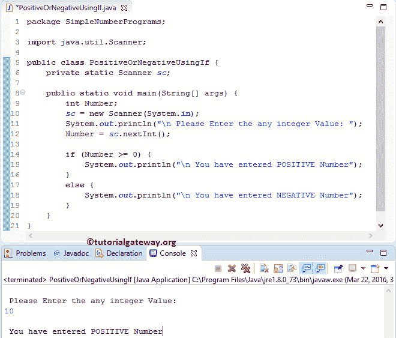

# Java 程序：检查正数或负数

> 原文：<https://www.tutorialgateway.org/java-program-to-find-positive-or-negative-number/>

用 If Else 语句、Else If 语句和三元运算符编写 Java 程序来查找正数或负数或零，并举例说明。如果这个数大于 0，那么它就是正数。如果数字小于 0，则为负数。

## 用 If Else 语句寻找正数或负数的 Java 程序

这个 Java 程序允许用户输入任何数字。接下来，它使用 Java If Else 语句 检查输入的值是正还是负

```java
package SimpleNumberPrograms;

import java.util.Scanner;

public class PositiveOrNegativeUsingIf {
	private static Scanner sc;

	public static void main(String[] args) {
		int Number;
		sc = new Scanner(System.in);		
		System.out.println("\n Please Enter the any integer Value: ");
		Number = sc.nextInt();

		if (Number >= 0) {
			System.out.println("\n You have entered POSITIVE Number");
		}
		else {
			System.out.println("\n You have entered NEGATIVE Number");
		}
	}
}
```

从下面的 [Java](https://www.tutorialgateway.org/java-tutorial/) 截图可以观察到，我们输入的 Number 值为 10。这意味着，条件为真，这就是它在 If 块中显示语句的原因。



检查负值

```java
 Please Enter the any integer Value: 
-5

 You have entered NEGATIVE Number
```

在这个 Java 程序中查找正数或负数的例子，首先， [if 条件](https://www.tutorialgateway.org/java-if-statement/)检查给定的数字是否大于等于 0。

*   如果条件在 [Java If Else 语句](https://www.tutorialgateway.org/java-if-else-statement/)中失败，那么给定的数字将是负数。
*   如果条件为真，则给定的数字是正整数。

## 用三进制运算符求正数或负数的 Java 程序

该 Java 程序使用条件运算符或 [Java 三元运算符](https://www.tutorialgateway.org/java-ternary-operator/)检查输入的值是正还是负或零

```java
// Java program to find Positive or Negative Number using Ternary Operator
package SimpleNumberPrograms;

import java.util.Scanner;

public class PositiveOrNegativeUsingConditional {
	private static Scanner sc;

	public static void main(String[] args) {
		int Num;
		sc = new Scanner(System.in);		
		System.out.println("\n Please Enter the any integer Value: ");
		Num = sc.nextInt();

		System.out.println((Num. >=0)? "\nPOSITIVE":
                                                "\nNEGATIVE");
	}
}
```

```java
 Please Enter the any integer Value: 
215

POSITIVE
```

检查负值

```java
 Please Enter the any integer Value: 
-15

NEGATIVE
```

让我们仔细看看 [Java](https://www.tutorialgateway.org/java-tutorial/) 条件运算符。

如果条件(数字> = 0)为真，则执行第一条语句。如果失败，它将检查第二个条件，它位于:符号(数字< 0)之后。

*   当条件为真时，它将打印第一条消息“肯定”
*   如果该条件为假，则将打印否定

## 用方法寻找正数或负数的 Java 程序

在这个 Java 程序中，我们使用了与第一个例子中相同的步骤。然而，我们分离了正数或负数逻辑，并将其放在一个单独的方法中。

如果您观察这个 Java 程序中的最后一条语句来寻找正数或负数，我们就称之为 Positive or Negative 方法。

从下面的 positiveOrNegative 方法片段中，您可以观察到该方法接受一个整数类型的参数。在函数中，我们执行的操作与我们在前面的示例中解释的相同。

```java
package SimpleNumberPrograms;

import java.util.Scanner;

public class PositiveOrNegativeUsingMethods {
	private static Scanner sc;

	public static void main(String[] args) {
		int Num;
		sc = new Scanner(System.in);		
		System.out.println("\n Please Enter the any integer Value: ");
		Num = sc.nextInt();

		positiveOrNegative(Num);

	}	
	public static void positiveOrNegative(int Num) {
		if (Num >= 0) {
			System.out.println("POSITIVE");
		}
		else {
			System.out.println("NEGATIVE");
		}
	}
}
```

```java
 Please Enter the any integer Value: 
56
POSITIVE
```

## 用 OOPs 查找正数或负数的 Java 程序

在这个 [Java 程序](https://www.tutorialgateway.org/learn-java-programs/)中，我们使用面向对象编程来划分代码。为此，首先，我们将创建一个包含两个方法的类。

提示:一般来说，你不必写第一种方法。我们用这个方法来显示可用的选项

```java
package SimpleNumberPrograms;

public class PositiveOrNegative {
	int x;

	public void positiveOrNegative() {
		if (x >= 0) {
			System.out.println("\n First Method: You have entered POSITIVE");
		}
		else {
			System.out.println("\n First Method: You have entered NEGATIVE");
		}
	}

	public void positiveOrNegativeAgain(int Number) {
		if (Number >= 0) {
			System.out.println("\n Second Method: You have entered POSITIVE");
		}
		else {
			System.out.println("\n Second Method: You have entered NEGATIVE");
		}
	}

}
```

在查找正数或负数的主程序中，我们将创建上述指定类的实例并调用方法。

```java
package SimpleNumberPrograms;

import java.util.Scanner;

public class PositiveOrNegativeUsingClass {
	private static Scanner sc;

	public static void main(String[] args) {
		int Number;
		sc = new Scanner(System.in);		
		System.out.println("\n Please Enter the First integer Value: ");
		Number = sc.nextInt();

		PositiveOrNegative pn = new PositiveOrNegative();
		pn.x = Number;

		pn.positiveOrNegative();
		pn.positiveOrNegativeAgain(Number);
	}
}
```

```java
 Please Enter the any integer Value: 
55
 First Method: You have entered POSITIVE
 Second Method: You have entered POSITIVE
```

积极或消极的类别分析:

*   首先，我们用零参数声明了一个函数 positiveOrNegative。在函数中，我们使用 If 语句来检查给定的数字是否大于或等于 0。如果为真，我们将打印正数语句，否则使用 System.out.println 语句打印负数语句。
*   接下来，我们用一个参数声明了一个函数 positiveOrNegativeAgain。在函数中，我们执行了第一个函数中解释的相同操作。

主类分析:

在这个寻找正数或负数的 Java 程序示例中，我们创建了一个实例/创建了一个 Positive or Negative 类的对象

```java
PositiveOrNegative pn = new PositiveOrNegative();
```

接下来，我们将用户输入的值分配给 positive 或 gative 类变量。

```java
pn.x = Number;
```

接下来，我们将调用 PositiveOrNegative 和 PositiveOrNegativeAgain 方法。

```java
pn.positiveOrNegative();
pn.positiveOrNegativeAgain(Number);
```