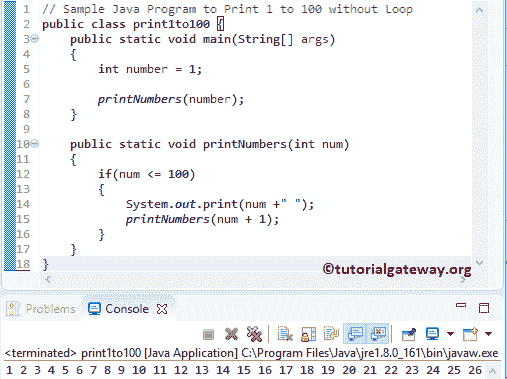

# 示例 Java 程序，打印 1 到 100，无循环

> 原文：<https://www.tutorialgateway.org/sample-java-program-to-print-1-to-100-without-loop/>

编写一个示例 Java 程序，在不使用 For 循环、While 和 Do While 循环的情况下打印 1 到 100 个示例。

## 示例 Java 程序，打印 1 到 100，无循环

在这个例子中，我们将编写一个 Java 程序，在不使用循环的情况下返回从 1 到 100 的数字。

```java
// Sample Java Program to Print 1 to 100 without Loop 
public class print1to100 {
	public static void main(String[] args) 
	{
		int number = 1;

		printNumbers(number);	
	}

	public static void printNumbers(int num)
	{
		if(num <= 100)
		{
			System.out.print(num +" "); 
			printNumbers(num + 1);
		}	
	}
}
```



在该方法中，我们使用 [If 语句](https://www.tutorialgateway.org/java-if-statement/)来检查数字是否小于或等于 100。如果条件返回真，则执行 If 语句中的代码。

```java
if(num <= 100)
{
	System.out.print(num +" "); 
	printNumbers(num + 1);
}
```

在 If 块中，我们使用了 print number(number + 1)语句，这有助于用更新后的值调用相同的方法。如果错过这个 [Java](https://www.tutorialgateway.org/java-tutorial/) 语句，那么在完成第一行后，它终止，输出为 1。

## 不带循环返回 100 比 1 的示例 Java 程序

在示例中，我们将编写一个 [JavaProgram](https://www.tutorialgateway.org/learn-java-programs/) 来显示从 100 到 1 的数字，而不使用 Loops。

```java
// Sample Java Program to Print 100 to 1 without Loop 
public class print1to100Ex2 {
	public static void main(String[] args) 
	{	
		printNumbers(100);	
	}

	public static void printNumbers(int num)
	{
		if(num > 0)
		{
			System.out.print(num +" "); 
			printNumbers(num - 1);
		}	
	}
}
```

```java
100 99 98 97 96 95 94 93 92 91 90 89 88 87 86 85 84 83 82 81 80 79 78 77 76 75 74 73 72 71 70 69 68 67 66 65 64 63 62 61 60 59 58 57 56 55 54 53 52 51 50 49 48 47 46 45 44 43 42 41 40 39 38 37 36 35 34 33 32 31 30 29 28 27 26 25 24 23 22 21 20 19 18 17 16 15 14 13 12 11 10 9 8 7 6 5 4 3 2 1 
```