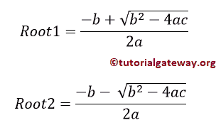
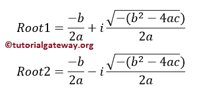
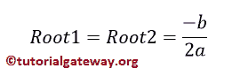

# Java 程序：计算二次方程根

> 原文：<https://www.tutorialgateway.org/java-program-to-find-roots-of-a-quadratic-equation/>

写一个 Java 程序，用例子找到一个二次方程的根。二次方程的数学表示是 ax +bx+c = 0。二次方程有两个根，它们完全取决于判别式。如果判别式> 0，则该方程存在两个不同的实根。



若判别< 0, then Two Distinct Complex Roots exists



如果判别式= 0，则存在两个相等的实根。



## 用 Else If 寻找二次方程根的 Java 程序

这个 Java 程序允许用户输入 a、b 和 c 三个值。接下来，这个 Java 程序使用 [Else If 语句](https://www.tutorialgateway.org/java-else-if-statement/)返回一个二次方程的根。

```java
// Java Program to find Roots of a Quadratic Equation
import java.util.Scanner;

public class QuadraticEquation1 {
	private static Scanner sc;
	public static void main(String[] args) 
	{
		double a, b, c;
		double root1, root2, imaginary, discriminant;
		sc = new Scanner(System.in);

		System.out.print(" Please Enter the Values of a, b, c of Quadratic Equation : ");
		a = sc.nextDouble();	
		b = sc.nextDouble();
		c = sc.nextDouble();

		discriminant = (b * b) - (4 * a *c);

	  	if(discriminant > 0)
	  	{
	  		root1 = (-b + Math.sqrt(discriminant) / (2 * a));
	  		root2 = (-b - Math.sqrt(discriminant) / (2 * a));
	  		System.out.println("\n Two Distinct Real Roots Exists: root1 = " + root1 + " and root2 = " + root2);
	  	}
	  	else if(discriminant == 0)
	  	{
	  		root1 = root2 = -b / (2 * a);
	  		System.out.println("\n Two Equal and Real Roots Exists: root1 = " + root1 + " and root2 = " + root2);
	  	}
	  	else if(discriminant < 0)
	  	{
	  		root1 = root2 = -b / (2 * a);
	  		imaginary = Math.sqrt(-discriminant) / (2 * a);
	  		System.out.println("\n Two Distinct Complex Roots Exists: root1 = " + 
	  						root1 + " + " + imaginary + " and root2 = " + root2 +" - " +imaginary);
	  	}		
	}
}
```

```java
Please Enter the Values of a, b, c of Quadratic Equation : 2
3
5

 Two Distinct Complex Roots Exists: root1 = -0.75 + 1.3919410907075054 and root2 = -0.75 - 1.3919410907075054
```

用户输入的 [Java](https://www.tutorialgateway.org/java-tutorial/) 值为 2 3 5。意思是 a = 2，b = 3，c = 5，二次方程是 2x +3x+5 = 0

判别式=(b * b)–(4 * a * c)= >(3 * 3)–(4 * 2 * 5)
判别式=(9)–(40)=-31

意思是判别式< 0 so
root 1 = root 2 =-b/(2 * a)=>-3/(2 * 2)
root 1 = root 2 =-0.75

虚数= sqrt(-判别式)/ (2 * a)
虚数= sqrt(-31)/(2 * 2)=>5.567/4
虚数= 1.3919

root 1 = root 1+虚数= -0.75 + 1.3919

root 2 = root 2-假想。= -0.75 – 1.3919

## 用开关情况求二次方程根的 Java 程序

这个显示二次方程根的 Java 程序和上面一样，但是这次我们使用的是[开关的情况](https://www.tutorialgateway.org/java-switch-case/)。

```java
import java.util.Scanner;

public class QuadraticEquation2 {
	private static Scanner sc;
	public static void main(String[] args) 
	{
		double a, b, c;
		sc = new Scanner(System.in);

		System.out.print(" Please Enter the Values of a, b, c of Quadratic Equation : ");
		a = sc.nextDouble();	
		b = sc.nextDouble();
		c = sc.nextDouble();

		QuadraticEquation(a, b, c);
	}
	public static void QuadraticEquation(double a, double b, double c)
	{
		double root1, root2, imaginary, discriminant;
		discriminant = (b * b) - (4 * a *c);

	  	if(discriminant > 0)
	  	{
	  		root1 = (-b + Math.sqrt(discriminant) / (2 * a));
	  		root2 = (-b - Math.sqrt(discriminant) / (2 * a));
	  		System.out.println("\n Two Distinct Real Roots Exists: root1 = " + root1 + " and root2 = " + root2);
	  	}
	  	else if(discriminant == 0)
	  	{
	  		root1 = root2 = -b / (2 * a);
	  		System.out.println("\n Two Equal and Real Roots Exists: root1 = " + root1 + " and root2 = " + root2);
	  	}
	  	else if(discriminant < 0)
	  	{
	  		root1 = root2 = -b / (2 * a);
	  		imaginary = Math.sqrt(-discriminant) / (2 * a);
	  		System.out.println("\n Two Distinct Complex Roots Exists: root1 = " + root1 + 
	  					" + " + imaginary + " and root2 = " + root2 +" - " +imaginary);
	  	}		
	}
}
```

```java
 Please Enter the Values of a, b, c of Quadratic Equation : 10 15 -25

 Two Distinct Real Roots Exists: root1 = -13.25 and root2 = -16.75
```

在这个 [Java 程序](https://www.tutorialgateway.org/learn-java-programs/)中，为了找到一个二次方程的根，用户输入的值是 10 ^ 15-25。意思是 a = 10，b = 15，c = -25，二次方程是 10x +15x-25 = 0

判别式=(b * b)–(4 * a * c)= >(15 * 15)–(4 * 10 *(25))
= 225+1000 = 1225

意思是判别式> 0 所以
root1 = (-b + sqrt(判别式)/(2 * a))
=(-15+sqrt(1225)/(2 * 10))=>(-15+35/(20))
=-15+1.75 =-13.25

root 2 =(-b–sqrt(判别式)/(2 * a))
=(-15–sqrt(1225)/(2 * 10))=>(-15–35/(20))
=-15–1.75 =-16.75