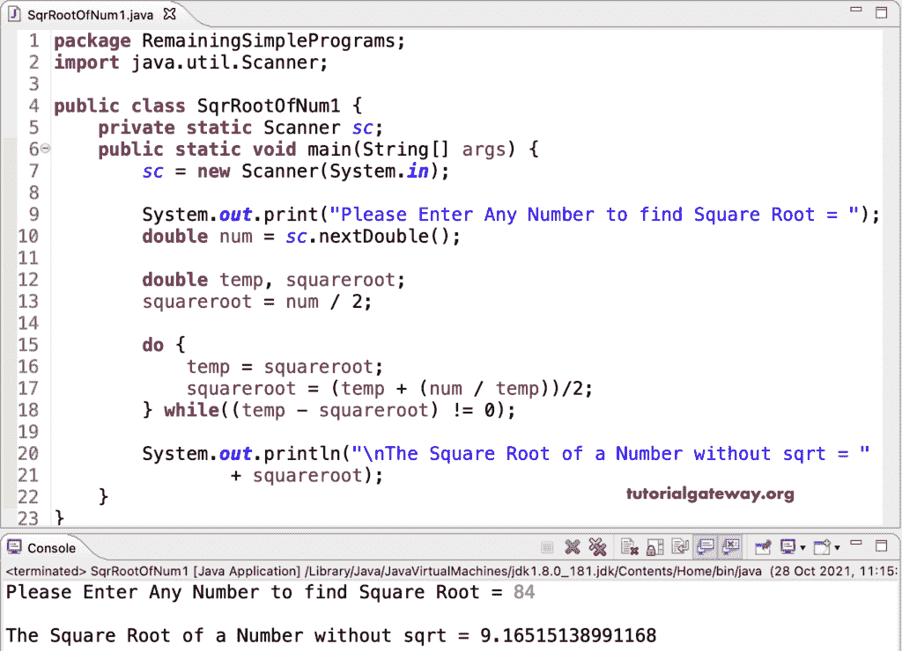

# Java 程序：不用 sqrt 求一个数的平方根

> 原文：<https://www.tutorialgateway.org/java-program-to-find-square-root-of-a-number-without-sqrt/>

在 Java 中，我们有一个 Math.sqrt 函数，它返回任何给定数字的平方根。在这个 Java 程序中，我们将在不使用 sqrt 函数的情况下找到平方根。如您所见，我们使用 do while 循环来求平方根。

```java
package RemainingSimplePrograms;

import java.util.Scanner;

public class SqrRootOfNum1 {

	private static Scanner sc;

	public static void main(String[] args) {

		sc = new Scanner(System.in);

		System.out.print("Please Enter Any Number to find Square Root = ");
		double num = sc.nextDouble();

		double temp, squareroot;

		squareroot = num / 2;

		do {
			temp = squareroot;
			squareroot = (temp + (num / temp))/2;
		} while((temp - squareroot) != 0);

		System.out.println("\nThe Square Root of a Number without sqrt = " + squareroot);
	}
}
```



在这个 Java 例子中，我们计算每个成员与给定数字的平方。如果它小于给定的数字，则递增该值。

```java
package RemainingSimplePrograms;

import java.util.Scanner;

public class SqrRootOfNum2 {
	private static Scanner sc;
	public static void main(String[] args) {
		sc = new Scanner(System.in);

		System.out.print("Please Enter Any Number to find Square Root = ");
		int num = sc.nextInt();

		int squareroot = squareRootWithoutsqrt(num);

		System.out.println("\nThe Square Root of a Number without sqrt = " + squareroot);
	}

	public static int squareRootWithoutsqrt(int num) {
		if(num < 2) {
			return num;
		}
		int mid, start = 1, end = num;
		while(start <= end) {
			mid = (start + end) /2;

			if(mid * mid == num) {
				return mid;
			} else if(mid * mid > num) {
				end = mid - 1;
			} else {
				start = mid + 1;
			}
		}
		return end;
	}
}

```

```java
Please Enter Any Number to find Square Root = 986

The Square Root of a Number without sqrt = 31 
```

## 不用 sqrt 求一个数的平方根的 Java 程序

在这个 [Java 例子](https://www.tutorialgateway.org/learn-java-programs/)中，我们使用了二分搜索法来求平方根。

```java
package RemainingSimplePrograms;

import java.util.Scanner;

public class SqrRootOfNum3 {
	private static Scanner sc;
	public static void main(String[] args) {
		sc = new Scanner(System.in);

		System.out.print("Please Enter Any Number to find Square Root = ");
		int num = sc.nextInt();

		int squareroot = squareRootWithoutsqrt(num);

		System.out.println("\nThe Square Root of a Number without sqrt = " + squareroot);
	}

	public static int squareRootWithoutsqrt(int num) {
		if(num < 2) {
			return num;
		}

		int sqrtVal = 1;
		while(sqrtVal * sqrtVal <= num) {
			sqrtVal++;
		}
		return sqrtVal - 1;
	}
}

```

```java
Please Enter Any Number to find Square Root = 97

The Square Root of a Number without sqrt = 9
```