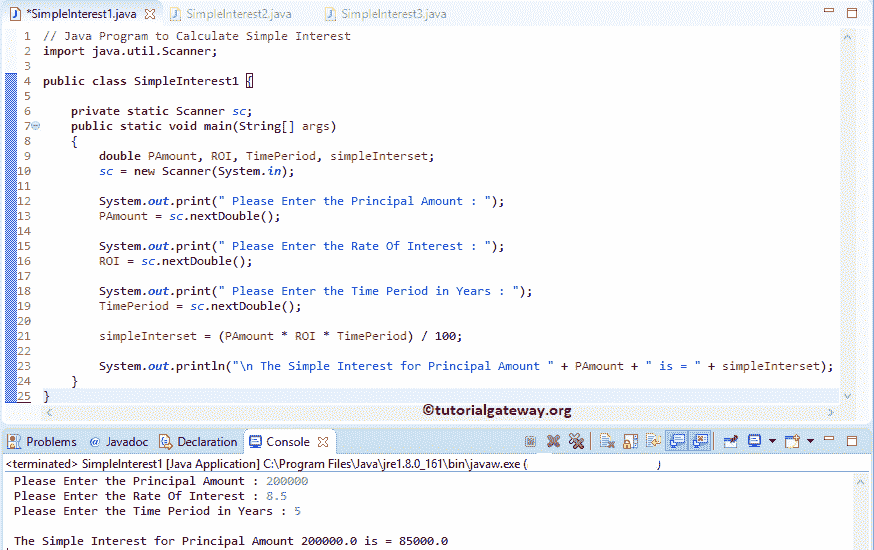

# Java 程序：计算简单利息

> 原文：<https://www.tutorialgateway.org/java-program-to-calculate-simple-interest/>

用例子写一个计算简单利息的 Java 程序。这个简单利息计算背后的公式是

单利=(本金*利率*年数)/ 100

## 计算简单兴趣的 Java 程序示例 1

这个 Java 程序允许用户输入本金金额、总年限和利率。通过使用这些值，这个 Java 程序使用上面指定的公式找到简单的兴趣。

```java
// Java Program to Calculate Simple Interest
import java.util.Scanner;

public class SimpleInterest1 {

	private static Scanner sc;
	public static void main(String[] args) 
	{
		double PAmount, ROI, TimePeriod, simpleInterset;
		sc = new Scanner(System.in);

		System.out.print(" Please Enter the Principal Amount : ");
		PAmount = sc.nextDouble();

		System.out.print(" Please Enter the Rate Of Interest : ");
		ROI = sc.nextDouble();

		System.out.print(" Please Enter the Time Period in Years : ");
		TimePeriod = sc.nextDouble();

		simpleInterset = (PAmount * ROI * TimePeriod) / 100;

		System.out.println("\n The Simple Interest for Principal Amount " + PAmount + " is = " + simpleInterset);
	}
}
```



## 寻找简单兴趣的 Java 程序示例 2

这个 Java 程序和上面一样。但是这次，我们创建了一个单独的 Java 方法来找到简单兴趣。

```java
import java.util.Scanner;

public class SimpleInterest2 {
	private static Scanner sc;
	public static void main(String[] args) 
	{
		double PAmount, ROI, TimePeriod;
		sc = new Scanner(System.in);

		System.out.print(" Please Enter the Principal Amount : ");
		PAmount = sc.nextDouble();

		System.out.print(" Please Enter the Rate Of Interest : ");
		ROI = sc.nextDouble();

		System.out.print(" Please Enter the Time Period in Years : ");
		TimePeriod = sc.nextDouble();

		calSimpleInterest(PAmount, ROI, TimePeriod);

	}
	public static void calSimpleInterest(double PAmount, double ROI, double TimePeriod)
	{
		double simpleInterset;

		simpleInterset = (PAmount * ROI * TimePeriod) / 100;

		System.out.println("\n The Simple Interest for Principal Amount " + PAmount + " is = " + simpleInterset);
	}
}
```

```java
 Please Enter the Principal Amount : 500000
 Please Enter the Rate Of Interest : 9.75
 Please Enter the Time Period in Years : 7

 The Simple Interest for Principal Amount 500000.0 is = 341250.0
```

## 寻找简单兴趣的 Java 程序示例 3

这个[程序](https://www.tutorialgateway.org/learn-java-programs/)返回一个值，而不是从一个方法中打印简单兴趣。接下来，在主 [Java](https://www.tutorialgateway.org/java-tutorial/) 程序中，我们将返回值赋给另一个变量。

```java
import java.util.Scanner;

public class SimpleInterest3 {

	private static Scanner sc;
	public static void main(String[] args) 
	{
		double PAmount, ROI, TimePeriod, simpleInterset;
		sc = new Scanner(System.in);

		System.out.print(" Please Enter the Principal Amount : ");
		PAmount = sc.nextDouble();

		System.out.print(" Please Enter the Rate Of Interest : ");
		ROI = sc.nextDouble();

		System.out.print(" Please Enter the Time Period in Years : ");
		TimePeriod = sc.nextDouble();

		simpleInterset = calSimpleInterest(PAmount, ROI, TimePeriod);
		System.out.println("\n The Simple Interest for Principal Amount " + PAmount + " is = " + simpleInterset);

	}
	public static double calSimpleInterest(double PAmount, double ROI, double TimePeriod)
	{
		double simpleInterset;

		simpleInterset = (PAmount * ROI * TimePeriod) / 100;

		return simpleInterset;
	}
}
```

```java
 Please Enter the Principal Amount : 1200000
 Please Enter the Rate Of Interest : 7.5
 Please Enter the Time Period in Years : 9

 The Simple Interest for Principal Amount 1200000.0 is = 810000.0
```