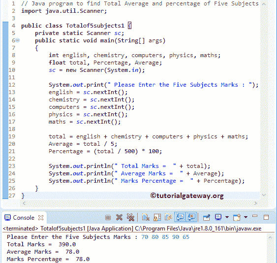

# Java 程序：查找五个主题的总平均值和百分比

> 原文：<https://www.tutorialgateway.org/java-program-to-find-total-average-and-percentage-of-five-subjects/>

写一个 Java 程序，用例子找出五个科目的总平均值和百分比，或者`N`个科目。

## 用于查找五个科目的总平均值和百分比的 Java 程序示例 1

这个 Java 程序允许用户为五个主题输入五个不同的值。然后，这个 Java 程序找到这五个主题的总数、平均值和百分比。在这个例子中，我们使用[算术运算符](https://www.tutorialgateway.org/java-arithmetic-operators/)来执行算术运算。

```java
// Java program to find Total Average and percentage of Five Subjects
import java.util.Scanner;

public class Totalof5subjects1 {
	private static Scanner sc;
	public static void main(String[] args) 
	{
		int english, chemistry, computers, physics, maths; 
	    float total, Percentage, Average;
		sc = new Scanner(System.in);

		System.out.print(" Please Enter the Five Subjects Marks : ");
		english = sc.nextInt();	
		chemistry = sc.nextInt();	
		computers = sc.nextInt();	
		physics = sc.nextInt();	
		maths = sc.nextInt();	

		total = english + chemistry + computers + physics + maths;
		Average = total / 5;
	    Percentage = (total / 500) * 100;

	    System.out.println(" Total Marks =  " + total);
	    System.out.println(" Average Marks =  " + Average);
	    System.out.println(" Marks Percentage =  " + Percentage);
	}
}
```



## 计算五个科目的总平均值和百分比的 Java 程序示例 2

上面的 Java 程序是针对固定数量的主题的。在这个 Java 程序中，用户可以灵活选择几个主题。然后，它找到总分数、平均值和百分比

```java
// Java program to find Total Average and percentage of Five Subjects
import java.util.Scanner;

public class Totalof5subjects2 {
	private static Scanner sc;
	public static void main(String[] args) 
	{
		int totalSubjects, i;
	    float Marks, total = 0, Percentage, Average;
		sc = new Scanner(System.in);

		System.out.print(" Please Enter the Total Number of Subjects : ");
		totalSubjects = sc.nextInt();

		System.out.print(" Please Enter the Subjects Marks : ");
		for(i = 0; i < totalSubjects; i++)
		{
			Marks = sc.nextInt();
			total = total + Marks;
		}

		Average = total / totalSubjects;
	    Percentage = (total / (totalSubjects * 100)) * 100;

	    System.out.println(" Total Marks =  " + total);
	    System.out.println(" Average Marks =  " + Average);
	    System.out.println(" Marks Percentage =  " + Percentage);
	}
}
```

分析

1.  第一条 [Java](https://www.tutorialgateway.org/java-tutorial/) system.out.print 语句要求用户输入主题总数。例如，3 个主题
2.  [For 循环](https://www.tutorialgateway.org/java-for-loop/)拒绝用户使用条件 i <输入超过 3 个值。在下一行中，我们将用户输入的值添加到总计中。
3.  在循环之外，我们计算平均值和百分比。

```java
 Please Enter the Total Number of Subjects : 6
 Please Enter the Subjects Marks : 80 85 75 65 90 95
 Total Marks =  490.0
 Average Marks =  81.666664
 Marks Percentage =  81.666664
```

## 计算五个科目的总平均值和百分比的 Java 程序示例 3

这个[程序](https://www.tutorialgateway.org/learn-java-programs/)和第一个例子一样。但是在这个 Java 程序中，我们创建了一个单独的方法来计算学生分数的总数、平均值和百分比。

```java
// Java program to find Total Average and percentage of Five Subjects
import java.util.Scanner;

public class Totalof5subjects3 {

	private static Scanner sc;
	public static void main(String[] args) 
	{
		int english, chemistry, computers, physics, maths; 	    
		sc = new Scanner(System.in);

		System.out.print(" Please Enter the Five Subjects Marks : ");
		english = sc.nextInt();	
		chemistry = sc.nextInt();	
		computers = sc.nextInt();	
		physics = sc.nextInt();	
		maths = sc.nextInt();	

		totalmarks(english, chemistry, computers, physics, maths);
	}	
	public static void totalmarks(int eng, int chem, int com, int phy, int math)
	{
		float total, Percentage, Average;
		total = eng + chem + com + phy + math;
		Average = total / 5;
	    Percentage = (total / 500) * 100;

	    System.out.println(" Total Marks =  " + total);
	    System.out.println(" Average Marks =  " + Average);
	    System.out.println(" Marks Percentage =  " + Percentage);
	}
}
```

```java
 Please Enter the Five Subjects Marks : 65 75 85 95 90
 Total Marks =  410.0
 Average Marks =  82.0
 Marks Percentage =  82.0
```