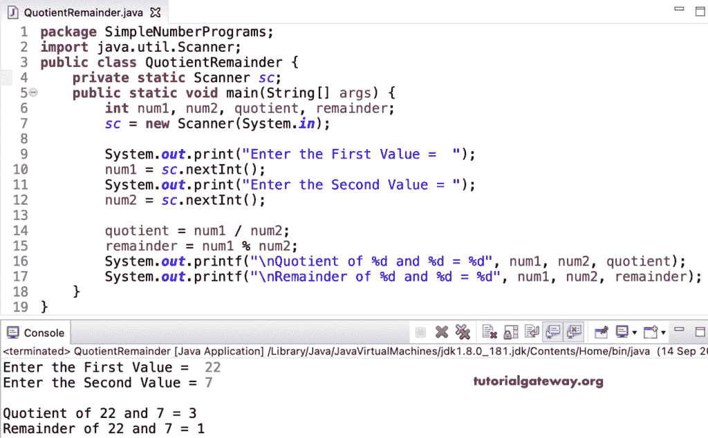

# Java 程序：计算商和余数

> 原文：<https://www.tutorialgateway.org/java-program-to-compute-quotient-and-remainder/>

用一个例子写一个计算商和余数的 Java 程序。在 Java 中，我们有/和%运算符来求商和余数。因此，这个 Java 示例允许用户输入两个整数值，并计算余数和商。

```java
package SimpleNumberPrograms;

import java.util.Scanner;

public class QuotientRemainder {
	private static Scanner sc;

	public static void main(String[] args) {
		int num1, num2, quotient, remainder;
		sc = new Scanner(System.in);

		System.out.print("Enter the First Value =  ");
		num1 = sc.nextInt();

		System.out.print("Enter the Second Value = ");
		num2 = sc.nextInt();

		quotient = num1 / num2;
		remainder = num1 % num2;

		System.out.printf("\nQuotient of %d and %d = %d", num1, num2, quotient);
		System.out.printf("\nRemainder of %d and %d = %d", num1, num2, remainder);
	}
}
```



让我试试另一个值。

```java
Enter the First Value =  200
Enter the Second Value = 5

Quotient of 200 and 5 = 40
Remainder of 200 and 5 = 0
```

在这个 [Java 例子](https://www.tutorialgateway.org/learn-java-programs/)中，我们创建了计算并返回商和余数的 calc 商数和 calcRemainder 函数。

```java
package SimpleNumberPrograms;

import java.util.Scanner;

public class QuotientRemainder2 {
	private static Scanner sc;

	public static void main(String[] args) {
		int num1, num2;

		sc = new Scanner(System.in);

		System.out.print("Enter the First Value =  ");
		num1 = sc.nextInt();

		System.out.print("Enter the Second Value = ");
		num2 = sc.nextInt();

		System.out.printf("\nQuotient  = %d", calcQuotient(num1, num2));
		System.out.printf("\nRemainder = %d", calcRemainder(num1, num2));
	}

	public static int calcQuotient(int num1, int num2) {
		return num1 / num2;
	}

	public static int calcRemainder(int num1, int num2) {
		return num1 % num2;
	}
}
```

```java
Enter the First Value =  125
Enter the Second Value = 7

Quotient  = 17
Remainder = 6
```