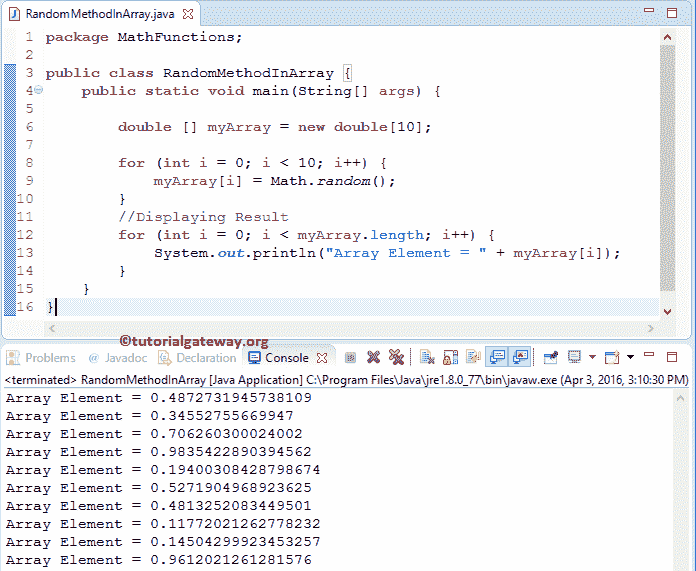

# Java 程序：随机数生成器

> 原文：<https://www.tutorialgateway.org/java-random-number-generator/>

Java 随机生成器函数是 JMath 库函数之一，用于生成和返回介于 0 和 1 之间的伪随机数。Java 编程语言中数学随机数的基本语法如下所示。

```java
static double random(); //Return Type is Double

// In order to use in program: 
Math.random();
```

## Java 随机数生成器示例

函数返回 0 到 1 之间的伪随机数。在这个程序中，我们将使用该函数并显示输出。

```java
package MathFunctions;

public class RandomMethod {
	public static void main(String[] args) {

		System.out.println(Math.random());
		System.out.println(Math.random());

		System.out.println(Math.random());
		System.out.println(Math.random());
	}
}
```

Java 随机函数生成的值从 0(包括)到小于 1。如果您观察下面的输出，我们调用了函数四次，它返回四个不同的值。

```java
0.03922519673249125

0.6550200808825295

0.9178026557745128

0.8929566570868191
```

### Java 随机数生成器示例 2

在本[程序](https://www.tutorialgateway.org/learn-java-programs/)中，我们将展示如何将随机值存储到数组中。在这里，我们将声明一个双精度类型的数组，并用 Math.random 生成的不同值填充该数组

首先，我们声明了一个空的双[数组](https://www.tutorialgateway.org/java-array/)。接下来，我们使用 Java For 循环来迭代数组。在 For 循环中，我们将 I 值初始化为 0。这里，编译器将检查条件(i < 10)。

以下语句将值存储到数组中。如果您观察代码片段，我们将为每个索引位置分配一个值。这里编译器会调用[数学函数](https://www.tutorialgateway.org/java-math-library/)(静态双随机() )返回一个 0 到 1 之间的值。

接下来，为了显示数组值，我们使用另一个[用于循环](https://www.tutorialgateway.org/java-for-loop/)来迭代数组。在 For 循环中，我们将 I 值初始化为 0，编译器将检查该条件(i < myArray.length)。myArray.length 查找数组的长度

在循环中， [Java](https://www.tutorialgateway.org/java-tutorial/) System.out.println 语句打印输出。

```java
package MathFunctions;

public class RandomMethodInArray {
	public static void main(String[] args) {

		double [] myArray = new double[10];

		for (int i = 0; i < 10; i++) {
			myArray[i] = Math.random();
		}
		//Displaying Result
		for (int i = 0; i < myArray.length; i++) {
			System.out.println("Array Element = " + myArray[i]);
		}
	}
}
```

