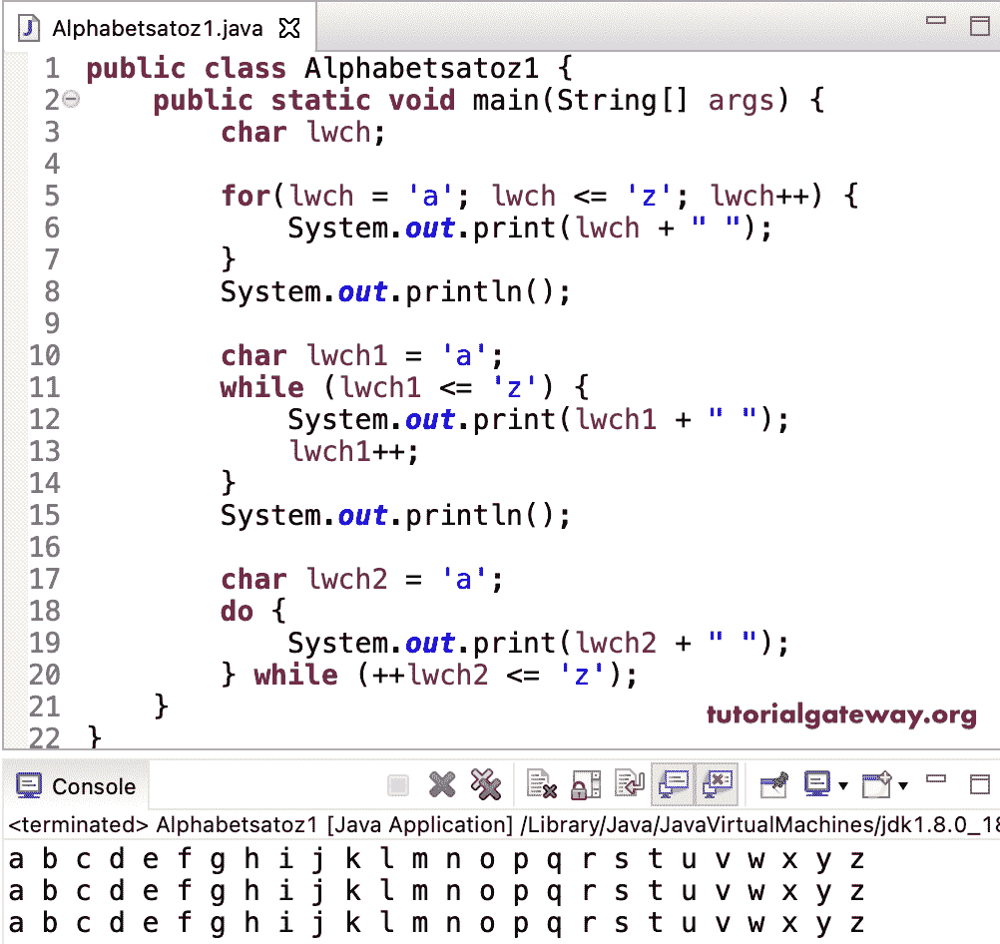

# Java 程序：显示字母

> 原文：<https://www.tutorialgateway.org/java-program-to-display-alphabets-from-a-to-z/>

编写一个 Java 程序，使用 for 循环、while 循环和 do while 循环显示从 a 到 z 的字母。在这个 Java 例子中，所有的循环从字母 a 到 z 进行迭代，并将它们显示为输出。

```java
public class Alphabetsatoz1 {
	public static void main(String[] args) {	
		char lwch;

		for(lwch = 'a'; lwch <= 'z'; lwch++) 
		{
			System.out.print(lwch + " ");
		}
		System.out.println();

		char lwch1 = 'a';
		while (lwch1 <= 'z') 
		{
			System.out.print(lwch1 + " ");
			lwch1++;
		}
		System.out.println();

		char lwch2 = 'a';
		do 
		{
			System.out.print(lwch2 + " ");
		} while (++lwch2 <= 'z');
	}
}
```



这个 [Java 程序](https://www.tutorialgateway.org/learn-java-programs/)显示 a 到 z 迭代 ASCII 码从 97 到 122，表示字母 a 到 z 并打印出来。

```java
public class Alphabetatoz2 {

	public static void main(String[] args) {

		for(int i = 97; i <= 122; i++) 
		{
			System.out.printf("%c ", i);
		}
	}
}
```

```java
a b c d e f g h i j k l m n o p q r s t u v w x y z 
```

这个 Java 显示字母从 a 到 z 的程序允许用户输入开始的小写字母，并打印剩余的小写字母直到 z。

```java
import java.util.Scanner;

public class Alphabetatoz3 {

	private static Scanner sc;

	public static void main(String[] args) {

		char ch, strlwChar;
		sc= new Scanner(System.in);

		System.out.print("Please Enter any Character =  ");
		strlwChar = sc.next().charAt(0);

		for(ch = strlwChar; ch <= 'z'; ch++) {
			System.out.print(ch + " ");
		}
	}
}
```

```java
Please Enter any Character =  h
h i j k l m n o p q r s t u v w x y z 
```