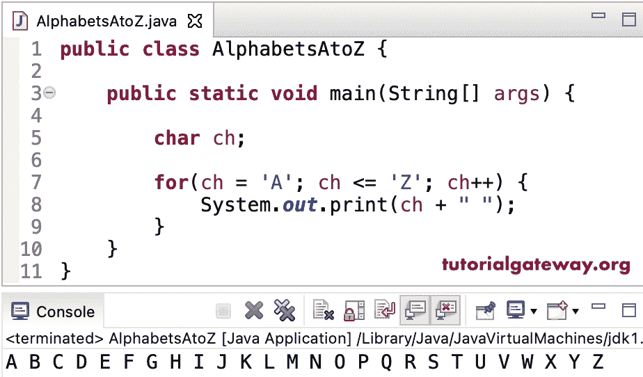

# Java 程序：从 A 到 Z 打印字母

> 原文：<https://www.tutorialgateway.org/java-program-to-print-alphabets-from-a-to-z/>

编写一个 Java 程序，使用 for 循环打印从 A 到 Z 的字母。在这个 Java 例子中，for 循环将从字母 A 到 Z 进行迭代，并将它们作为输出打印出来。

```java
public class AlphabetsAtoZ {

	public static void main(String[] args) {

		char ch;

		for(ch = 'A'; ch <= 'Z'; ch++) {
			System.out.print(ch + " ");
		}
	}
}
```



这个 [Java 程序](https://www.tutorialgateway.org/learn-java-programs/)从 65 到 90 迭代 ASCII 码，表示字母 A 到 Z，并打印出来。这里，我们使用 for 循环、while 循环和 do while 循环向您展示了各种可能性。

```java
public class AlphabetsAtoZ2 {

	public static void main(String[] args) {

		for(int i = 65; i <= 90; i++) 
		{
			System.out.printf("%c ", i);
		}
		System.out.println();

		int j = 65;
		while(j <= 90) 
		{
			System.out.printf("%c ", j);
			j++;
		}	
		System.out.println();

		int k = 65;
		do 
		{
			System.out.printf("%c ", k);
		}	while(++k <= 90);
	}
}
```

```java
A B C D E F G H I J K L M N O P Q R S T U V W X Y Z 
A B C D E F G H I J K L M N O P Q R S T U V W X Y Z 
A B C D E F G H I J K L M N O P Q R S T U V W X Y Z 
```

这个从 A 到 Z 的 Java 字母程序允许用户输入起始字母，并打印到 Z 的剩余大写字母

```java
import java.util.Scanner;

public class AlphabetsAtoZ3 {

	private static Scanner sc;

	public static void main(String[] args) {

		char ch, strChar;
		sc= new Scanner(System.in);

		System.out.print("Please Enter any Character =  ");
		strChar = sc.next().charAt(0);

		for(ch = strChar; ch <= 'Z'; ch++) {
			System.out.print(ch + " ");
		}
	}
}
```

```java
Please Enter any Character =  G
G H I J K L M N O P Q R S T U V W X Y Z 
```