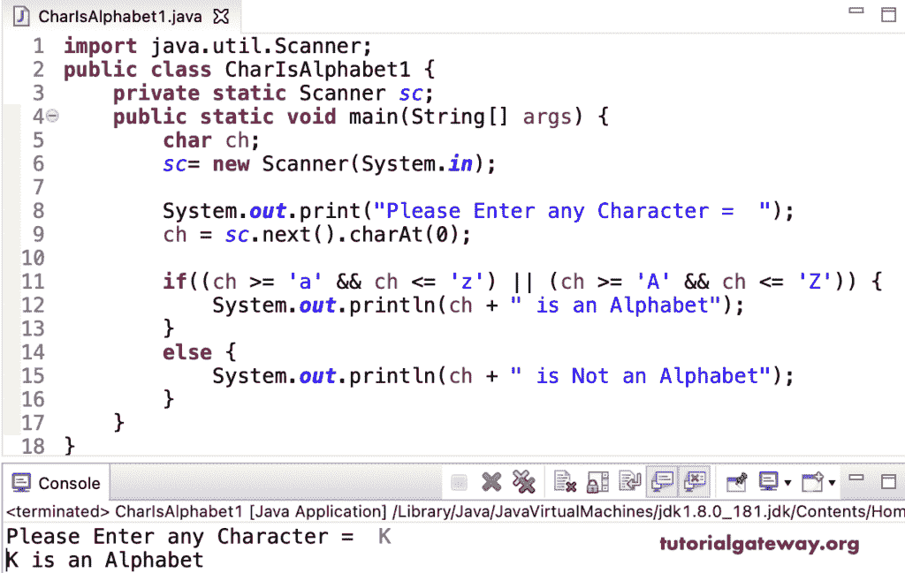

# Java 程序：检查字符是否是字母

> 原文：<https://www.tutorialgateway.org/java-program-to-check-character-is-alphabet-or-not/>

编写一个 Java 程序，通过一个例子，使用 if-else 语句检查一个字符是否是字母表。如果条件检查用户输入的字符是在 A 到 z 之间还是在 A 到 z 之间。如果条件为真，则它是字母表；否则，它就不是字母表。

```java
import java.util.Scanner;

public class CharIsAlphabet1 {

	private static Scanner sc;

	public static void main(String[] args) {

		char ch;
		sc= new Scanner(System.in);

		System.out.print("Please Enter any Character =  ");
		ch = sc.next().charAt(0);

		if((ch >= 'a' && ch <= 'z') || (ch >= 'A' && ch <= 'Z')) {
			System.out.println(ch + " is an Alphabet");
		}
		else {
			System.out.println(ch + " is Not an Alphabet");
		}

	}
}
```



勾选数字

```java
Please Enter any Character =  9
9 is Not an Alphabet
```

## 使用条件运算符检查字符是否是字母的程序

```java
import java.util.Scanner;

public class CharIsAlphabet2 {

	private static Scanner sc;

	public static void main(String[] args) {

		char ch;
		sc= new Scanner(System.in);

		System.out.print("Please Enter any Character =  ");
		ch = sc.next().charAt(0);

		String result = ((ch >= 'a' && ch <= 'z') || (ch >= 'A' && ch <= 'Z')) ?
				ch + " is an Alphabet" : ch + " is Not an Alphabet";

		System.out.println(result);

		}	
}
```

```java
Please Enter any Character =  m
m is an Alphabet

Please Enter any Character =  .
. is Not an Alphabet
```

在 Java 中，我们有一个 isAlphabetic 字符函数，它检查给定的字符是否是字母表。我们也用同样的。

```java
import java.util.Scanner;

public class CharIsAlphabet3 {

	private static Scanner sc;

	public static void main(String[] args) {

		char ch;
		sc= new Scanner(System.in);

		System.out.print("Please Enter any Character =  ");
		ch = sc.next().charAt(0);

		if(Character.isAlphabetic(ch)) {
			System.out.println(ch + " is an Alphabet");
		}
		else {
			System.out.println(ch + " is Not an Alphabet");
		}

	}
}
```

```java
Please Enter any Character =  K
K is an Alphabet

Please Enter any Character =  *
* is Not an Alphabet
```

每个字母表都与一个 ASCII 码相关联。这个 [Java 示例](https://www.tutorialgateway.org/learn-java-programs/)检查给定字符的 ASCII 值是在 65 到 90 (A 到 Z)之间还是 97 到 122 (a 到 Z)之间。

```java
import java.util.Scanner;

public class CharIsAlphabet4 {

	private static Scanner sc;

	public static void main(String[] args) {

		char ch;
		sc= new Scanner(System.in);

		System.out.print("Please Enter any Character =  ");
		ch = sc.next().charAt(0);

		if((ch >= 65 && ch <= 90) || (ch >= 97 && ch <= 122)) {
			System.out.println(ch + " is an Alphabet");
		}
		else {
			System.out.println(ch + " is Not an Alphabet");
		}

	}
}
```

```java
Please Enter any Character =  j
j is an Alphabet

Please Enter any Character =  1
1 is Not an Alphabet
```