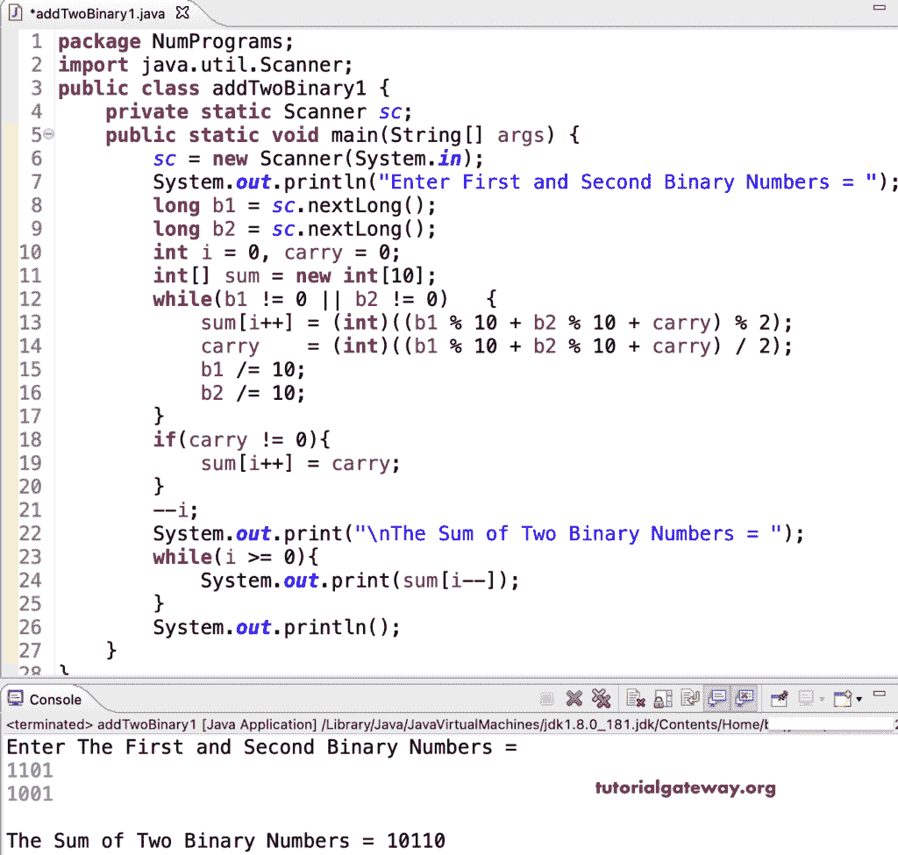

# Java 程序：添加两个二进制数

> 原文：<https://www.tutorialgateway.org/java-program-to-add-two-binary-numbers/>

写一个 Java 程序，用一个例子把两个二进制数相加。众所周知，二进制数是 1 和 0 的组合。因此，将两个二进制数相加意味着

*   0 + 0 = 0
*   0 + 1 = 1
*   1 + 0 = 1
*   1 + 1 = 10.这里，1 将结转。
*   1(结转号码)+ 1 + 1 = 11，1 将结转。

```java
package NumPrograms;

import java.util.Scanner;

public class addTwoBinary1 {

	private static Scanner sc;

	public static void main(String[] args) {

		sc = new Scanner(System.in);

		System.out.println("Enter The First and Second Binary Numbers = ");	
		long b1 = sc.nextLong();
		long b2 = sc.nextLong();

		int i = 0, carry = 0;

		int[] sum = new int[10];

		while(b1 != 0 || b2 != 0)
		{
			sum[i++] = (int)((b1 % 10 + b2 % 10 + carry) % 2);
			carry    = (int)((b1 % 10 + b2 % 10 + carry) / 2);
			b1 /= 10;
			b2 /= 10;
		}
		if(carry != 0)
		{
			sum[i++] = carry;
		}
		--i;
		System.out.print("\nThe Sum of Two Binary Numbers = ");
		while(i >= 0)
		{
			System.out.print(sum[i--]);
		}
		System.out.println();
	}

}
```



这个 Java 程序将二进制转换为整数，并添加两个二进制数。如果这两个二进制数是字符串数据类型，我们可以使用 Integer parseInt 方法将它们转换为整数，并将这两个整数值相加。接下来，我们可以使用 [Java](https://www.tutorialgateway.org/learn-java-programs/) toBinaryString 将它们转换回二进制数。

```java
package NumPrograms;

import java.util.Scanner;

public class addTwoBinary2 {

	private static Scanner sc;

	public static void main(String[] args) {

		sc = new Scanner(System.in);

		System.out.println("Enter The First and Second Binary Numbers = ");	
		String b1 = sc.nextLine();
		String b2 = sc.nextLine();

		int num1 = Integer.parseInt(b1, 2);
		int num2 = Integer.parseInt(b2, 2);

		int output = num1 + num2;

		System.out.print("\nThe Sum of Two Binary Numbers = ");
		System.out.print(Integer.toBinaryString(output));
	}
}
```

```java
Enter The First and Second Binary Numbers = 
101010
111111

The Sum of Two Binary Numbers = 1101001
```

使用 for 循环将两个二进制数相加的 Java 程序。

```java
package NumPrograms;

import java.util.Scanner;

public class addTwoBinary3 {

	private static Scanner sc;

	public static void main(String[] args) {

		sc = new Scanner(System.in);

		System.out.println("Enter The First and Second Binary Numbers = ");	
		long b1 = sc.nextLong();
		long b2 = sc.nextLong();

		int i, carry = 0;

		int[] sum = new int[10];

		for(i = 0; b1 != 0 || b2 != 0; b1 /= 10, b2 /= 10)
		{
			sum[i++] = (int)((b1 % 10 + b2 % 10 + carry) % 2);
			carry    = (int)((b1 % 10 + b2 % 10 + carry) / 2);		
		}
		if(carry != 0)
		{
			sum[i++] = carry;
		}
		--i;
		System.out.print("\nThe Sum of Two Binary Numbers = ");
		while(i >= 0)
		{
			System.out.print(sum[i--]);
		}
		System.out.println();
	}

}
```

```java
Enter The First and Second Binary Numbers = 
110101
010111

The Sum of Two Binary Numbers = 1001100
```