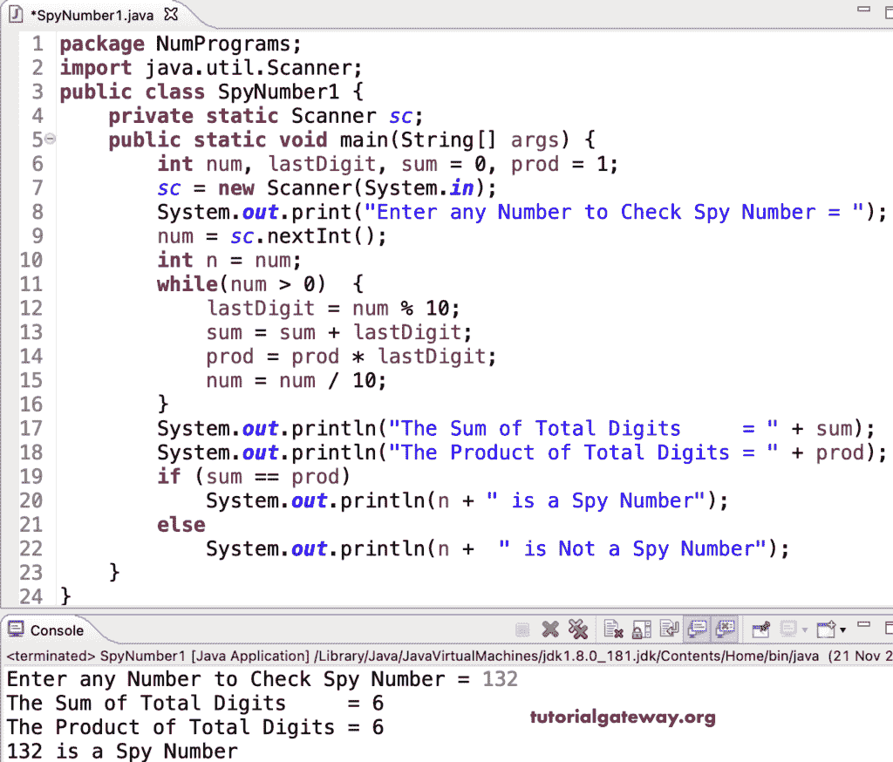

# Java 程序：检查间谍数字

> 原文：<https://www.tutorialgateway.org/java-program-to-check-spy-number/>

编写一个 Java 程序，使用 while 循环检查间谍数字。如果所有数字的总和等于数字的乘积，任何数字都可以是间谍号。例如，132 是一个间谍号，因为 1 + 3 + 2 (6)等于 1 * 3 * 2 (6)。

```java
package NumPrograms;

import java.util.Scanner;

public class SpyNumber1 {
	private static Scanner sc;

	public static void main(String[] args) {
		int num, lastDigit, sum = 0, prod = 1;
		sc = new Scanner(System.in);	

		System.out.print("Enter any Number to Check Spy Number = ");
		num = sc.nextInt();
		int n = num;
		while(num > 0)
		{
			lastDigit = num % 10;
			sum = sum + lastDigit;
			prod = prod * lastDigit;
			num = num / 10;
		}

		System.out.println("The Sum of Total Digits     = " + sum);
		System.out.println("The Product of Total Digits = " + prod);

		if (sum == prod) 
		{
			System.out.println(n + " is a Spy Number");
		}
		else 
		{
			System.out.println(n +  " is Not a Spy Number");
		}
	}

}
```



这个 Java 程序使用 for 循环检查给定的数字是否是间谍数字。

```java
package NumPrograms;

import java.util.Scanner;

public class SpyNumber2 {
	private static Scanner sc;

	public static void main(String[] args) {
		int num, lastDigit, sum, prod;
		sc = new Scanner(System.in);	

		System.out.print("Enter any Number to Check Spy Number = ");
		num = sc.nextInt();
		int n = num;
		for(sum = 0, prod = 1; num > 0; num = num /10)
		{
			lastDigit = num % 10;
			sum = sum + lastDigit;
			prod = prod * lastDigit;
		}

		System.out.println("The Sum of Total Digits     = " + sum);
		System.out.println("The Product of Total Digits = " + prod);

		if (sum == prod) 
		{
			System.out.println(n + " is a Spy Number");
		}
		else 
		{
			System.out.println(n +  " is Not a Spy Number");
		}
	}
}
```

```java
Enter any Number to Check Spy Number = 132
The Sum of Total Digits     = 6
The Product of Total Digits = 6
132 is a Spy Number

Enter any Number to Check Spy Number = 121
The Sum of Total Digits     = 4
The Product of Total Digits = 2
121 is Not a Spy Number
```

在这个 [Java 例子](https://www.tutorialgateway.org/learn-java-programs/)中，checkSpyNumber 函数检查给定的数字是否是间谍数字，并返回布尔值。

```java
package NumPrograms;

import java.util.Scanner;

public class SpyNumber3 {
	private static Scanner sc;

	public static void main(String[] args) {

		sc = new Scanner(System.in);	

		System.out.print("Enter any Number to Check Spy Number = ");
		int num = sc.nextInt();

		if (checkSpyNumber(num) == true) 
		{
			System.out.println(num + " is a Spy Number");
		}
		else 
		{
			System.out.println(num +  " is Not a Spy Number");
		}
	}
	static boolean checkSpyNumber(int num)
	{
		int lastDigit, sum, prod;

		for(sum = 0, prod = 1; num > 0; num = num /10)
		{
			lastDigit = num % 10;
			sum = sum + lastDigit;
			prod = prod * lastDigit;
		}

		System.out.println("The Sum of Total Digits     = " + sum);
		System.out.println("The Product of Total Digits = " + prod);

		if (sum == prod) 
		{
			return true;
		}
		else
		{
			return false;
		}
	}
}
```

```java
Enter any Number to Check Spy Number = 2215
The Sum of Total Digits     = 10
The Product of Total Digits = 20
2215 is Not a Spy Number

Enter any Number to Check Spy Number = 4211
The Sum of Total Digits     = 8
The Product of Total Digits = 8
4211 is a Spy Number
```

一个 Java 程序，用于打印从 1 到 N 或给定范围内的间谍数字。

```java
package NumPrograms;

import java.util.Scanner;

public class SpyNumber4 {
	private static Scanner sc;

	public static void main(String[] args) {

		sc = new Scanner(System.in);	

		System.out.print("Enter Spy Numbers Start and End Range = ");	
		int start = sc.nextInt();
		int end = sc.nextInt();

		System.out.println("The List of Spy Numbers from " + start + " to " + end);
		for(int i = start; i <= end; i++)
		{
			if (checkSpyNumber(i) == true) 
			{
				System.out.print(i + "  ");
			}
		}
	}
	static boolean checkSpyNumber(int num)
	{
		int lastDigit, sum, prod;

		for(sum = 0, prod = 1; num > 0; num = num /10)
		{
			lastDigit = num % 10;
			sum = sum + lastDigit;
			prod = prod * lastDigit;
		}

		if (sum == prod) 
		{
			return true;
		}
		else
		{
			return false;
		}
	}
}
```

```java
Enter Spy Numbers Start and End Range = 2 10000
The List of Spy Numbers from 2 to 10000
2  3  4  5  6  7  8  9  22  123  132  213  231  312  321  1124  1142  1214  1241  1412  1421  2114  2141  2411  4112  4121  4211 
```