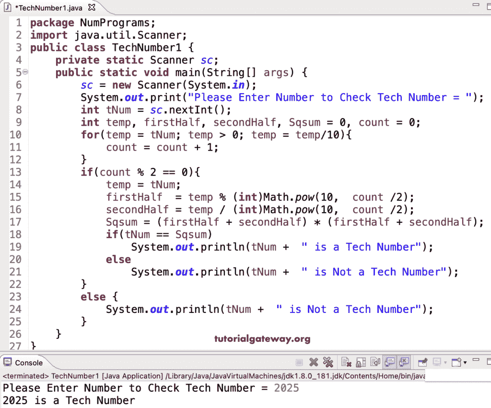

# Java 程序：检查技术数字

> 原文：<https://www.tutorialgateway.org/java-program-to-check-tech-number/>

写一个 Java 程序来检查技术数字。例如，如果一个数字有偶数位数，它被精确地分成两部分，这两部分之和的平方等于实际数字，那么它就是一个 Tech 数。因此，在这个 Java 例子中，首先，我们计算数字的总数，如果是偶数，我们将它们分成两半。接下来，我们求出这两个一半的和，并求结果的平方。If 语句检查实际数字是否等于平方，那么它就是一个技术数字。

```java
package NumPrograms;

import java.util.Scanner;

public class TechNumber1 {
	private static Scanner sc;

	public static void main(String[] args) {
		sc = new Scanner(System.in);	

		System.out.print("Please Enter Number to Check Tech Number = ");
		int tNum = sc.nextInt();

		int temp, firstHalf, secondHalf, Sqsum = 0, count = 0;

		for(temp = tNum; temp > 0; temp = temp/10)
		{
			count = count + 1;
		}

		if(count % 2 == 0)
		{
			temp = tNum;
			firstHalf  = temp % (int)Math.pow(10,  count /2);
			secondHalf = temp / (int)Math.pow(10,  count /2);

			Sqsum = (firstHalf + secondHalf) * (firstHalf + secondHalf);

			if(tNum == Sqsum)
			{
				System.out.println(tNum +  " is a Tech Number");
			}
			else
			{
				System.out.println(tNum +  " is Not a Tech Number");
			}
		}
		else 
		{
			System.out.println(tNum +  " is Not a Tech Number");
		}
	}

}
```



在这个 Java 程序中，digitCount 对一个数字中的数字进行计数，sumOfToHalfs 将这个数字分成两个大厅，求出两个一半的平方和。

```java
package NumPrograms;

import java.util.Scanner;

public class TechNumber2 {
	private static Scanner sc;

	public static void main(String[] args) {
		sc = new Scanner(System.in);	

		System.out.print("Please Enter Number to Check Tech Number = ");
		int tNum = sc.nextInt();

		int count = digitCount(tNum);

		if(count % 2 == 0 && tNum == sumOfToHalfs(tNum, count))
		{	
			System.out.println(tNum +  " is a Tech Number");
		}
		else 
		{
			System.out.println(tNum +  " is Not a Tech Number");
		}
	}

	static int digitCount(int tNum)
	{
		int count = 0;
		for(; tNum > 0; tNum = tNum/10)
		{
			count = count + 1;
		}
		return count;
	}

	static int sumOfToHalfs(int tNum, int count)
	{
		int firstHalf, secondHalf, Sqsum = 0; 

		firstHalf  = tNum % (int)Math.pow(10,  count /2);
		secondHalf = tNum / (int)Math.pow(10,  count /2);

		Sqsum = (firstHalf + secondHalf) * (firstHalf + secondHalf);

		return Sqsum;
	}

}
```

```java
Please Enter Number to Check Tech Number = 2025
2025 is a Tech Number

Please Enter Number to Check Tech Number = 2050
2050 is Not a Tech Number
```

这个 Java 程序打印给定范围内的技术数字。

```java
package NumPrograms;

import java.util.Scanner;

public class TechNumber3 {
	private static Scanner sc;

	public static void main(String[] args) {
		sc = new Scanner(System.in);	

		System.out.print("Enter Tech Numbers Start and End Range = ");	
		int start = sc.nextInt();
		int end = sc.nextInt();

		int firstHalf, secondHalf, Sqsum = 0;

		System.out.println("The List of Techn Numbers from " + start + " to " + end);
		for(int i = start; i <= end; i++)
		{
			firstHalf  = i % 100;
			secondHalf = i / 100;
			Sqsum = (firstHalf + secondHalf) * (firstHalf + secondHalf);

			if(i == Sqsum)
			{
				System.out.println(i +  " is a Tech Number");
			}
		}
	}
}
```

```java
Enter Tech Numbers Start and End Range = 1 10000
The List of Techn Numbers from 1 to 10000
1 is a Tech Number
2025 is a Tech Number
3025 is a Tech Number
9801 is a Tech Number
10000 is a Tech Number
```

在 [Java](https://www.tutorialgateway.org/learn-java-programs/) 中打印科技号从 1 到 N 是另一种方式。

```java
package NumPrograms;

import java.util.Scanner;

public class TechNumber4 {
	private static Scanner sc;

	public static void main(String[] args) {
		sc = new Scanner(System.in);	

		System.out.print("Enter Tech Numbers Start and End Range = ");	
		int start = sc.nextInt();
		int end = sc.nextInt();

		System.out.println("The List of Techn Numbers from " + start + " to " + end);
		for(int i = start; i <= end; i++)
		{				
			if(i == sumOfToHalfs(i))
			{	
				System.out.println(i +  " is a Tech Number");
			}
		}
	}

	static int digitCount(int tNum)
	{
		int count = 0;
		for(; tNum > 0; tNum = tNum/10)
		{
			count = count + 1;
		}
		return count;
	}

	static int sumOfToHalfs(int tNum)
	{
		int firstHalf, secondHalf, Sqsum = 0; 
		int count = digitCount(tNum);

		if(count % 2 == 0)
		{	
			firstHalf  = tNum % (int)Math.pow(10,  count /2);
			secondHalf = tNum / (int)Math.pow(10,  count /2);

			Sqsum = (firstHalf + secondHalf) * (firstHalf + secondHalf);
		}

		return Sqsum;
	}

}
```

```java
Enter Tech Numbers Start and End Range = 2 10000
The List of Techn Numbers from 2 to 10000
81 is a Tech Number
2025 is a Tech Number
3025 is a Tech Number
9801 is a Tech Number
```