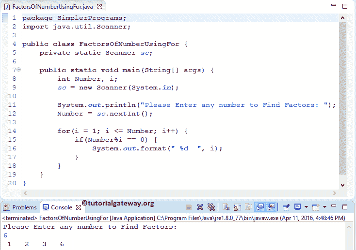

# Java 程序：寻找数字因数

> 原文：<https://www.tutorialgateway.org/java-program-to-find-factors-of-a-number/>

编写一个 Java 程序，使用 For 循环、While 循环、Do While 循环和函数来查找一个数的因数。能被给定数完全整除的数(这意味着余数应该是 0)称为给定数的因数。

## 用 For 循环求一个数的因数的 Java 程序

这个 Java 程序允许用户输入任何整数值。接下来，这个程序将使用 Java For 循环找到一个数的因数。

```java
// Java Program to Find factors of a number using For Loop

package SimplerPrograms;

import java.util.Scanner;

public class FactorsOfNumberUsingFor {
	private static Scanner sc;

	public static void main(String[] args) {
		int Number, i;
		sc = new Scanner(System.in);

		System.out.println("Please Enter any number to Find Factors: ");
		Number = sc.nextInt();

		for(i = 1; i <= Number; i++) {
			if(Number%i == 0) {
				System.out.format(" %d  ", i);
			}
		}
	}
}

```



在这个寻找数字因数的 Java 程序中，我们声明了两个整数变量 Number 和 I。然后，将该数字赋给变量 number。

```java
System.out.println("Please Enter any number to Find Factors: ");
Number = sc.nextInt();
```

在下一行中，我们有 [For 循环](https://www.tutorialgateway.org/java-for-loop/)，并且 For 循环内的条件(i < = Number)将确保我不会超过该数字。在 For 循环中，我们使用 If 条件来检查数字% i 是否等于零。如果条件为真，那么我将被打印为输出。请参考 [Java If 语句](https://www.tutorialgateway.org/java-if-statement/)文章了解 If else 语句。

```java
for(i = 1; i <= Number; i++) {
	if(Number%i == 0) {
		System.out.format(" %d  ", i);
	}
}
```

让我们看看这个 Java 程序的工作原理，以迭代的方式为循环寻找一个数的因数。从上面的截图中，用户输入了值:Number = 6。

寻找数字第一次迭代因数的 Java 程序

对于第一次迭代，数字= 6，i = 1

*   For 循环内的条件(1 <= 6)为真。因此，编译器将开始在 For 循环中执行语句
*   在 for 循环中，我们有 [If 语句](https://www.tutorialgateway.org/java-if-statement/)和条件 if (6 % 1 == 0)为真。所以，System.out.format(" %d "，I)；报表将被打印
*   最后，我将增加 1。请参考 Java 文章中的[递增和递减运算符来理解++符号。](https://www.tutorialgateway.org/increment-and-decrement-operators-in-java/)

第二次迭代

从第一次迭代开始，I 的值随着 i = 2 而改变

*   For 循环内的条件(2 <= 6)为真。因此，编译器将开始在 For 循环中执行语句
*   在 for 循环中，if 条件 if (6 % 2 == 0)为真。所以，System.out.format(" %d "，I)；报表将被打印
*   最后，我将增加 1。

第三次迭代

从第二次迭代开始，i = 3 的值

*   For 循环内的条件(3 <= 6)为真。
*   在 for 循环中，if 条件 if (6 % 3 == 0)为真，因此 System.out.format(" %d "，I)；报表将被打印
*   最后，我将增加 1。

Java 程序第四次迭代求一个数的因数

从第三次迭代开始，i = 4 的值

*   For 循环内的条件(4 <= 6)为真。
*   在 for 循环中，if 条件 if (6 % 4 == 0)为 False。所以，System.out.format(" %d "，I)；不会打印对账单
*   最后，我将增加 1。

第五次迭代

从第四次迭代开始，i = 5

*   For 循环内的条件(5 <= 6)为真。
*   在 for 循环中，if 条件 if (6 % 5 == 0)为 False。所以，System.out.format(" %d "，I)；不会打印对账单
*   最后，我将增加 1。

第六次迭代

从第五次迭代开始，I 的值改变为 i = 6

*   For 循环内的条件(6 <= 6)为真。
*   在 for 循环中，if 条件 if (6 % 6 == 0)为真。所以，System.out.format(" %d "，I)；报表将被打印
*   最后，我将增加 1。

第七次迭代

从第六次迭代开始，i = 7 的值和 For 循环内的条件(7 <= 6)为假。因此，Jcompiler 将从 For 循环中退出。

## 用 While 循环寻找一个数的因数的 Java 程序

这个 [Java 程序](https://www.tutorialgateway.org/learn-java-programs/)允许用户输入任意整数值。通过使用这个值，这个程序将使用 [Java While Loop](https://www.tutorialgateway.org/java-while-loop/) 找到一个数字的因数。

```java
// Java Program to Find factors of a number using While Loop

package SimplerPrograms;

import java.util.Scanner;

public class FactorsOfNumberUsingWhile {
	private static Scanner sc;

	public static void main(String[] args) {
		int Number, i = 1;
		sc = new Scanner(System.in);

		System.out.println("Please Enter any number to Find Factors: ");
		Number = sc.nextInt();

		while(i <= Number) {
			if(Number % i == 0) {
				System.out.format(" %d  ", i);
			}
			i++;
		}
	}
}
```

我们刚刚用 While 循环替换了上面例子中的 [Java](https://www.tutorialgateway.org/java-tutorial/) For 循环。如果您不理解 While 循环，请参考 [Java While 循环](https://www.tutorialgateway.org/java-while-loop/)。

```java
Please Enter any number to Find Factors: 
30
 1   2   3   5   6   10   15   30 
```

## 用边循环边做找到一个数的因数的 Java 程序

这个 [Java 程序](https://www.tutorialgateway.org/learn-java-programs/)允许用户输入任意整数值。通过使用这个值，这个程序将使用 [Java Do While Loop](https://www.tutorialgateway.org/java-do-while-loop/) 找到一个数的因数。

```java
package SimplerPrograms;

import java.util.Scanner;

public class FactorsOfNumberUsingDoWhile {
	private static Scanner sc;

	public static void main(String[] args) {
		int Number, i = 1;
		sc = new Scanner(System.in);

		System.out.println("Please Enter any number to Find Factors: ");
		Number = sc.nextInt();

		do {
			if(Number%i == 0) {
				System.out.format(" %d  ", i);
			}
			i++;
		} while(i <= Number);
	}
}

```

我们刚刚用 Do While 循环替换了上面例子中的 While 循环。如果您不了解 do while Loop 的功能，那么请参考 [Java Do While Loop](https://www.tutorialgateway.org/java-do-while-loop/) 。

```java
 Please Enter any number to Find Factors: 
256
 1   2   4   8   16   32   64   128   256 
```

## 用函数求一个数的因数的 Java 程序

这个 [Java 程序](https://www.tutorialgateway.org/learn-java-programs/)允许用户输入任意正整数值。然后，我们将把用户输入的值传递给我们创建的方法。在这个用户定义的函数中，这个程序将使用 [Java For Loop](https://www.tutorialgateway.org/java-for-loop/) 找到一个数字的因数

```java
package SimplerPrograms;

import java.util.Scanner;

public class FactorsOfNumberUsingMethods {
	private static Scanner sc;

	public static void main(String[] args) {
		int Number;
		sc = new Scanner(System.in);		
		System.out.println("Please Enter any number to Find Factors: ");
		Number = sc.nextInt();

		FactorsOfNumber(Number);

	}
	public static void FactorsOfNumber(int Number) {
		int i;
		for (i = 1; i <= Number; i++) {
			if(Number % i == 0) {
				System.out.format(" %d  ", i);
			}
		}
	}
}
```

```java
 Please Enter any number to Find Factors: 
640
 1   2   4   5   8   10   16   20   32   40   64   80   128   160   320   640 
```

在这个 Java 数字因数的例子中，我们调用了 FactorsofNumber(数字)方法。

```java
FactorsOfNumber(Number);
```

当编译器到达 main()程序中的 FactorsofNumber(Number)行时，编译器会立即跳转到下面的函数:

```java
public static void FactorsOfNumber(int Number) {
```